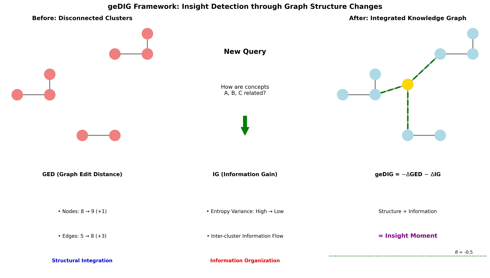
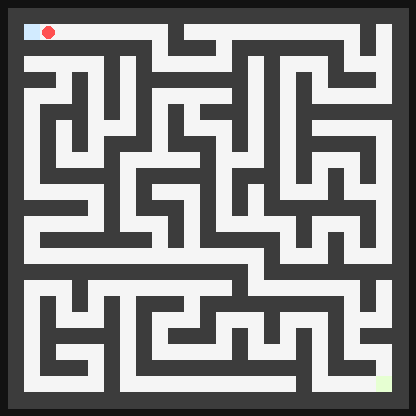
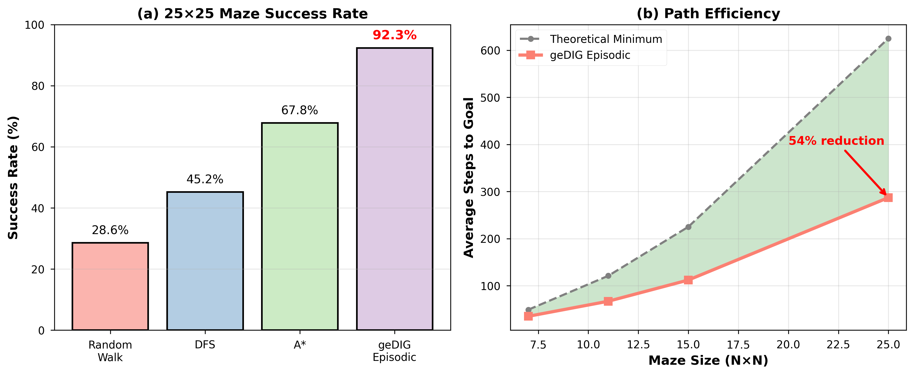
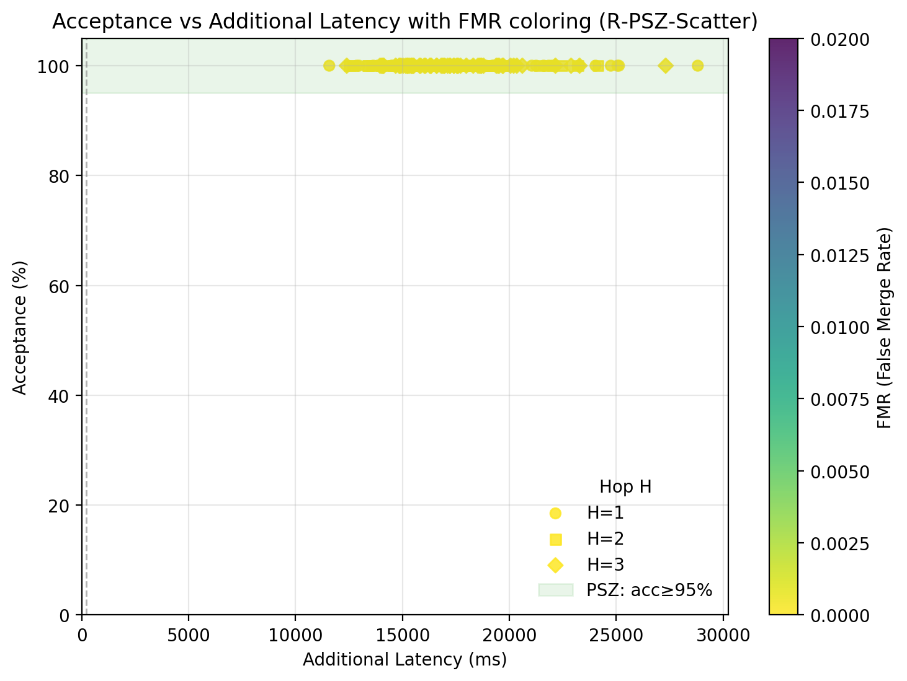

# InsightSpike-AI — geDIG: A Unified Gauge for Dynamic Knowledge Graphs

[](https://github.com/miyauchikazuyoshi/InsightSpike-AI/actions/workflows/ci-lite.yml)
[](https://github.com/miyauchikazuyoshi/InsightSpike-AI/actions/workflows/ci-unit.yml)
[](docs/paper/geDIG_onegauge_improved_v4.pdf)
[](https://miyauchikazuyoshi.github.io/InsightSpike-AI)

> What if a knowledge graph could decide what to learn — and what to forget — on its own?

Inspired by the Free Energy Principle (FEP), geDIG provides a light‑weight, unified gauge for deciding when to accept structural updates in a dynamic knowledge graph. It captures the “moment of update” by balancing edit‑path cost (structure) against information gain.



F = ΔEPC_norm − λ·ΔIG  （ΔIG = ΔH_norm + γ·ΔSP_rel）

Cloud/Lightweight defaults
- Mock LLM by default (no external APIs); minimal imports
- Recommended env: `INSIGHTSPIKE_LITE_MODE=1`, `INSIGHTSPIKE_MIN_IMPORT=1`, `PYTEST_DISABLE_PLUGIN_AUTOLOAD=1`
- Smoke: `make codex-smoke` (fast, no network)
- For safe CLI in cloud: `INSIGHTSPIKE_LLM__PROVIDER=mock`, `INSIGHTSPIKE_LLM__MODEL=mock`

Docs / GitHub Pages: https://miyauchikazuyoshi.github.io/InsightSpike-AI

## 🎯 What We’re Building

We aim to build a self‑updating RAG system that treats structural improvement in its own knowledge graph as an intrinsic reward, and autonomously updates itself. The geDIG gauge provides a principled decision for When to accept a graph update by balancing normalized edit‑path cost (structure) against information gain.

## ⚡ Quick Start (≈30s)

```bash
python -m venv .venv && source .venv/bin/activate    # Windows: .venv\Scripts\activate
pip install -e .

# Option 1: Run with mock LLM (no external APIs)
python examples/public_quick_start.py

# Option 2: Minimal geDIG demo (prints F, ΔEPC_norm, ΔIG)
python examples/hello_insight.py

# Optional overrides (nested via __)
python - <<'PY'
from insightspike import create_agent
agent = create_agent(
    provider="mock",
    llm__temperature=0.2,       # nested as section__field
    processing__max_cycles=3,
)
print(agent.config.llm.temperature, agent.config.processing.max_cycles)
PY
```

Note (Linkset‑First): By default we use Linkset‑IG (paper‑aligned). When calling Core directly, pass `linkset_info`; otherwise it falls back to a compatible graph‑IG with a deprecation warning. See QUICKSTART.md for minimal examples.

Example output (rough):
```
F = -0.42  (ΔEPC_norm=0.15,  ΔIG=0.57,  spike=True)
```

## 🔬 Proof‑of‑Concepts (PoC)

- RAG (equal‑resources): Paper figures and operating curves showing movement toward PSZ under unified gating. See the PDF for protocols and aggregation scripts.
  - Paper (v4 PDF): docs/paper/geDIG_onegauge_improved_v4.pdf
  - Pages overview: https://miyauchikazuyoshi.github.io/InsightSpike-AI

- Maze (partial observability): query‑centric subgraph evaluation with AG (0‑hop) and DG (multi‑hop) to reduce redundant exploration.
  - Single‑seed quick run (example):
    - `python experiments/maze-query-hub-prototype/run_experiment_query.py --preset paper --maze-size 25 --max-steps 300 --output tmp/seed0_summary.json --step-log tmp/seed0_steps.json`
  - Batch reproduction + aggregation (25×25, 500 steps):
    - L3 (60 seeds): `python scripts/run_maze_batch_and_update.py --mode l3 --seeds 60 --workers 4 --update-tex`
    - Eval (60 seeds): `python scripts/run_maze_batch_and_update.py --mode eval --seeds 60 --workers 4 --update-tex`
    - Aggregates land in `docs/paper/data/` and the 25×25 table is updated automatically.

  - Demo GIF (seed0, short):

    <p align="center">
      
    </p>

  - Interactive HTML (seed0):
    - experiments/maze-query-hub-prototype/results/batch_25x25/paper25_25x25_s500_seed0_interactive.html

<p align="center">
  
</p>

<p align="center">
  
</p>

## 🎯 Contributions (Phase 1 → Phase 2)

- Phase 1 (implemented): query‑centric, local subgraph evaluation of ΔEPC/ΔIG with two‑stage gating (AG/DG) to control accept/hold/reject, exploration, and backtrack. PoC in Maze (step reduction) and RAG (toward PSZ‑consistent quality/efficiency).

- Phase 2 (designed; collaboration open): extend to offline global rewiring under the FEP–MDL bridge, using GED_min as a regularizer/constraint; plan for rigorous validation and larger graphs.

## 🧭 Documentation

- QUICKSTART.md — 5‑minute setup and shortest run
- CONCEPTS.md — Terms and theory (ΔEPC/ΔIG, One‑Gauge, AG/DG, phases)
- EXPERIMENTS.md — Entry points for Maze/RAG reproduction
- Paper (v4 PDF): docs/paper/geDIG_onegauge_improved_v4.pdf
- Figures: docs/paper/figures/

## 🧪 Minimal Public API Example

```python
from insightspike.public import create_agent

agent = create_agent()  # lightweight by default
res = agent.process_question("geDIG in one sentence?")
print(getattr(res, 'response', res.get('response', 'No response')))
```

## Design Highlights (Phase 1)

- ΔEPC_norm: normalized edit‑path cost of actually applied operations (operational, not minimum‑distance only)
- ΔIG: ΔH_norm + γ·ΔSP_rel (signed SP)
  - SP modes (within the query‑hub evaluation subgraph)
    - fixed‑before (default): relative improvement on a fixed pair set sampled from the before subgraph
    - ALL‑PAIRS (diagnostic): average shortest path over reachable pairs before/after (`--sp-allpairs`)
    - ALL‑PAIRS‑EXACT (recommended, fast): exact all‑pairs preserved numerically on the evaluation subgraph with two BFS per hop edge and O(n^2) incremental updates (`--sp-allpairs-exact`)

### Practical tips (Query‑Hub)

With ALL‑PAIRS‑EXACT and minimal snapshots/diagnostics, wall‑clock time drops significantly. Optionally reuse the APSP matrix between steps to further accelerate.

```
python experiments/maze-query-hub-prototype/run_experiment_query.py \
  --preset paper --maze-size 25 --max-steps 150 --layer1-prefilter \
  --sp-allpairs-exact --sp-exact-stable-nodes \
  --steps-ultra-light --no-post-sp-diagnostics \
  --snapshot-level minimal --sp-cand-topk 16 --anchor-recent-q 6 \
  --output experiments/maze-query-hub-prototype/results/paper_25x25_s150_allpairs_exact_ul_summary.json \
  --step-log experiments/maze-query-hub-prototype/results/paper_25x25_s150_allpairs_exact_ul_steps.json
```

Empirical (reference): 25×25 / 150 steps → wall ≈ 42 s, avg_time_ms_eval ≈ 1.41 ms/step.
- One‑Gauge control: smaller F implies an “insight‑like” event; AG/DG makes the decision robust

<!-- Pipeline overview is described in the paper; Mermaid is omitted for GitHub compatibility. -->

## License / Contact

- License: Apache-2.0
- Contact: miyauchikazuyoshi@gmail.com
- X (Twitter): @kazuyoshim5436
- Patents (JP): 2025-082988, 2025-082989

## Feedback & Collaboration

We’re looking for collaborators (co‑authorship offered by contribution) in:

- Theorist (Phase transitions & statistical mechanics)
  - Hypothesis: critical information temperature λ_c yields small‑world structure
  - Tasks: λ‑scan experiments, scaling laws, critical exponents
- ML Researcher (RAG & multi‑hop)
  - Tasks: baselines vs geDIG/GraphRAG on public QA; PSZ analysis; latency/quality trade‑offs
- Neuroscientist (FEP & Active Inference)
  - Tasks: relate geDIG to consolidation/replay; bridge to FEP literature
- Systems Engineer (scaling & optimization)
  - Tasks: 1M+ nodes; storage/indices; incremental APSP/SSSP caches; anytime operation
- Generalist (demos & docs)
  - Tasks: web demos, visualizations (maze GIFs), tutorials, community support

What you get
- Co‑authorship on papers (credited by contribution)
- Early access to Phase‑2 (offline rewiring) design and internal tooling
- Freedom to explore (open research; no corporate constraints)

How to join
- Open an Issue with label “Review” or “Collaboration” and 3–5 lines on your focus
- Or DM on X (@kazuyoshim5436)
