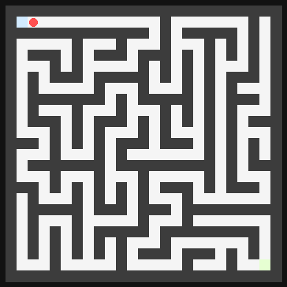

# InsightSpike-AI — geDIG: A Unified Gauge for Dynamic Knowledge Graphs

[](https://github.com/miyauchikazuyoshi/InsightSpike-AI/actions/workflows/ci-lite.yml)
[](https://github.com/miyauchikazuyoshi/InsightSpike-AI/actions/workflows/ci-unit.yml)
[](docs/paper/arxiv_v5_en/geDIG_onegauge_improved_v5_full_en.pdf)
[](https://miyauchikazuyoshi.github.io/InsightSpike-AI)

> What if a knowledge graph could decide what to learn — and what to forget — on its own?

Inspired by the Free Energy Principle (FEP), geDIG provides a light‑weight, unified gauge for deciding when to accept structural updates in a dynamic knowledge graph. It captures the “moment of update” by balancing edit‑path cost (structure) against information gain.


F = ΔEPC_norm − λ·ΔIG  （ΔIG = ΔH_norm + γ·ΔSP_rel）

Cloud/Lightweight defaults
- Mock LLM by default (no external APIs); minimal imports
- Recommended env: `INSIGHTSPIKE_LITE_MODE=1`, `INSIGHTSPIKE_MIN_IMPORT=1`, `PYTEST_DISABLE_PLUGIN_AUTOLOAD=1`
- Smoke: `make codex-smoke` (fast, no network)
- For safe CLI in cloud: `INSIGHTSPIKE_LLM__PROVIDER=mock`, `INSIGHTSPIKE_LLM__MODEL=mock`

Docs / GitHub Pages: https://miyauchikazuyoshi.github.io/InsightSpike-AI

## 🎯 What We’re Building

We aim to build a self‑updating RAG system that treats structural improvement in its own knowledge graph as an intrinsic reward, and autonomously updates itself. The geDIG gauge provides a principled decision for When to accept a graph update by balancing normalized edit‑path cost (structure) against information gain.

### Why this RAG is “nice to have”

- **Fewer pointless searches**: geDIG’s 0‑hop gate (AG) lets the system answer from its current graph when it is confident, and only fire retrieval when local structure looks ambiguous.  
- **Safer, cleaner knowledge**: the multi‑hop gate (DG) only accepts updates when they create real structural shortcuts (ΔSP_rel) and information gain, reducing noisy merges and long‑term “knowledge pollution”.  
- **Latency under control**: the same gauge that decides “When to update” also keeps extra hops and retrieval budget within PSZ/SLO bands (accuracy / FMR / P50).  
- **Transparent decisions**: AG/DG logs and gauge traces make it possible to see _when_ the system decided to explore, backtrack, or update.

### Why a Maze PoC for a RAG system?

- The Maze environment is a **small, fully observable sandbox** where “good structure” has a clear ground truth: shortest paths.  
- Each step in the maze is an analogue of a query:  
  - AG detects “I’m probably going the wrong way” (dead‑ends / ambiguity).  
  - DG commits only when a better route (structural shortcut) is actually found.  
- This lets us measure, in a controlled setting, whether geDIG really reduces redundant exploration and backtracks intelligently.  
- The **same F + AG/DG control logic** is then reused in the RAG pipeline, where the maze’s “cells” become documents/nodes and paths become multi‑hop reasoning chains.

## ⚡ RAG Quick Start (≈30s)

```bash
python -m venv .venv && source .venv/bin/activate    # Windows: .venv\Scripts\activate
pip install -e .

# Option 1: Run with mock LLM (no external APIs)
python examples/public_quick_start.py

# Option 2: Minimal geDIG demo (prints F, ΔEPC_norm, ΔIG)
python examples/hello_insight.py

# Optional overrides (nested via __)
python - <<'PY'
from insightspike import create_agent
agent = create_agent(
    provider="mock",
    llm__temperature=0.2,       # nested as section__field
    processing__max_cycles=3,
)
print(agent.config.llm.temperature, agent.config.processing.max_cycles)
PY
```

Note (Linkset‑First): By default we use Linkset‑IG (paper‑aligned). When calling Core directly, pass `linkset_info`; otherwise it falls back to a compatible graph‑IG with a deprecation warning. See QUICKSTART.md for minimal examples.

Example output (rough):
```
F = -0.42  (ΔEPC_norm=0.15,  ΔIG=0.57,  spike=True)
```

## 🔬 Proof‑of‑Concepts (PoC)

- RAG (equal‑resources): Paper figures and operating curves showing movement toward PSZ under unified gating. See the v5 PDFs for protocols and aggregation scripts.
  - Paper v5 (JA): docs/paper/geDIG_onegauge_improved_v5.pdf
  - Paper v5 (EN, full): docs/paper/arxiv_v5_en/geDIG_onegauge_improved_v5_full_en.pdf
  - Pages overview: https://miyauchikazuyoshi.github.io/InsightSpike-AI

- Maze (partial observability): query‑centric subgraph evaluation with AG (0‑hop) and DG (multi‑hop) to reduce redundant exploration.
  - Single‑seed quick run (example):
    - `python experiments/maze-query-hub-prototype/run_experiment_query.py --preset paper --maze-size 25 --max-steps 300 --output tmp/seed0_summary.json --step-log tmp/seed0_steps.json`
  - Batch reproduction + aggregation (25×25, 500 steps):
    - L3 (60 seeds): `python scripts/run_maze_batch_and_update.py --mode l3 --seeds 60 --workers 4 --update-tex`
    - Eval (60 seeds): `python scripts/run_maze_batch_and_update.py --mode eval --seeds 60 --workers 4 --update-tex`
    - Aggregates land in `docs/paper/data/` and the 25×25 table is updated automatically.

  - Demo GIF (seed0, short):

    <p align="center">
      
    </p>

  - Demo GIF (seed17, AG/DG 活発):

    <p align="center">
      
    </p>

  - Interactive HTML (seed0):
    - experiments/maze-query-hub-prototype/results/batch_25x25/paper25_25x25_s500_seed0_interactive.html
  - Interactive HTML (seed17):
    - experiments/maze-query-hub-prototype/results/batch_25x25/paper25_25x25_s300_seed17_interactive.html

## 🔁 Reproduce in 5 lines (paper preset, lite)

```bash
python -m experiments.exp2to4_lite.src.run_experiment \
  --config experiments/exp2to4_lite/configs/exp23_paper.yaml
python -m experiments.exp2to4_lite.run_exp23 \
  --config experiments/exp2to4_lite/configs/exp23_paper.yaml
python -m experiments.exp2to4_lite.src.alignment \
  --results experiments/exp2to4_lite/results/exp23_paper_*.json \
  --dataset experiments/exp2to4_lite/data/test_500.jsonl
```

Artifacts
- PDFs: `docs/paper/geDIG_onegauge_improved_v5.pdf` (JA), `docs/paper/arxiv_v5_en/geDIG_onegauge_improved_v5_full_en.pdf` (EN full) 
- arXiv pack: `bash scripts/pack_arxiv_v5.sh both`

<p align="center">
  
</p>

<p align="center">
  
</p>

## 🎯 Contributions (Phase 1 → Phase 2)

- Phase 1 (implemented): query‑centric, local subgraph evaluation of ΔEPC/ΔIG with two‑stage gating (AG/DG) to control accept/hold/reject, exploration, and backtrack. PoC in Maze (step reduction) and RAG (toward PSZ‑consistent quality/efficiency).

- Phase 2 (designed; collaboration open): extend to offline global rewiring under the FEP–MDL bridge, using GED_min as a regularizer/constraint; plan for rigorous validation and larger graphs.

## 🧭 Documentation

- QUICKSTART.md — 5‑minute setup and shortest run
- CONCEPTS.md — Terms and theory (ΔEPC/ΔIG, One‑Gauge, AG/DG, phases)
- EXPERIMENTS.md — Entry points for Maze/RAG reproduction
- Papers v5: docs/paper/geDIG_onegauge_improved_v5.pdf (JA), docs/paper/arxiv_v5_en/geDIG_onegauge_improved_v5_full_en.pdf (EN full)
- Figures: docs/paper/figures/

## 🧪 Minimal Public API Example

```python
from insightspike.public import create_agent

agent = create_agent()  # lightweight by default
res = agent.process_question("geDIG in one sentence?")
print(getattr(res, 'response', res.get('response', 'No response')))
```

## Design Highlights (Phase 1)

- ΔEPC_norm: normalized edit‑path cost of actually applied operations (operational, not minimum‑distance only)
- ΔIG: ΔH_norm + γ·ΔSP_rel (signed SP)
  - SP modes (within the query‑hub evaluation subgraph)
    - fixed‑before (default): relative improvement on a fixed pair set sampled from the before subgraph
    - ALL‑PAIRS (diagnostic): average shortest path over reachable pairs before/after (`--sp-allpairs`)
    - ALL‑PAIRS‑EXACT (recommended, fast): exact all‑pairs preserved numerically on the evaluation subgraph with two BFS per hop edge and O(n^2) incremental updates (`--sp-allpairs-exact`)

### Practical tips (Query‑Hub)

With ALL‑PAIRS‑EXACT and minimal snapshots/diagnostics, wall‑clock time drops significantly. Optionally reuse the APSP matrix between steps to further accelerate.

```
python experiments/maze-query-hub-prototype/run_experiment_query.py \
  --preset paper --maze-size 25 --max-steps 150 --layer1-prefilter \
  --sp-allpairs-exact --sp-exact-stable-nodes \
  --steps-ultra-light --no-post-sp-diagnostics \
  --snapshot-level minimal --sp-cand-topk 16 --anchor-recent-q 6 \
  --output experiments/maze-query-hub-prototype/results/paper_25x25_s150_allpairs_exact_ul_summary.json \
  --step-log experiments/maze-query-hub-prototype/results/paper_25x25_s150_allpairs_exact_ul_steps.json
```

Empirical (reference): 25×25 / 150 steps → wall ≈ 42 s, avg_time_ms_eval ≈ 1.41 ms/step.
- One‑Gauge control: smaller F implies an “insight‑like” event; AG/DG makes the decision robust

<!-- Pipeline overview is described in the paper; Mermaid is omitted for GitHub compatibility. -->

## 📊 Experiment Highlights (v4-lite)

### Maze (Query‑Hub, partial observability)

Representative L3‑only results under the paper preset (same runs as Table~\\ref{tab:maze_results} / Table~\\ref{tab:maze_v4_main} in the paper):

| Maze (max steps) | Seeds | geDIG success | Avg. steps | Edge compression (mem) |
|------------------|-------|---------------|------------|-------------------------|
| 15×15 (250)      | 100   | 1.00          | 69.0       | 0.95                    |
| 25×25 (250)      | 60    | 1.00          | 352.3      | 0.99                    |
| 51×51 (1500)     | 11    | 0.55          | 755.6      | 0.99                    |

Raw aggregates live under `docs/paper/data/maze_*x*_*.json` and are produced by the Query‑Hub runners in `experiments/maze-query-hub-prototype/tools/`.

### RAG (static vs dynamic, 500‑query lite)

Paper‑preset lite run (`experiments/exp2to4_lite`, 500 queries, equal‑resources):

| Method        | EM   | PER   | Acc   | FMR   | P50 (ms) |
|--------------|------|-------|-------|-------|----------|
| Static RAG   | 0.00 | 0.172 | 0.000 | 1.000 | 160      |
| geDIG‑lite   | 0.25 | 0.421 | 0.374 | 0.626 | 240      |

Here PER is the Path Equivalence Rate (answer+evidence), Acc and FMR are measured over accepted events, and P50 is measured latency. Full details and operating curves are in `docs/paper/geDIG_onegauge_improved_v4{_en}.pdf`.

## 🌊 Phase Transitions & λ‑Scan（Outlook）

The FEP–MDL bridge section in the paper suggests that the gauge

\\[
  \\mathcal{F} = \\Delta \\mathrm{EPC}_{\\mathrm{norm}} - \\lambda\\,(\\Delta H_{\\mathrm{norm}} + \\gamma\\,\\Delta \\mathrm{SP}_{\\mathrm{rel}})
\\]

can be read as an operational free energy, where λ plays the role of an information temperature.

Hypothesis (to be tested in v5+):

- There exists a critical λ\\_c at which the knowledge graph transitions from a sparse, tree‑like regime to an over‑connected or small‑world regime.
- Around λ\\_c, we expect sharp changes in:
  - success / regret,
  - FMR and PSZ shortfall,
  - edge compression and path‑length statistics,
  - the empirical distribution of F (e.g., bimodality or heavy tails).

Planned experiments:

- λ‑scan on the maze Query‑Hub (15×15, 25×25, 51×51) with fixed AG/DG percentiles, tracking PSZ shortfall and structural metrics.
- λ‑scan on the RAG lite suite (Exp II/III) under equal‑resources, checking whether λ\\_c aligns with PSZ‑like operating points.

Status:

- Not implemented in v4; currently framed as an outlook and collaboration topic (see “Theorist” role in Feedback & Collaboration).
- Results will be folded into a v5 revision of the paper once we have a clean λ‑scan and phase‑transition‑style analysis.

## License / Contact

- License: Apache-2.0
- Contact: miyauchikazuyoshi@gmail.com
- X (Twitter): @kazuyoshim5436
- Patent applications (JP, pending): 2025-082988, 2025-082989

## Feedback & Collaboration

We’re looking for collaborators (co‑authorship offered by contribution) in:

- Theorist (Phase transitions & statistical mechanics)
  - Hypothesis: critical information temperature λ_c yields small‑world structure
  - Tasks: λ‑scan experiments, scaling laws, critical exponents
- ML Researcher (RAG & multi‑hop)
  - Tasks: baselines vs geDIG/GraphRAG on public QA; PSZ analysis; latency/quality trade‑offs
- Neuroscientist (FEP & Active Inference)
  - Tasks: relate geDIG to consolidation/replay; bridge to FEP literature
- Systems Engineer (scaling & optimization)
  - Tasks: 1M+ nodes; storage/indices; incremental APSP/SSSP caches; anytime operation
- Generalist (demos & docs)
  - Tasks: web demos, visualizations (maze GIFs), tutorials, community support

What you get
- Co‑authorship on papers (credited by contribution)
- Early access to Phase‑2 (offline rewiring) design and internal tooling
- Freedom to explore (open research; no corporate constraints)

How to join
- Open an Issue with label “Review” or “Collaboration” and 3–5 lines on your focus
- Or DM on X (@kazuyoshim5436)

## Environment Variables (Core)

Common variables you might set:

- INSIGHTSPIKE_LITE_MODE=1 — enable lightweight paths (no heavy deps)
- INSIGHTSPIKE_MIN_IMPORT=1 — minimize import surface for faster startup
- PYTEST_DISABLE_PLUGIN_AUTOLOAD=1 — prevent third‑party pytest plugins
- INSIGHTSPIKE_LLM__PROVIDER=mock — mock LLM (no network)
- INSIGHTSPIKE_LLM__MODEL=mock — mock model identifier
- INSIGHTSPIKE_CONFIG_PATH=path/to/config.yaml — override config file
- INSIGHTSPIKE_DATA_DIR=./data/insight_store — override data root
- INSIGHTSPIKE_LOG_DIR=./results/logs — safe write location for logs

Advanced overrides (geDIG internals):
- INSIGHTSPIKE_GEDIG_LAMBDA=1.0 — λ (trade‑off) override
- INSIGHTSPIKE_SP_BETA=1.0 — γ (ΔSP weight) override

Note: With Lite mode or when sentence‑transformers/torch are not installed, the system falls back to a simple CPU embedder and Numpy index; functionality remains intact for docs/tests.
