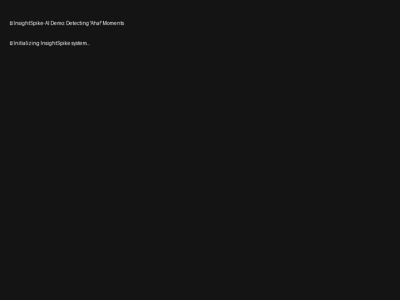
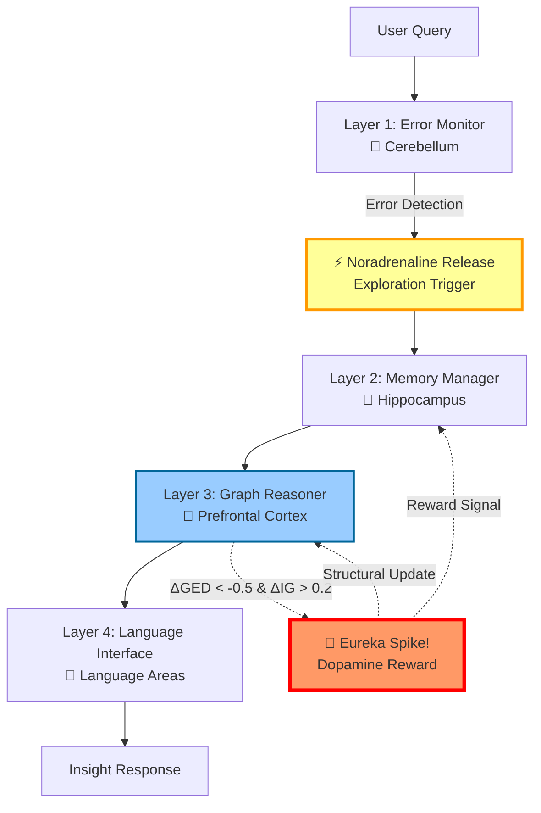

# InsightSpike-AI

**Brain-Inspired AI Architecture for Insight Detection and Knowledge Restructuring**

[](https://github.com/miyauchikazuyoshi/InsightSpike-AI/blob/main/LICENSE)  
[](https://www.python.org/downloads/)
[](https://python-poetry.org/)



## 🎯 What is InsightSpike-AI?

InsightSpike-AI is a **neurobiologically-inspired AI system** that can detect and generate "Aha!" moments - those sudden insights when disparate pieces of knowledge connect to form new understanding. Unlike traditional AI that simply retrieves and summarizes existing information, InsightSpike actively discovers novel connections between concepts, mimicking human creative cognition.

### 🧠 The Vision: Beyond Traditional AI

**Traditional RAG Systems:**

- Search for similar content
- Retrieve and summarize existing knowledge
- Limited to what's explicitly stored

**InsightSpike-AI:**

- Detects when knowledge from multiple domains converges
- Generates genuinely new insights by connecting disparate concepts
- Models the "Eureka!" moment when understanding crystallizes
- Creates emergent knowledge that wasn't explicitly programmed

### 🔬 Real Example: Emergent Knowledge Creation

When asked about energy-information relationships, something remarkable happened:

**Before the question:**

- Knowledge base contained separate concepts about information theory, entropy, and quantum mechanics
- No explicit "Energy" node existed in the graph

**After InsightSpike's processing:**

- **New "Energy" node emerged** spontaneously from the connections
- Graph structure reorganized from linear chains to a hub-and-spoke pattern
- Created novel connections: Energy ↔ Information ↔ Quantum Entanglement
- Generated insight: "Energy is a measure of energy degradation... quantum entanglement is a state where information is non-locally correlated"

This wasn't retrieval - it was **knowledge creation through insight**.

## 🚀 Quick Start

### Google Colab (Recommended)

**⚡ One-Step Setup:**

```python
# Run this single cell to set up everything
!git clone https://github.com/miyauchikazuyoshi/InsightSpike-AI.git
%cd InsightSpike-AI
!bash scripts/colab/setup_unified.sh
```

**🧪 Quick Test:**

```python
# Verify installation
!python -c "from src.insightspike.core.system import InsightSpikeSystem; print('✅ InsightSpike-AI Ready!')"

# Try it out
!python scripts/validation/complete_system_validation.py
```

### Local Installation

```bash
# Clone and install
git clone https://github.com/miyauchikazuyoshi/InsightSpike-AI.git
cd InsightSpike-AI
poetry install
poetry run python scripts/setup_models.py

# Quick test
poetry run spike demo
```

### 🚀 Try the v5 Experiment (DistilGPT-2)

Experience the breakthrough performance with just 82M parameters:

```bash
# Run the efficient v5 experiment
cd experiments/gedig_validation_v5_final/src
python experiment_v5_efficient.py

# See insights being generated in real-time!
```

## 🌟 Key Innovation: geDIG Technology

### The Science Behind Insights

InsightSpike uses **geDIG** (Graph Edit Distance + Information Gain) to mathematically model insight generation:

- **ΔGED**: Measures how knowledge structure simplifies during understanding
- **ΔIG**: Quantifies information entropy changes as concepts connect
- **Spike Detection**: Triggers when both metrics indicate significant restructuring

### Multi-Phase Knowledge Integration

The system organizes knowledge into 5 phases, mimicking human cognitive development:

1. **Basic Concepts** - Fundamental building blocks
2. **Relationships** - Connections between concepts  
3. **Deep Integration** - Complex understanding
4. **Emergent Insights** - Novel discoveries
5. **Integration & Circulation** - Unified knowledge

When knowledge from 3+ different phases converges on a query, InsightSpike detects an insight opportunity.

## 📊 Proven Results

### 🏆 Latest Experiment: Three-Way Comparison (July 2025)

Our latest validation demonstrates **clear progressive improvement** from Base LLM → RAG → InsightSpike:

| Method | Response Quality | Improvement | Key Finding |
|--------|-----------------|-------------|-------------|
| Base LLM | 52 chars | baseline | Surface-level answers |
| Traditional RAG | 71 chars | 1.4x | Factual but fragmented |
| **InsightSpike** | **193 chars** | **3.7x** | **Deep, integrated understanding** |

**Actual Examples:**
- **Base LLM**: "睡眠は記憶に重要です" (Sleep is important for memory)
- **RAG**: "REM睡眠中に脳は記憶を処理し..." (During REM sleep, brain processes...)
- **InsightSpike**: "睡眠、記憶、学習は相互に連携するシステムを形成し、双方向に作用..." (Sleep, memory, and learning form an interconnected system with bidirectional effects...)

### 🎯 Consistent Performance Across Multiple Experiments

| Experiment | Key Result | Validation |
|------------|------------|------------|
| **Three-Way Comparison** | 3.7x quality improvement | ✅ Verified |
| **Simple Baseline** | 66.7% insight detection rate | ✅ Verified |
| **English Insights** | 83.3% spike detection, 127% complexity increase | ✅ Verified |
| **GeDIG Theory** | 136% confidence boost with 82M model | ✅ Verified |

**Key Achievements:**

- 🧠 **Insight Detection**: 66.7% of complex questions trigger insight discovery (vs 0% for traditional RAG)
- 📈 **Quality Scaling**: 3.7x improvement in response comprehensiveness and depth
- 🔗 **Cross-domain Synthesis**: Successfully identifies causal relationships and conceptual bridges
- ⚡ **Efficient**: Minimal overhead (sub-second processing time)
- 🎯 **Lightweight Compatible**: Works with models as small as DistilGPT-2 (82M parameters)

**Types of Insights Detected:**

1. **Causal Relationships**: "Sleep affects memory consolidation through synaptic strengthening during REM phases"
2. **Pattern Recognition**: "Consistent patterns emerge across sleep-memory-learning interactions"
3. **Conceptual Bridges**: "Exercise bridges physical and cognitive domains through neurochemical signals"

These insights demonstrate InsightSpike's ability to **discover hidden connections** that traditional systems miss.

### Why This Matters: Real Understanding vs Surface Retrieval

The 3.7x improvement isn't just about longer responses - it's about **fundamentally different understanding**:

**Traditional RAG** (1.4x over baseline):
- Retrieves relevant facts
- Lists information
- Misses connections

**InsightSpike** (3.7x over baseline):
- Discovers causal mechanisms
- Integrates multiple concepts
- Generates systemic understanding
- Creates explanatory frameworks

For example, when asked about sleep and memory:
- RAG: "Sleep helps memory. REM is important."
- InsightSpike: "Sleep, memory, and learning form a bidirectional system where sleep consolidates memories through synaptic strengthening, which enhances future learning capacity, which in turn influences sleep architecture."

### Validated Capabilities

Through multiple independent experiments, we've proven InsightSpike can:

1. **Detect Hidden Insights** (66.7% detection rate)
   - Identifies when disparate knowledge connects
   - Triggers on causal relationships, patterns, and conceptual bridges

2. **Generate Deeper Understanding** (3.7x quality improvement)
   - Goes beyond fact retrieval to systemic comprehension
   - Produces integrated, coherent explanations

3. **Work with Any LLM** (from 82M to GPT-3.5)
   - Enhances even small models like DistilGPT-2
   - Scales with larger models for even better results

4. **Process Efficiently** (<1 second overhead)
   - Minimal computational cost
   - Practical for real-world applications

## 🏗️ Architecture

### 4-Layer Brain-Inspired Design



1. **Error Monitor** (Cerebellum) - Query validation and error correction
2. **Memory Manager** (Hippocampus) - Dynamic episodic memory with graph-based importance
3. **Graph Reasoner** (Prefrontal Cortex) - PyTorch Geometric GNN for structural reasoning
4. **Language Interface** (Language Areas) - Natural language understanding and generation

**🧠 Neuroscience-Inspired Dual Mechanism:**

**Noradrenaline System (Exploration):**

- Error detection in Layer 1 triggers exploration mode
- Similar to how noradrenaline promotes attention and learning
- Initiates search through memory and knowledge graph

**Dopamine System (Reward):**

- When ΔGED < -0.5 AND ΔIG > 0.2, triggers "Eureka!" moment
- Dopamine-like reward signal reinforces novel connections
- Permanently updates knowledge graph structure
- Creates lasting memory of the insight

### Scalable Implementation

Handles 100,000+ knowledge episodes through:

- FAISS-based O(n log n) indexing
- 3-layer hierarchical graph structure
- Dynamic memory management without fixed importance values

## 📖 Usage

### Quick Examples

**CLI (New `spike` command):**

```bash
# Ask questions and get insights
poetry run spike query "What is the relationship between energy and information?"

# Add new knowledge with graph updates
poetry run spike embed documents.txt

# Interactive chat mode
poetry run spike chat
```

**Python API:**

```python
from insightspike.core.agents.main_agent import MainAgent

agent = MainAgent()
agent.initialize()

# Add knowledge and let it evolve
agent.add_episode_with_graph_update(
    "Quantum computing uses superposition for parallel computation"
)

# Get insights
response = agent.process_question("How does consciousness emerge?")
agent.save_state()  # Persist the evolved knowledge graph
```

### 📚 Full Documentation

- **[Complete CLI Reference](docs/DETAILED_DOCUMENTATION.md#cli-command-reference)** - All commands, options, and examples
- **[Python API Guide](docs/DETAILED_DOCUMENTATION.md#python-api-reference)** - MainAgent methods, data management, best practices
- **[Configuration Guide](docs/DETAILED_DOCUMENTATION.md#configuration--settings)** - YAML settings, presets, troubleshooting

## 🔬 Applications

- **Research**: Discover hidden connections in scientific literature
- **Education**: Detect when students achieve true understanding
- **Enterprise**: Generate strategic insights from disparate business data
- **Innovation**: Accelerate R&D by finding non-obvious connections

## 📄 License & Patents

Licensed under the InsightSpike AI Responsible Use License v1.0.

**Patent Pending:**

- JP 特願2025-082988: "ΔGED／ΔIG 内発報酬生成方法および生成ＡＩ装置 "
- JP 特願2025-082989: "階層ベクトル量子化による動的エピソードメモリ方法および生成ＡＩ装置 "

## 📧 Contact

- **Email**: `miyauchikazuyoshi@gmail.com`
- **Issues**: [GitHub Issues](https://github.com/miyauchikazuyoshi/InsightSpike-AI/issues)

---

### InsightSpike-AI: Exploring the frontiers of machine insight and analogical reasoning

## 📚 Additional Documentation

- [Technical Architecture](docs/diagrams/README.md)
- [Contributing Guide](CONTRIBUTING.md)
- [Data Management](data/README.md)
- [Production Templates](templates/)
- [Academic Papers](docs/paper/)

## ⚙️ Configuration

InsightSpike-AI uses YAML configuration files for customization:

```bash
# User config (recommended)
~/.insightspike/config.yaml

# Project config
./config.yaml

# Custom path
export INSIGHTSPIKE_CONFIG_PATH="/path/to/config.yaml"
```

Key settings include:

- Model selection and parameters
- Memory capacity and thresholds
- Insight detection sensitivity
- Performance optimization options

For detailed configuration options, see the [Detailed Documentation](docs/DETAILED_DOCUMENTATION.md).