# InsightSpike-AI
**Brain-Inspired Multi-Agent Architecture for "Spike of Insight" (ΔGED × ΔIG)**

> Quantized RAG ＋ GNN ＋ Internal Reward (ΔGED/ΔIG)  
> Implementing a cerebellum–LC–hippocampus–VTA loop to study *insight*.

[](https://github.com/miyauchikazuyoshi/InsightSpike-AI/blob/main/LICENSE)  
<a href="https://arxiv.org/abs/YYMM.NNNNN"></a>  
<a href="https://github.com/miyauchikazuyoshi/InsightSpike-AI/releases"></a>
<a href="https://github.com/miyauchikazuyoshi/InsightSpike-AI/issues"></a>
<a href="https://github.com/miyauchikazuyoshi/InsightSpike-AI/network/members"></a>
<a href="https://github.com/miyauchikazuyoshi/InsightSpike-AI/stargazers"></a>

> **🎓 Project Status**: **Research-Ready Open Source** - Complete experimental framework with rigorous validation. Academic-grade implementation ready for research and production use. See [experiments/](experiments/) for comprehensive experimental validation and [docs/technical_specifications.md](docs/technical_specifications.md) for detailed technical documentation.

## 📋 Table of Contents

- [🎯 What is InsightSpike-AI?](#-what-is-insightspike-ai)
- [✨ Key Features](#-key-features)
- [🧠 Architecture Overview](#-architecture-overview)
- [🚀 Quick Start](#-quick-start)
- [📊 Basic Usage Examples](#-basic-usage-examples)
- [📐 Input Data Formats](#-input-data-formats)
- [🔧 Configuration](#-configuration)
- [📚 Documentation](#-documentation)
- [🧪 Research & Validation](#-research--validation)
- [🤝 Contributing](#-contributing)
- [📄 License & Patents](#-license--patents)
- [🔗 Related Resources](#-related-resources)

## 🎯 What is InsightSpike-AI?

InsightSpike-AI is a novel AI architecture that detects and models human-like "insight moments" using neurobiologically-inspired mechanisms. Unlike traditional AI systems that provide incremental improvements, InsightSpike-AI identifies breakthrough moments when knowledge restructures dramatically - the computational equivalent of "Aha!" moments.

### Core Innovation: geDIG Technology

The system's breakthrough lies in its **geDIG** (Graph Edit Distance + Information Gain) mechanism:

- **ΔGED**: Measures structural simplification in knowledge graphs
- **ΔIG**: Quantifies information entropy changes during learning
- **EurekaSpike**: Fires when ΔGED ≤ -0.5 AND ΔIG ≥ 0.2 simultaneously

This creates an **intrinsic reward signal** that identifies genuine insight moments, not just correct answers.

### Real-World Applications

- **Educational Systems**: Adaptive learning that recognizes when students truly "get it"
- **Research Tools**: Accelerating scientific discovery by identifying conceptual breakthroughs
- **Problem Solving**: AI assistants that understand the difference between rote answers and insights
- **Creative AI**: Systems that can experience and recognize creative leaps

## Patent Notice

The core ΔGED/ΔIG intrinsic-reward mechanism and hierarchical VQ memory module are **patent-pending** in Japan:

- JP Application No. **特願2025-082988** — "ΔGED/ΔIG 内発報酬生成方法"
- JP Application No. **特願2025-082989** — "階層ベクトル量子化による動的メモリ方法"

Further filings (US/PCT) will follow within the priority year.

## ✨ Key Features

### 🧮 Core geDIG Technology
- **ΔGED (Graph Edit Distance)**: Measures structural changes in knowledge graphs with O(n²) to O(n!) complexity options
- **ΔIG (Information Gain)**: Quantifies entropy changes using Shannon, clustering, and mutual information methods
- **EurekaSpike Detection**: Automatic insight moment identification when ΔGED ≤ -0.5 AND ΔIG ≥ 0.2
- **Fusion Reward**: Configurable weighted combination: `R = w₁×ΔGED + w₂×ΔIG - w₃×Conflict`

### 🧠 Neurobiological Architecture
- **4-Layer Subcortical Loop**: Cerebellum → LC+Hippocampus → PFC → Language Area
- **Vector Quantized Memory**: FAISS-based episodic memory with IVF-PQ indexing
- **Graph Neural Networks**: PyTorch Geometric-based reasoning with GCN/GAT models
- **Dynamic Memory Management**: Adaptive topK optimization and conflict detection

### 🔧 Research-Ready API
- **Public Functions**: `compute_delta_ged()`, `compute_delta_ig()`, `compute_fusion_reward()`
- **Preset Configurations**: 6 validated configurations for research, production, education, etc.
- **Algorithm Modules**: Independent implementations with multiple optimization levels
- **External Integration**: Clean API for MATLAB, R, and other research environments

### 📊 Validation & Performance
- **Comprehensive Experimental Framework**: RAG memory improvement, dynamic memory benchmarks, bias-corrected evaluation
- **Scientific Rigor**: Statistical significance testing with multiple comparison correction and effect size calculation  
- **Cross-Domain Validation**: Educational, research, and problem-solving scenarios with real educational system integration
- **Reproducible Research**: Complete experimental environment with 8,990+ lines of validation code
- **Production Ready**: Full CI/CD pipeline with Docker support and multi-environment compatibility

### 🧪 Research Framework
- **16 Experimental Modules**: Complete validation suite covering all core functionalities
- **Automated Report Generation**: Academic-grade experimental reports with statistical analysis
- **Bias Correction**: Objective validation replacing inflated claims with measured improvements
- **Long-term Benchmarks**: Dynamic memory system validation over extended periods

## 🧠 Architecture Overview

### Neurobiologically-Inspired 4-Layer System

```mermaid
graph TD
    A[Query Input] --> B[L1: Error Monitor<br/>Cerebellum Analog]
    B --> C[L2: Memory Manager<br/>LC + Hippocampus]
    C --> D[L3: Graph Reasoner<br/>Prefrontal Cortex]
    D --> E[L4: LLM Interface<br/>Language Area]
    E --> F[Response Output]
    
    C --> G[VQ Memory<br/>FAISS Index]
    D --> H[GNN Processing<br/>PyTorch Geometric]
    D --> I[ΔGED/ΔIG<br/>Calculation]
    I --> J[EurekaSpike<br/>Detection]
```



| Layer | Brain Analog      | Main File                       | Function                          | Key Technology |
|-------|-------------------|---------------------------------|-----------------------------------|----------------|
| **L1** | Cerebellum        | `layer1_error_monitor.py`       | Query analysis & topK optimization| Conflict detection, adaptive learning |
| **L2** | LC + Hippocampus  | `layer2_memory_manager.py`      | Vector quantized episodic memory  | FAISS IVF-PQ, dynamic indexing |
| **L3** | PFC               | `layer3_graph_reasoner.py`      | GNN reasoning with ΔGED/ΔIG      | PyTorch Geometric, insight detection |
| **L4** | Language Area     | `layer4_llm.py`                 | Natural language synthesis       | Context integration, response generation |

### Enhanced Features (v0.7-Eureka)
- 📋 **Intelligent Separation**: Automatic known/unknown information categorization
- 🎯 **Synthesis Detection**: Recognizes when cross-domain synthesis is required
- 🔄 **Adaptive TopK**: Dynamic optimization for chain reaction insights
- 🧠 **Human-like Learning**: Weak relationship formation and strengthening over time
- 📚 **Scalable Memory**: Vector quantized episodic memory with efficient retrieval
- 🕸️ **Enhanced Reasoning**: Graph neural networks with improved density and connectivity
- ⚡ **Real-time Detection**: Sub-second insight spike identification  
- 🔄 Adaptive topK optimization for chain reaction insights
- 🧠 Human-like learning system with weak relationship formation
- 📚 Vector quantized episodic memory with IVF-PQ
- 🕸️ Graph neural network reasoning with enhanced graph density
- ⚡ Real-time insight spike detection

---

## 🚀 Quick Start

### 🎯 Interactive Demo
Try the insight detection capabilities immediately:

```bash
# Clone and setup
git clone https://github.com/miyauchikazuyoshi/InsightSpike-AI.git
cd InsightSpike-AI

# Run interactive demo (no setup required)
poetry run insightspike demo
```

This demo showcases InsightSpike's ability to synthesize insights across domains like probability theory, mathematics, and philosophy - even when the knowledge base contains no direct answers to the questions!

### 🏠 Local Development Setup

**Automated platform detection with Poetry**:
```bash
# Clone repository
git clone https://github.com/miyauchikazuyoshi/InsightSpike-AI.git
cd InsightSpike-AI

# Automated setup with platform detection
poetry install --with dev

# Verify installation
poetry run insightspike --help
poetry run python -c "import torch, faiss; print(f'PyTorch: {torch.__version__}, FAISS: {faiss.__version__}')"
```

**Platform-Specific Support**:
- 🍎 **macOS**: torch==2.2.2 + faiss-cpu (Intel/AMD compatibility)
- 🐧 **Linux**: torch>=2.4.0 + faiss-gpu (CI/GPU environments)
- 🪟 **Windows**: torch>=2.4.0 + faiss-cpu (fallback)

### ⚡ Google Colab Setup (GPU Optimized)

**One-Click Setup with Colab Notebook**:
1. Open [`InsightSpike_Colab_Demo.ipynb`](InsightSpike_Colab_Demo.ipynb) in Google Colab
2. Choose GPU runtime: Runtime > Change runtime type > GPU  
3. Run cells in order: The notebook guides you through setup and demo

**Manual Setup Options**:
```bash
# Standard setup (8-12 minutes, recommended)
!git clone https://github.com/miyauchikazuyoshi/InsightSpike-AI.git
%cd InsightSpike-AI
!chmod +x scripts/colab/setup_colab.sh
!./scripts/colab/setup_colab.sh

# Minimal setup (<60 seconds, for testing)
!./scripts/colab/setup_colab.sh minimal

# Debug setup (15-20 minutes, troubleshooting)
!chmod +x scripts/colab/setup_colab_debug.sh
!./scripts/colab/setup_colab_debug.sh
```

**2025 Modern Environment Features**:
- ✅ NumPy 2.x compatibility with intelligent FAISS fallback
- ✅ PyTorch 2.6.0+cu124 for optimal T4 GPU performance
- ✅ Automatic GPU → CPU fallback for compatibility
- ✅ Realistic messaging about available capabilities

---

## 📊 Basic Usage Examples

### 1. Simple Insight Detection

```python
from insightspike import InsightAgent
from insightspike.metrics import analyze_insight

# Initialize agent
agent = InsightAgent()

# Process a question that requires insight
question = "How does the Monty Hall problem relate to Bayesian inference?"
response = agent.process(question)

# Analyze the insight metrics
analysis = analyze_insight(
    before_state=response.before_state,
    after_state=response.after_state
)

print(f"EurekaSpike detected: {analysis['eureka_spike_detected']}")
print(f"Learning efficiency: {analysis['learning_efficiency']:.3f}")
print(f"Knowledge gain: {analysis['knowledge_gain']:.3f}")
```

### 2. Research API Usage

```python
from insightspike.algorithms import GraphEditDistance, InformationGain
from insightspike.metrics import compute_fusion_reward, apply_preset_configuration

# Configure for research use
config = apply_preset_configuration('research_high_precision')

# Initialize calculators
ged_calc = GraphEditDistance(optimization_level='precise')
ig_calc = InformationGain(method='clustering')

# Calculate metrics
delta_ged = ged_calc.compute_delta_ged(graph_before, graph_after)
delta_ig = ig_calc.compute_delta_ig(state_before, state_after)

# Compute fusion reward
reward = compute_fusion_reward(
    delta_ged=delta_ged,
    delta_ig=delta_ig,
    weights=config['weights']
)

print(f"Insight reward: {reward:.3f}")
```

### 3. Educational System Integration

```python
from insightspike.metrics import get_preset_configurations

# Get education-focused configuration
edu_config = get_preset_configurations()['education_focused']

# Process student response
student_understanding = analyze_insight(
    before_state=student_previous_knowledge,
    after_state=student_current_knowledge,
    weights=edu_config['weights'],
    thresholds=edu_config['thresholds']
)

if student_understanding['eureka_spike_detected']:
    print("🎉 Student breakthrough detected!")
    print(f"Learning intensity: {student_understanding['spike_intensity']:.2f}")
```

### 4. Batch Processing for Research

```python
from insightspike.algorithms import create_default_ged_calculator
import json

# Process multiple insight episodes
results = []
ged_calc = create_default_ged_calculator(optimization_level='fast')

for episode in research_dataset:
    delta_ged = ged_calc.compute_delta_ged(
        episode['before_graph'], 
        episode['after_graph']
    )
    
    results.append({
        'episode_id': episode['id'],
        'delta_ged': delta_ged,
        'insight_detected': delta_ged <= -0.5
    })

# Save results
with open('insight_analysis_results.json', 'w') as f:
    json.dump(results, f, indent=2)
```

## 📐 Input Data Formats

### Graph Data (for ΔGED calculation)

**NetworkX Graphs** (Recommended):
```python
import networkx as nx

# Create knowledge graph
knowledge_graph = nx.Graph()
knowledge_graph.add_nodes_from([
    ('probability', {'type': 'concept', 'domain': 'mathematics'}),
    ('bayes_theorem', {'type': 'theorem', 'domain': 'statistics'}),
    ('monty_hall', {'type': 'problem', 'domain': 'probability'})
])
knowledge_graph.add_edges_from([
    ('probability', 'bayes_theorem', {'relation': 'uses'}),
    ('monty_hall', 'probability', {'relation': 'example_of'}),
    ('monty_hall', 'bayes_theorem', {'relation': 'demonstrates'})
])
```

**PyTorch Geometric Data**:
```python
import torch
from torch_geometric.data import Data

# Node features and edges
x = torch.randn(num_nodes, feature_dim)  # Node features
edge_index = torch.tensor([[0, 1, 2], [1, 2, 0]], dtype=torch.long)  # Edges

graph = Data(x=x, edge_index=edge_index)
```

### Vector Data (for ΔIG calculation)

**NumPy Arrays**:
```python
import numpy as np

# Knowledge state representations
knowledge_before = np.random.randn(100, 384)  # 100 concepts, 384-dim embeddings
knowledge_after = np.random.randn(120, 384)   # 120 concepts after learning

# Calculate information gain
from insightspike.metrics import compute_delta_ig
delta_ig = compute_delta_ig(knowledge_before, knowledge_after)
```

**Document Collections**:
```python
# Text documents for automatic vectorization
documents = [
    "Probability theory deals with uncertainty and randomness...",
    "Bayes' theorem describes how to update probabilities...",
    "The Monty Hall problem demonstrates counterintuitive probability..."
]

# Agent automatically converts to embeddings
agent = InsightAgent()
agent.load_documents(documents)
```

### Configuration Files

**YAML Configuration**:
```yaml
# config.yaml
model:
  gnn:
    hidden_dim: 128
    num_layers: 3
    dropout: 0.1
  memory:
    vector_dim: 384
    max_items: 10000
    
insight_detection:
  weights:
    ged: 0.5
    ig: 0.4
    conflict: 0.1
  thresholds:
    ged_threshold: -0.5
    ig_threshold: 0.2

algorithms:
  ged:
    optimization_level: "standard"
    timeout_seconds: 5.0
  ig:
    method: "clustering"
    k_clusters: 8
```

**JSON Configuration**:
```json
{
  "preset": "research_high_precision",
  "custom_weights": {
    "ged": 0.6,
    "ig": 0.3,
    "conflict": 0.1
  },
  "experimental_params": {
    "random_seed": 42,
    "batch_size": 32,
    "learning_rate": 0.001
  }
}
```

### Expected Output Formats

**Insight Analysis Results**:
```python
{
    'delta_ged': -0.734,
    'delta_ig': 0.456,
    'fusion_reward': 0.234,
    'eureka_spike_detected': True,
    'spike_intensity': 0.78,
    'learning_efficiency': 0.734,
    'knowledge_gain': 0.456,
    'thresholds_used': {'ged_threshold': -0.5, 'ig_threshold': 0.2},
    'weights_used': {'ged': 0.4, 'ig': 0.3, 'conflict': 0.3}
}
```

**Performance Statistics**:
```python
{
    'total_calculations': 150,
    'average_computation_time': 0.0234,
    'approximation_rate': 0.12,
    'insight_detection_accuracy': 0.91,
    'memory_usage_mb': 45.6
}
```

## 🔧 Configuration

InsightSpike-AI supports multiple configuration methods for different use cases:

### 1. Environment Variables
```bash
export INSIGHTSPIKE_CONFIG_PATH="/path/to/config.yaml"
export INSIGHTSPIKE_LOG_LEVEL="DEBUG"
export INSIGHTSPIKE_RANDOM_SEED="42"
```

### 2. Command Line Arguments
```bash
# Use custom configuration file
poetry run insightspike demo --config config.yaml

# Override specific parameters
poetry run insightspike benchmark --ged-optimization fast --ig-method shannon

# Set random seed for reproducibility
poetry run insightspike experiment_suite --seed 42
```

### 3. Programmatic Configuration
```python
from insightspike.core.config import get_config, set_config

# Load default configuration
config = get_config()

# Modify settings
config.insight_detection.weights.ged = 0.6
config.algorithms.ged.optimization_level = "precise"

# Apply changes
set_config(config)
```

### 4. Preset Configurations
```python
from insightspike.metrics import apply_preset_configuration

# Available presets:
# - research_high_precision: For academic research
# - production_balanced: For production systems  
# - education_focused: For educational applications
# - structure_focused: For graph optimization
# - real_time_fast: For low-latency applications
# - domain_adaptive: For cross-domain use

apply_preset_configuration('research_high_precision')
```

---

## 🎮 CLI Commands
