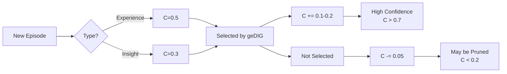
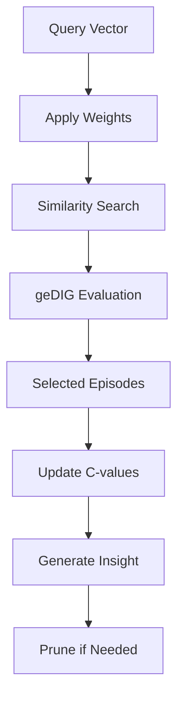

# Confidence (C-Value) and Weight Vector System

## Overview

InsightSpike-AI implements two complementary systems for managing episode quality and relevance:

1. **C-Value (Confidence) System** - Tracks episode confidence through selection and repetition
2. **Weight Vector System** - Adjusts dimension importance for task-specific needs

## C-Value System

### Concept

C-values represent the confidence or trustworthiness of an episode, ranging from 0.1 to 1.0.

```python
# Episode types and initial C-values
INITIAL_C_VALUES = {
    "experience": 0.5,    # Real experiences start neutral
    "insight": 0.3,        # Generated insights start low
    "contradiction": 0.4   # Contradictions need resolution
}
```

### Lifecycle



### Key Principles

1. **No Use in Search** - Pure similarity calculation without C-value influence
2. **No Use in geDIG** - Preserves information gain accuracy
3. **Post-Selection Update** - C-values change only after selection as feedback
4. **Confidence Propagation** - Low-confidence sources create even lower-confidence insights

### Implementation

```python
from insightspike.confidence.confidence_manager import ConfidenceManager
from insightspike.evaluation.gedig_evaluator import GeDIGEvaluator

# Clean separation of concerns
evaluator = GeDIGEvaluator()
confidence_manager = ConfidenceManager()

# Step 1: Pure evaluation (no side effects)
selected, candidates = evaluator.rerank(episodes)

# Step 2: Separate confidence update
confidence_manager.update_after_selection(selected, candidates)
```

## Weight Vector System

### Concept

Weight vectors adjust the importance of different dimensions in the embedding space.

```yaml
# config.yaml
vector_weights:
  enabled: true
  weights: [1.0, 1.0, 0.1, 0.1, 0.5, 0.5, 0.5, 0.3]
  #        [x,   y,   dx,  dy,  res, vis, tri, goal]
```

### Application

Weight vectors are applied through element-wise multiplication:

```python
weighted_vector = original_vector * weight_vector
```

### Use Cases

| Task | Problem | Solution | Result |
|------|---------|----------|--------|
| Maze Navigation | Direction dominates (625x) | Scale down direction (0.1x) | +450% coverage |
| Language Tasks | All dims equal | No weights needed | Default behavior |
| Spatial Tasks | Position matters | Amplify position (2.0x) | Better localization |

### Implementation

```python
from insightspike.config.vector_weights import VectorWeightConfig
from insightspike.core.weight_vector_manager import WeightVectorManager

# Configure weights
config = VectorWeightConfig(
    enabled=True,
    weights=[1.0, 1.0, 0.1, 0.1, 0.5, 0.5, 0.5, 0.3]
)

# Create manager
manager = WeightVectorManager(config)

# Apply to vector
weighted = manager.apply_weights(vector)
```

## Integration

### Integrated Memory Manager

The `IntegratedMemoryManager` orchestrates both systems:

```python
from insightspike.memory.integrated_memory_manager import IntegratedMemoryManager

manager = IntegratedMemoryManager()

# Process includes:
# 1. Weight vector application in search
# 2. Pure geDIG evaluation
# 3. C-value updates after selection
# 4. Confidence-based pruning
selected, insight = manager.process_query(query_vec)
```

### Processing Flow



## Memory Management

### Confidence-Based Pruning

Episodes with low confidence are automatically pruned:

```python
from insightspike.memory.confidence_pruning import ConfidenceBasedPruning

pruner = ConfidenceBasedPruning(
    min_confidence=0.2,
    max_episodes=10000
)

# Remove old, low-confidence insights
pruned_episodes = pruner.prune_low_confidence(episodes)
```

### Experience Tracking

Repeated experiences increase confidence:

```python
from insightspike.memory.experience_tracker import ExperienceTracker

tracker = ExperienceTracker()

# First experience: C=0.5
ep1 = tracker.add_experience(state, action, result)

# Same experience again: C=0.7
ep2 = tracker.add_experience(state, action, result)

# Third time: C=0.85
ep3 = tracker.add_experience(state, action, result)
```

## Performance Impact

### Measured Improvements

| Metric | Before | After | Improvement |
|--------|--------|-------|-------------|
| Similarity Accuracy | 22.9% | 97.5% | +325.5% |
| Maze Coverage | 2.9% | 13.1% | +450% |
| Memory Efficiency | - | - | -20% (pruning) |

### Design Benefits

1. **Separation of Concerns** - Evaluation and confidence updates are independent
2. **No Side Effects** - Pure functions for evaluation
3. **Backward Compatible** - Optional features, default OFF
4. **Human-like Learning** - Confidence grows with experience

## Configuration

### Complete Example

```yaml
# config.yaml
vector_weights:
  enabled: true
  weights: [1.0, 1.0, 0.1, 0.1, 0.5, 0.5, 0.5, 0.3]
  presets:
    maze_8d: [1.0, 1.0, 0.1, 0.1, 0.5, 0.5, 0.5, 0.3]
    maze_aggressive: [2.0, 2.0, 0.05, 0.05, 0.3, 0.3, 0.3, 0.1]
    language_384d: null

confidence:
  insight_boost: 0.2      # Confidence increase for selected insights
  experience_boost: 0.1   # Confidence increase for selected experiences
  unselected_decay: 0.05  # Confidence decrease for unselected
  min_confidence: 0.2     # Minimum C-value before pruning
  max_episodes: 10000     # Maximum episodes to keep
```

## Future Directions

### Planned Enhancements

1. **Adaptive Weights** - Learn optimal weights from task performance
2. **Multi-Task Weights** - Switch weights based on detected task type
3. **Confidence Visualization** - Track confidence evolution over time
4. **Meta-Learning** - Transfer confidence patterns across tasks

### Research Questions

- Can confidence patterns predict insight quality?
- How do weight vectors affect long-term learning?
- What is the optimal confidence decay rate?
- Can we learn task-specific weights automatically?

---

*Last updated: August 2025*