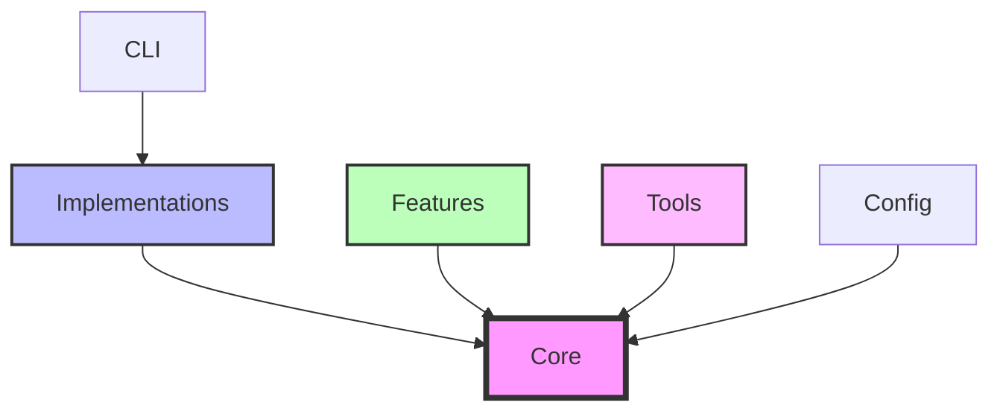

# InsightSpike Directory Structure

## 📁 Overview

After the 2025-07-18 refactoring, InsightSpike follows a clean architecture with clear separation of concerns.

## 🗂️ Directory Layout

```
src/insightspike/
├── core/                        # Core data structures and utilities
│   ├── base/                   # Base interfaces (DataStore, etc.)
│   │   └── datastore.py       # Abstract DataStore interface
│   ├── contracts/              # Contract definitions (placeholder)
│   ├── episode.py             # Core Episode data structure
│   ├── error_handler.py       # Exception classes and logging
│   └── memory_graph/          # Memory and graph structures
│       ├── knowledge_graph_memory.py
│       └── scalable_graph_manager.py
│
├── implementations/            # Concrete implementations
│   ├── agents/                # Agent implementations
│   │   ├── main_agent.py      # MainAgent for Q&A
│   │   ├── configurable_agent.py  # Configurable agent (planned)
│   │   └── agent_factory.py   # Agent creation utilities
│   ├── layers/                # Layer implementations
│   │   ├── layer1_error_monitor.py
│   │   ├── layer2_memory_manager.py
│   │   ├── layer2_compatibility.py  # Backward compatibility
│   │   ├── layer3_graph_reasoner.py
│   │   ├── layer4_llm_interface.py
│   │   ├── layer4_prompt_builder.py
│   │   └── scalable_graph_builder.py
│   ├── datastore/             # DataStore implementations
│   │   ├── factory.py         # DataStore factory
│   │   └── filesystem.py      # FileSystem DataStore
│   └── memory/                # Memory implementations (placeholder)
│
├── features/                  # Feature modules
│   ├── query_transformation/  # Query transformation feature
│   │   ├── query_transformer.py
│   │   ├── query_state.py
│   │   └── graph_explorer.py
│   └── graph_reasoning/       # Graph reasoning features
│
├── tools/                     # Standalone tools
│   ├── standalone/           # Tools that work independently
│   │   └── standalone_l3.py  # Standalone L3 reasoner
│   └── experiments/          # Experiment utilities
│       ├── __init__.py       # Experiment exports
│       ├── experiment_runner.py  # ExperimentRunner class
│       └── demo_runner.py    # DemoRunner class
│
├── config/                    # Configuration system
│   ├── models.py             # Pydantic models (InsightSpikeConfig)
│   ├── loader.py             # Configuration loading (ConfigLoader)
│   ├── presets.py            # Configuration presets
│   ├── converter.py          # ConfigConverter for legacy support
│   ├── legacy_config.py      # Legacy config classes (to be removed)
│   └── simple_config.py      # Simple config (to be removed)
│
├── cli/                       # Command-line interface
│   ├── spike.py              # Main CLI with Typer
│   ├── __main__.py           # CLI entry point
│   ├── commands/             # CLI command implementations
│   │   └── deps.py           # Dependency commands
│   └── legacy.py             # Legacy CLI (deprecated)
│
├── utils/                     # Utility modules
├── algorithms/                # Algorithm implementations
├── memory/                    # Memory system
├── detection/                 # Spike detection
└── metrics/                   # Graph metrics
```

## 🏗️ Architecture Principles

### 1. **Core Package**
- Contains only abstract interfaces and data structures
- No concrete implementations
- Defines contracts that implementations must follow
- Minimal dependencies

### 2. **Implementations Package**
- All concrete implementations of core interfaces
- Organized by type (agents, layers, memory)
- Can have external dependencies
- Easily swappable implementations

### 3. **Features Package**
- Self-contained feature modules
- Can be enabled/disabled independently
- Clear boundaries and interfaces
- Examples: query transformation, graph reasoning

### 4. **Tools Package**
- Standalone utilities that can work independently
- Experimental frameworks
- Research tools
- Can be extracted to separate projects

## 🔄 Import Examples

### Before (old structure):
```python
from insightspike.core.agents.configurable_agent import ConfigurableAgent
from insightspike.core.layers.layer2_memory_manager import L2MemoryManager
from insightspike.core.query_transformation import QueryTransformer
```

### After (new structure):
```python
from insightspike.implementations.agents.configurable_agent import ConfigurableAgent
from insightspike.implementations.layers.layer2_memory_manager import L2MemoryManager
from insightspike.features.query_transformation import QueryTransformer
```

## 🎯 Benefits

1. **Clear Separation**: Interfaces vs implementations
2. **Better Testing**: Mock implementations easily
3. **Modularity**: Features can be added/removed cleanly
4. **Maintainability**: Clear where to find things
5. **Extensibility**: Easy to add new implementations
6. **SOLID Principles**: Following clean architecture

## 📦 Package Dependencies



## 🚀 Migration Guide

If you're updating from the old structure:

1. Update imports to use new paths
2. Core interfaces remain the same
3. All functionality is preserved
4. Backward compatibility maintained through `__init__.py`

See the migration documentation for detailed steps.