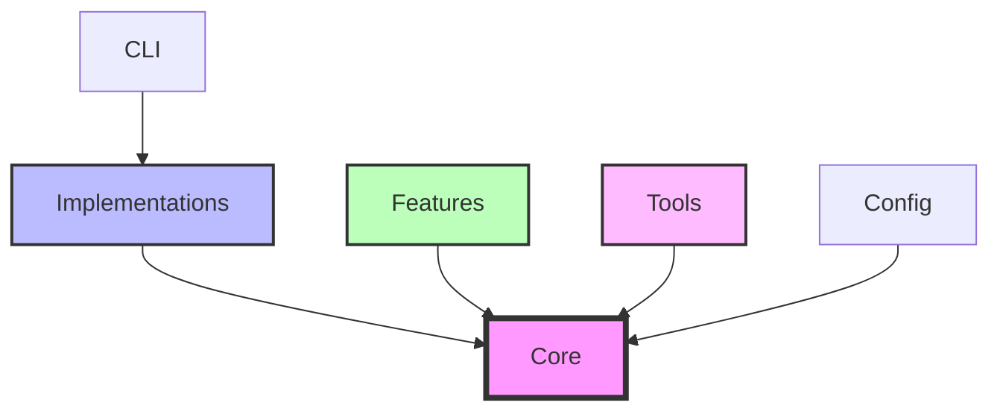

# InsightSpike Directory Structure

## 📁 Overview

After the 2025-07-18 refactoring, InsightSpike follows a clean architecture with clear separation of concerns.

## 🗂️ Directory Layout

```
src/insightspike/
├── core/                        # Core interfaces and base classes ONLY
│   ├── agents/                 # Agent interfaces
│   │   └── generic_agent.py    # GenericReasoner interface
│   ├── base/                   # Base classes
│   │   └── datastore.py       # Abstract DataStore interface
│   ├── interfaces/             # Layer interfaces
│   │   ├── generic_interfaces.py  # EnvironmentState, etc.
│   │   ├── layer_interfaces.py    # L1-L4 interfaces
│   │   └── __init__.py
│   ├── episode.py             # Core Episode data structure
│   └── error_handler.py       # Exception classes and logging
│
├── implementations/            # All concrete implementations
│   ├── agents/                # Agent implementations
│   │   ├── main_agent.py      # MainAgent for Q&A (primary)
│   │   └── configurable_agent.py  # Configurable agent
│   ├── layers/                # Layer implementations (unified)
│   │   ├── layer1_error_monitor.py     # L1: Error detection
│   │   ├── layer2_memory_manager.py    # L2: Memory + aging
│   │   ├── layer2_compatibility.py     # L2: Backward compat
│   │   ├── layer2_working_memory.py    # L2: DataStore variant
│   │   ├── layer3_graph_reasoner.py    # L3: Graph analysis
│   │   ├── layer4_llm_interface.py     # L4: LLM providers
│   │   ├── layer4_prompt_builder.py    # L4: Prompt generation
│   │   └── scalable_graph_builder.py   # Graph construction
│   └── datastore/             # Storage implementations
│       ├── filesystem_store.py  # FileSystem storage
│       └── __init__.py
│
├── features/                  # Optional feature modules
│   ├── graph_reasoning/       # Graph analysis features
│   │   ├── graph_analyzer.py  # Graph metrics calculator
│   │   └── reward_calculator.py  # Reward computation
│   └── query_transformation/  # Query processing (unused)
│
├── algorithms/                # Core algorithms
│   ├── graph_edit_distance.py # GED calculation
│   ├── information_gain.py    # IG calculation
│   ├── similarity_entropy.py  # Entropy metrics
│   └── __init__.py
│
├── config/                    # Pydantic configuration system
│   ├── models.py             # Config models (InsightSpikeConfig)
│   ├── loader.py             # Configuration loading
│   ├── presets.py            # Built-in presets
│   ├── converter.py          # Legacy conversion
│   ├── constants.py          # Default values
│   └── legacy_config.py      # Legacy support (deprecated)
│
├── cli/                       # Command-line interfaces
│   ├── spike.py              # Main CLI (improved)
│   ├── commands/             # CLI command modules
│   │   ├── discover.py       # Discover insights
│   │   ├── bridge.py         # Bridge concepts
│   │   ├── graph.py          # Graph visualization
│   │   └── __init__.py
│   └── __init__.py
│
├── metrics/                   # Metric calculations
│   ├── graph_metrics.py      # Graph analysis metrics
│   └── __init__.py
│
└── utils/                     # Utility functions
    ├── file_utils.py         # File operations
    ├── embedding_utils.py    # Embedding helpers
    └── __init__.py
```

## 🏗️ Architecture Principles

### 1. **Core Package**
- Contains only abstract interfaces and data structures
- No concrete implementations
- Defines contracts that implementations must follow
- Minimal dependencies

### 2. **Implementations Package**
- All concrete implementations of core interfaces
- Organized by type (agents, layers, memory)
- Can have external dependencies
- Easily swappable implementations

### 3. **Features Package**
- Self-contained feature modules
- Can be enabled/disabled independently
- Clear boundaries and interfaces
- Examples: query transformation, graph reasoning

### 4. **Tools Package**
- Standalone utilities that can work independently
- Experimental frameworks
- Research tools
- Can be extracted to separate projects

## 🔄 Import Examples

### Current structure (July 2025):
```python
# Interfaces (from core)
from insightspike.core.interfaces.layer_interfaces import L2MemoryInterface
from insightspike.core.interfaces.generic_interfaces import EnvironmentState
from insightspike.core.agents.generic_agent import GenericReasoner

# Implementations
from insightspike.implementations.agents.main_agent import MainAgent
from insightspike.implementations.layers.layer2_memory_manager import L2MemoryManager
from insightspike.implementations.layers.layer3_graph_reasoner import L3GraphReasoner

# Features
from insightspike.features.graph_reasoning.reward_calculator import RewardCalculator
from insightspike.features.graph_reasoning.graph_analyzer import GraphAnalyzer

# Algorithms
from insightspike.algorithms.graph_edit_distance import calculate_graph_edit_distance
from insightspike.algorithms.information_gain import calculate_information_gain

# Configuration
from insightspike.config import load_config, InsightSpikeConfig
from insightspike.config.presets import ConfigPresets
```

## 🎯 Key Changes (July 2025)

### Removed/Deprecated:
- ❌ `config.reasoning` → Use `config.graph` instead
- ❌ Legacy methods: `_detect_spike`, `save_graph`, `load_graph`
- ❌ 13 experimental CLI commands
- ❌ `tools/` package (moved to experiments)
- ❌ Multiple duplicate layer implementations

### Added/Improved:
- ✅ Unified layer implementations
- ✅ Memory aging system (time-based decay)
- ✅ Intelligent episode merging (cosine similarity)
- ✅ Pydantic configuration with presets
- ✅ Clean separation of interfaces and implementations
- ✅ Test coverage improved (17% → 23%)

## 🎯 Benefits

1. **Clear Separation**: Interfaces in `core/`, implementations in `implementations/`
2. **Better Testing**: Easy to mock interfaces
3. **Modularity**: Features are self-contained
4. **Type Safety**: Pydantic models for configuration
5. **Extensibility**: Easy to add new implementations
6. **Clean Architecture**: Following SOLID principles

## 📦 Package Dependencies



## 🚀 Migration Guide

If you're updating from the old structure:

1. Update imports to use new paths
2. Core interfaces remain the same
3. All functionality is preserved
4. Backward compatibility maintained through `__init__.py`

See the migration documentation for detailed steps.