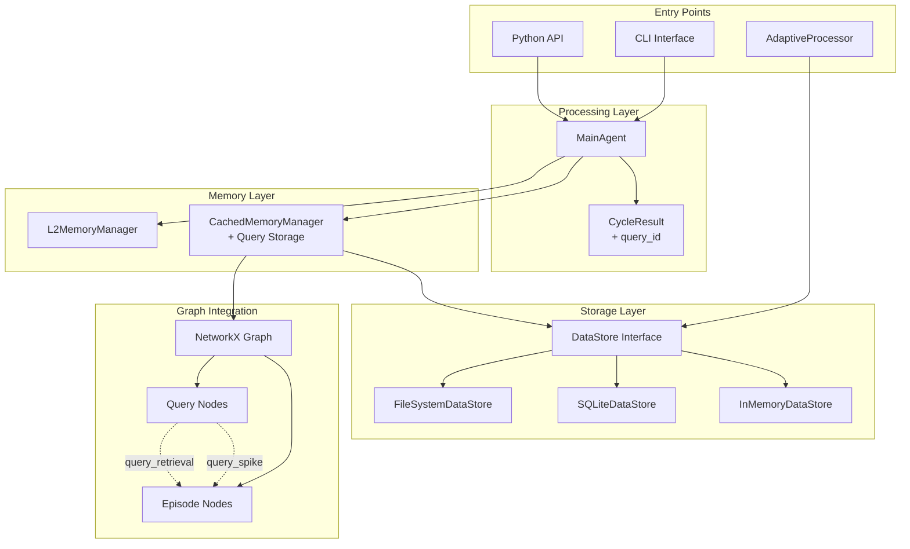

# Query Storage System Architecture

## Overview

The Query Storage System is a comprehensive feature that enables InsightSpike-AI to persist, track, and analyze all user queries throughout the system lifecycle. This system is deeply integrated with the existing DataStore abstraction and knowledge graph infrastructure.

## System Architecture

### Component Overview



## Data Model

### Query Structure

```python
@dataclass
class StoredQuery:
    id: str                          # query_<timestamp>_<uuid>
    text: str                        # Original query text
    vec: Optional[np.ndarray]        # 384-dim embedding vector
    has_spike: bool                  # Whether spike was generated
    spike_episode_id: Optional[str]  # ID of generated episode
    response: str                    # Response given to user
    timestamp: float                 # Unix timestamp
    metadata: Dict[str, Any]         # Processing metadata
```

### Metadata Fields

```python
{
    # Core metrics
    "processing_time": float,        # Total processing duration
    "llm_provider": str,            # Provider used (openai, anthropic, etc)
    "total_cycles": int,            # Number of reasoning cycles
    
    # Quality metrics
    "reasoning_quality": float,      # 0.0-1.0 quality score
    "confidence": float,            # Response confidence
    "coherence": float,             # Logical coherence score
    
    # Graph metrics
    "retrieved_episode_count": int,  # Episodes retrieved for context
    "graph_node_count": int,        # Total nodes in graph
    "graph_edge_count": int,        # Total edges in graph
    
    # Memory metrics
    "memory_searches": int,         # Number of memory searches
    "context_length": int,          # Total context tokens
    
    # Optional fields
    "error": Optional[str],         # Error message if failed
    "exploration_path": List[str],  # Reasoning path taken
    "experiment_id": Optional[str], # For experiment tracking
}
```

## Integration Points

### 1. MainAgent Integration

The MainAgent automatically saves queries after processing:

```python
# In MainAgent.process_question()
def process_question(self, question: str) -> CycleResult:
    start_time = time.time()
    
    # ... processing logic ...
    
    # Save query if datastore available
    if self.datastore and hasattr(self.datastore, 'save_queries'):
        query_id = self._save_query(
            query_text=question,
            query_vec=query_embedding,
            has_spike=has_spike,
            spike_episode_id=spike_episode_id,
            response=final_response,
            metadata={
                "processing_time": time.time() - start_time,
                "llm_provider": self.llm_provider,
                "total_cycles": cycle_count,
                # ... other metadata
            }
        )
        result.query_id = query_id
```

### 2. CachedMemoryManager Integration

The CachedMemoryManager adds queries to the knowledge graph:

```python
def add_query_to_graph(
    self,
    graph: nx.Graph,
    query_id: str,
    query_text: str,
    query_vec: np.ndarray,
    has_spike: bool,
    spike_episode_id: Optional[str] = None,
    retrieved_episode_ids: Optional[List[str]] = None,
    metadata: Optional[Dict[str, Any]] = None
) -> bool:
    # Add query node
    graph.add_node(
        query_id,
        type="query",
        text=query_text,
        vec=query_vec,
        has_spike=has_spike,
        timestamp=time.time(),
        metadata=metadata or {}
    )
    
    # Add edges to episodes
    if has_spike and spike_episode_id:
        # Edge to generated episode
        graph.add_edge(
            query_id,
            spike_episode_id,
            weight=1.0,
            edge_type="query_spike"
        )
    
    if retrieved_episode_ids:
        # Edges to retrieved episodes
        for episode_id in retrieved_episode_ids:
            similarity = self._calculate_similarity(query_vec, episode_vec)
            graph.add_edge(
                query_id,
                episode_id,
                weight=similarity,
                edge_type="query_retrieval"
            )
```

### 3. AdaptiveProcessor Integration

AdaptiveProcessor can optionally save queries:

```python
def __init__(self, ..., datastore: Optional[DataStore] = None):
    self.datastore = datastore
    
def process(self, question: str) -> ProcessingResult:
    # ... processing ...
    
    if self.datastore:
        self._save_query_to_datastore(question, result)
```

## Storage Backends

### FileSystemDataStore

- **Location**: `<base_path>/queries/queries.json`
- **Format**: Newline-delimited JSON
- **Appends**: New queries appended to file
- **Vector Storage**: Base64-encoded numpy arrays

```json
{"id": "query_1234567890_abc", "text": "What is insight?", "has_spike": true, ...}
{"id": "query_1234567891_def", "text": "How does memory work?", "has_spike": false, ...}
```

### SQLiteDataStore

- **Table**: `queries`
- **Schema**:
  ```sql
  CREATE TABLE queries (
      id TEXT PRIMARY KEY,
      text TEXT NOT NULL,
      vec BLOB,
      has_spike INTEGER,
      spike_episode_id TEXT,
      response TEXT,
      timestamp REAL,
      metadata TEXT,
      created_at TIMESTAMP DEFAULT CURRENT_TIMESTAMP
  );
  
  CREATE INDEX idx_queries_timestamp ON queries(timestamp);
  CREATE INDEX idx_queries_has_spike ON queries(has_spike);
  ```

### InMemoryDataStore

- **Storage**: Python dict in memory
- **Persistence**: None (testing only)
- **Performance**: Fastest for small datasets

## Query Analysis Features

### 1. Basic Statistics

```python
def get_query_statistics(self) -> Dict[str, Any]:
    queries = self.datastore.load_queries()
    
    return {
        "total_queries": len(queries),
        "spike_count": sum(1 for q in queries if q["has_spike"]),
        "spike_rate": spike_count / total if total > 0 else 0,
        "avg_processing_time": np.mean([q["metadata"]["processing_time"] for q in queries]),
        "llm_providers": Counter([q["metadata"]["llm_provider"] for q in queries]),
        "time_range": {
            "earliest": min(q["timestamp"] for q in queries),
            "latest": max(q["timestamp"] for q in queries)
        }
    }
```

### 2. Pattern Analysis

```python
def analyze_query_patterns(self) -> Dict[str, Any]:
    # Length analysis
    query_lengths = [len(q["text"].split()) for q in queries]
    
    # Complexity vs success
    simple_queries = [q for q in queries if len(q["text"].split()) <= 3]
    complex_queries = [q for q in queries if len(q["text"].split()) > 10]
    
    # Time-based patterns
    hourly_distribution = self._group_by_hour(queries)
    daily_trends = self._calculate_daily_trends(queries)
    
    return {
        "avg_query_length": np.mean(query_lengths),
        "simple_spike_rate": self._spike_rate(simple_queries),
        "complex_spike_rate": self._spike_rate(complex_queries),
        "peak_hours": hourly_distribution,
        "daily_trends": daily_trends
    }
```

### 3. Performance Analysis

```python
def analyze_performance(self) -> Dict[str, Any]:
    # Provider performance
    provider_metrics = defaultdict(list)
    for query in queries:
        provider = query["metadata"]["llm_provider"]
        provider_metrics[provider].append({
            "time": query["metadata"]["processing_time"],
            "success": query["has_spike"],
            "quality": query["metadata"].get("reasoning_quality", 0)
        })
    
    # Calculate aggregates
    results = {}
    for provider, metrics in provider_metrics.items():
        results[provider] = {
            "avg_time": np.mean([m["time"] for m in metrics]),
            "success_rate": sum(m["success"] for m in metrics) / len(metrics),
            "avg_quality": np.mean([m["quality"] for m in metrics])
        }
    
    return results
```

## Graph Analysis

### Query-Episode Relationships

```python
def analyze_query_graph_relationships(self, graph: nx.Graph) -> Dict[str, Any]:
    query_nodes = [n for n in graph.nodes() if graph.nodes[n].get("type") == "query"]
    
    results = {
        "total_query_nodes": len(query_nodes),
        "queries_with_spikes": sum(1 for n in query_nodes if graph.nodes[n]["has_spike"]),
        "avg_retrieval_connections": np.mean([
            len([e for e in graph.edges(n) if graph.edges[e].get("edge_type") == "query_retrieval"])
            for n in query_nodes
        ])
    }
    
    # Analyze query clustering
    if query_nodes:
        embeddings = np.array([graph.nodes[n]["vec"] for n in query_nodes])
        clusters = self._cluster_queries(embeddings)
        results["query_clusters"] = clusters
    
    return results
```

## Performance Considerations

### 1. Storage Optimization

- **Batch Saves**: Save queries in batches during high-throughput scenarios
- **Vector Compression**: Consider dimensionality reduction for long-term storage
- **Archival**: Move old queries to archive storage after threshold

### 2. Query Performance

- **Indexing**: Ensure proper indices on timestamp and has_spike fields
- **Pagination**: Use limit/offset for large query sets
- **Caching**: Cache frequently accessed statistics

### 3. Memory Management

- **Graph Size**: Limit query nodes in graph to recent N queries
- **Vector Storage**: Consider external vector DB for large-scale deployments
- **Cleanup**: Implement TTL for query data

## Security & Privacy

### 1. Data Sanitization

```python
def sanitize_query_for_storage(query: Dict[str, Any]) -> Dict[str, Any]:
    # Remove sensitive metadata
    sensitive_keys = ["api_key", "user_id", "session_token"]
    for key in sensitive_keys:
        query["metadata"].pop(key, None)
    
    # Optionally hash/anonymize query text
    if ANONYMIZE_QUERIES:
        query["text_hash"] = hashlib.sha256(query["text"].encode()).hexdigest()
        query["text"] = "[ANONYMIZED]"
    
    return query
```

### 2. Access Control

- Implement namespace isolation for multi-user scenarios
- Add query ownership metadata
- Restrict analysis to authorized users

## Migration Guide

### From Non-Query-Storing System

1. **Update Dependencies**:
   ```bash
   poetry update insightspike
   ```

2. **Enable Query Storage**:
   ```python
   # Ensure using DataStore
   datastore = FileSystemDataStore("data")
   agent = MainAgent(config=config, datastore=datastore)
   ```

3. **Verify Storage**:
   ```python
   # After processing
   queries = datastore.load_queries(limit=1)
   assert len(queries) > 0
   ```

### Upgrading Storage Backend

```python
# Migrate from FileSystem to SQLite
def migrate_queries(old_store: FileSystemDataStore, new_store: SQLiteDataStore):
    queries = old_store.load_queries()
    new_store.save_queries(queries)
    print(f"Migrated {len(queries)} queries")
```

## Future Enhancements

1. **Query Understanding**:
   - Intent classification
   - Query reformulation suggestions
   - Multi-turn conversation tracking

2. **Advanced Analytics**:
   - Time-series spike prediction
   - Query success prediction model
   - Automated insight pattern mining

3. **Integration Expansions**:
   - Webhook notifications for spike queries
   - Export to analytics platforms (Grafana, etc)
   - Real-time query monitoring dashboard

4. **Performance Optimizations**:
   - Distributed query storage
   - Query result caching
   - Predictive pre-computation

---

*Last updated: July 2025*