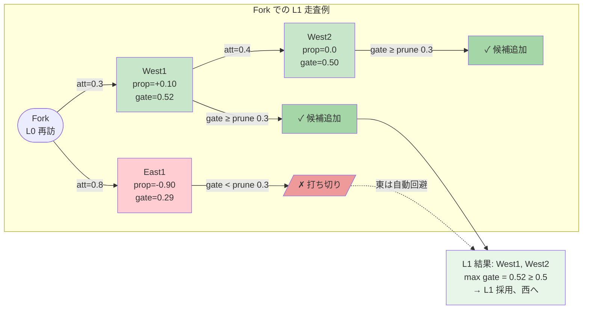
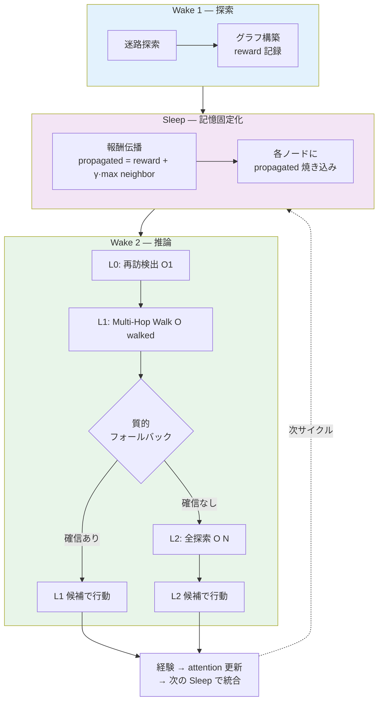

# 三層検索アーキテクチャ実装計画

**作成日**: 2026-02-09
**Status**: **Phase D-6b 完了 → 次フェーズ検討中**
**最終更新**: 2026-02-10（§20D Phase D-6b advantage-gated 実験完了）
**対象**: `experiments/maze/qhlib/` + `experiments/maze/run_experiment_query.py`
**根拠仕様**: `docs/research/thinking/memory_search_implementation_20260208.md`

---

## 1. 目的

現行の「SpatialGrid/L1プレフィルタ → 全候補距離計算 → 選択」フローを、
**不確実性に応じた三層検索**に置き換える。

```
計算量は不確実性に比例する。知っていることに計算を使わない。
```

| Layer | 判定 | 計算量 | 発火条件 |
|-------|------|--------|----------|
| Layer 0 | 完全一致（再訪判定） | O(1) | ハッシュヒット |
| Layer 1 | グラフ走査（attention参照） | O(degree) | 再訪 + attention > θ |
| Layer 2 | 記憶全ソート（現行ロジック相当） | O(N log N) | 新規 or L1候補不足 |

**期待効果:**
- 再訪時のLayer 2スキップ → 検索高速化
- attention重みによる候補品質向上
- β₁とattention閾値の連動 → 探索/活用の自動制御
- RAG等の大規模環境へのスケーラビリティ基盤

---

## 2. 現行アーキテクチャとの対応

### 2.1 現行フロー

```
クエリ到着
  ↓
[A] 観察候補生成（4方向、O(4)）           ← run_experiment_query.py:507-598
  ↓
[B] 記憶候補生成                          ← run_experiment_query.py:609-741
  ├─ SpatialGridIndex or L1 WeightedL2Index（プレフィルタ）
  └─ 全候補に weighted L2 距離計算
  ↓
[C] TwoThresholdSelector（θ_cand / θ_link） ← selector.py
  ↓
[D] build_ecand（候補エッジ組立）          ← edges.py
  ↓
[E] evaluate_multihop（マルチホップ評価）   ← evaluator.py
  ↓
[F] apply_commit_policy（グラフ更新）      ← commit.py
```

### 2.2 三層化後のフロー

```
クエリ到着: query_vector 生成
  ↓
[A] 観察候補生成（変更なし）
  ↓
[B'] 三層検索エンジン（[B]を置換）
  ├─ [Layer 0] VectorHashIndex.lookup() → 再訪判定 O(1)
  │     ├─ ヒット → [Layer 1]
  │     └─ ミス  → [Layer 2]
  │
  ├─ [Layer 1] AttentionGraphWalker.get_candidates() O(degree)
  │     ├─ 候補 ≥ min_layer1 → 候補確定、L2スキップ
  │     └─ 候補不足 → フォールスルー → [Layer 2]
  │
  └─ [Layer 2] 現行ロジック（SpatialGrid/L1 + weighted距離）
  ↓
[C] TwoThresholdSelector（変更なし、L2時のみ通過）
  ↓
[D'] build_ecand（L1候補 or L2候補を統合）
  ↓
[E] evaluate_multihop（変更なし）
  ↓
[F'] apply_commit_policy + AttentionManager
  ├─ 新エッジに attention=1.0 を付与
  └─ 全エッジ attention *= decay_rate（毎ステップ）
```

---

## 3. 新規ファイル

| ファイル | クラス | 行数見込み | 説明 |
|----------|--------|-----------|------|
| `qhlib/hash_index.py` | `VectorHashIndex` | ~80行 | Layer 0: 量子化ハッシュ再訪検出 |
| `qhlib/graph_walker.py` | `AttentionGraphWalker` | ~70行 | Layer 1: attention重み付きグラフ走査 |
| `qhlib/attention.py` | `AttentionManager` | ~60行 | エッジattentionライフサイクル管理 |
| `qhlib/search_engine.py` | `ThreeLayerSearchEngine` | ~100行 | 統合コントローラ（L0→L1→L2） |

**合計: ~310行の新規コード**

---

## 4. 既存ファイル変更

### 4.1 `qhlib/commit.py`（小変更）

**変更内容:** `add_edge()` 時に `attention=1.0` を付与

```python
# Phase 1: Hop-0 commit
if not graph.has_edge(current_query_node, dir_node):
    graph.add_edge(current_query_node, dir_node, attention=1.0)  # ← 追加

# Phase 2: Multi-hop commit
graph.add_edge(eu, ev, attention=1.0)  # ← 追加
```

**影響範囲:** 既存テストは `attention` 属性を参照しないため破壊なし。
**変更量:** ~5行

### 4.2 `qhlib/edges.py`（小変更）

**変更内容:** L1候補をecandに統合するパスを追加

```python
def build_ecand(
    *,
    # ... 既存パラメータ ...
    layer1_candidates: list[dict] | None = None,  # ← 新規パラメータ
) -> tuple[list, int, int]:
    # L1候補がある場合はそちらを優先
    if layer1_candidates:
        return _build_ecand_from_layer1(layer1_candidates, current_query_node, prev_graph)
    # 既存ロジック（L2フォールバック時）
    ...
```

**変更量:** ~20行

### 4.3 `qhlib/models.py`（小変更）

**変更内容:** StepRecord に三層検索診断フィールド追加

```python
@dataclass
class StepRecord:
    # ... 既存フィールド ...

    # 三層検索診断（デフォルト値あり、後方互換）
    search_layer_used: int = -1          # 0, 1, 2 (-1 = legacy)
    search_is_revisit: bool = False
    search_revisit_similarity: float = 0.0
    search_time_ms: float = 0.0
    search_l1_candidates: int = 0
```

**変更量:** ~10行

### 4.4 `run_experiment_query.py`（中変更）

**変更内容:** `--search-mode` フラグで三層検索を有効化

```python
# CLI引数追加
parser.add_argument("--search-mode", choices=["legacy", "threelayer"],
                    default="legacy")

# 初期化（search-mode=threelayer時のみ）
if config.search_mode == "threelayer":
    search_engine = ThreeLayerSearchEngine(
        hash_resolution=1.0 / config.maze_size,
        theta_revisit=0.95,
        theta_attention=config.theta_attention,
        weight_vector=WEIGHT_VECTOR,
        top_k=config.candidate_cap,
    )
    attention_mgr = AttentionManager(
        decay_rate=config.attention_decay,
        use_boost=config.attention_boost,
        theta=config.theta_attention,
    )

# ステップループ内（lines 609-741 の置換）
if config.search_mode == "threelayer":
    search_result = search_engine.search(query_vec, graph, memory_pool)
    if search_result.layer_used <= 1:
        # L0/L1ヒット: セレクタ・build_ecandをショートカット
        ecand = _ecand_from_search_result(search_result, current_query_node)
    else:
        # L2: 現行ロジックにフォールスルー
        ... (既存コード)
else:
    ... (既存コード、変更なし)

# コミット後: attention更新
if config.search_mode == "threelayer":
    attention_mgr.on_step(graph)           # 全エッジ減衰
    for eu, ev in committed_edges:
        attention_mgr.on_traverse(graph, eu, ev)  # 通過エッジ強化
    search_engine.register(current_query_node, query_vec)  # ハッシュ登録
```

**変更量:** ~80行（ただし既存コードの構造変更なし、if分岐の追加のみ）

### 4.5 `qhlib/models.py` — QueryHubConfig（小変更）

```python
@dataclass
class QueryHubConfig:
    # ... 既存フィールド ...
    search_mode: str = "legacy"
    theta_attention: float = 0.3
    attention_decay: float = 0.95
    attention_boost: float = 0.1
    attention_alpha: float = 0.5
    min_layer1_candidates: int = 2
```

**変更量:** ~10行

---

## 5. 実装フェーズ

### Phase 1: 独立コンポーネント実装（Day 1）

```
[1-1] qhlib/hash_index.py     — VectorHashIndex
[1-2] qhlib/graph_walker.py   — AttentionGraphWalker
[1-3] qhlib/attention.py      — AttentionManager
[1-4] qhlib/search_engine.py  — ThreeLayerSearchEngine
[1-5] 単体テスト
```

**依存関係:** なし。4ファイル並行作成可能。
**テスト方針:** 小規模グラフ（10ノード程度）でL0→L1→L2の各パスを検証。

### Phase 2: 統合（Day 2）

```
[2-1] commit.py に attention=1.0 付与追加
[2-2] edges.py に L1候補統合パス追加
[2-3] models.py に診断フィールド追加
[2-4] QueryHubConfig にパラメータ追加
[2-5] run_experiment_query.py に --search-mode threelayer 追加
```

**依存関係:** Phase 1 完了後。
**テスト方針:** `--search-mode legacy` で既存テスト全パスを確認後、`--search-mode threelayer` で9x9迷路スモークテスト。

### Phase 3: 検証実験（Day 3）

```
[3-1] 9x9 迷路: legacy vs threelayer 比較（3 seeds）
[3-2] 25x25 迷路: legacy vs threelayer 比較（5 seeds）
[3-3] dfs_loops 迷路: threelayer でβ₁/attention動態確認
```

**計測指標:**
- L1ヒット率（再訪時のL2スキップ率）
- 検索時間（L1 vs L2 の実測速度差）
- 候補品質（effective_score上位の候補が実際に良い選択か）
- β₁推移（探索↑ Sleep↓ のサイクルが出るか）

---

## 6. リスク管理

| リスク | 対策 |
|--------|------|
| 既存実験の再現性が壊れる | `--search-mode legacy` がデフォルト。既存コード変更なし |
| attention閾値のチューニング不足 | 初期値は仕様書準拠（θ=0.3, decay=0.95, boost=0.1）。実験で調整 |
| AttentionManager.on_step() のO(E)コスト | 25x25迷路のE=数百程度なら無視可能。大規模時はバッチ更新に移行 |
| L1候補品質が低い | min_layer1_candidates=2 をパラメータ化。不足時はL2フォールスルー |
| 切り戻し | `pre-betti1-baseline` ブランチが既存。追加で実装前にブランチ作成 |

---

## 7. 変更量サマリ

| カテゴリ | ファイル数 | 行数 |
|----------|-----------|------|
| 新規作成 | 4 | ~310行 |
| 既存変更 | 5 | ~125行 |
| テスト | 1-2 | ~100行 |
| **合計** | **10-11** | **~535行** |

---

## 8. 成功基準

1. `--search-mode legacy` で既存テスト全パス（回帰なし）
2. `--search-mode threelayer` で9x9/25x25スモークテスト通過
3. L1ヒット率 > 0%（再訪時にL2スキップが発生する）
4. threelayer の候補品質が legacy と同等以上（ゴール到達率で比較）
5. 25x25迷路でステップあたり検索時間が legacy 以下

---

## 9. テスト計画

### 9.1 単体テスト（Phase 1 完了時）

各コンポーネントを独立にテストする。テストファイル: `experiments/maze/test/test_threelayer.py`

#### VectorHashIndex

| # | テストケース | 入力 | 期待結果 |
|---|-------------|------|----------|
| H1 | 空インデックスからのlookup | 任意ベクトル | 空リスト |
| H2 | 登録→同一ベクトルlookup | vec=[0.5, 0.5] → lookup([0.5, 0.5]) | ヒット、sim ≈ 1.0 |
| H3 | 近傍ベクトルlookup | vec=[0.5, 0.5] → lookup([0.51, 0.49]) | resolution依存。resolution=0.05ならヒット |
| H4 | 遠方ベクトルlookup | vec=[0.5, 0.5] → lookup([0.9, 0.1]) | ミス（空リスト） |
| H5 | 複数登録→正しいノードID返却 | 3ノード登録、1つにヒット | 正しいnode_idのみ返却 |
| H6 | 量子化境界テスト | vec=[0.049, 0.0] → lookup([0.051, 0.0]) | lookup_with_neighbors使用時のみヒット |

#### AttentionGraphWalker

| # | テストケース | 入力 | 期待結果 |
|---|-------------|------|----------|
| W1 | 全エッジattention > θ | 3ノードグラフ、全att=1.0 | 全隣接ノード返却 |
| W2 | 全エッジattention < θ | 3ノードグラフ、全att=0.1 | 空リスト |
| W3 | 混在 | att=[1.0, 0.1, 0.5]、θ=0.3 | att>θの2エッジのみ |
| W4 | 再訪ノードがグラフに存在しない | 不在ノード指定 | 空リスト |
| W5 | effective_scoreソート順 | att=[0.9, 0.5]、sim=[0.3, 0.8] | score計算後に正しい降順 |

#### AttentionManager

| # | テストケース | 入力 | 期待結果 |
|---|-------------|------|----------|
| A1 | on_new_edge | 新エッジ追加 | attention=1.0, use_count=0 |
| A2 | on_step（減衰） | att=1.0, decay=0.95 | att=0.95 |
| A3 | on_step×10 | att=1.0, decay=0.95 | att≈0.5987 |
| A4 | on_traverse（強化） | att=0.5, boost=0.1 | att=0.6 |
| A5 | on_traverse上限 | att=0.95, boost=0.1 | att=1.0（min制限） |
| A6 | beta1計算 | 三角形グラフ、全att>θ | β₁=1 |
| A7 | beta1（att < θのエッジ除外） | 三角形、1辺att<θ | β₁=0（サイクル消滅） |

#### ThreeLayerSearchEngine

| # | テストケース | 入力 | 期待結果 |
|---|-------------|------|----------|
| E1 | 新規地点（L0ミス） | 未登録ベクトルでsearch | layer_used=2, is_revisit=False |
| E2 | 再訪（L0ヒット→L1十分） | 登録済みベクトル、隣接att>θが2以上 | layer_used=1, is_revisit=True |
| E3 | 再訪（L0ヒット→L1不足→L2） | 登録済みだが隣接att<θ | layer_used=2, is_revisit=True |
| E4 | register→lookup往復 | register後に同一ベクトルでsearch | L0ヒット |
| E5 | stats正確性 | L0→L1を3回、L2を2回 | stats['L1']=3, stats['L2']=2, L1_skip_rate=0.6 |

### 9.2 統合テスト（Phase 2 完了時）

テストファイル: `experiments/maze/test/test_threelayer_integration.py`

| # | テストケース | 手順 | 期待結果 |
|---|-------------|------|----------|
| I1 | 9x9迷路スモーク（threelayer） | `--maze-size 9 --max-steps 50 --seeds 1 --search-mode threelayer` | 完走、JSON出力にsearch_layer_usedあり |
| I2 | 9x9迷路スモーク（legacy） | `--maze-size 9 --max-steps 50 --seeds 1 --search-mode legacy` | 完走、search_layer_used=-1 |
| I3 | L1ヒット発生確認 | I1の出力JSONでsearch_layer_used=1のステップ数 | > 0（再訪が起きる迷路ならL1ヒットあり） |
| I4 | commit後のattention属性 | I1完了後のグラフエッジ | 全エッジにattention属性あり |
| I5 | attention減衰確認 | I1の途中ステップでattention < 1.0のエッジ | 存在する（on_stepで減衰） |

### 9.3 エンドツーエンドテスト（Phase 3）

テストスクリプト: `experiments/maze/test/run_threelayer_comparison.sh`

```bash
# 自動比較: legacy vs threelayer を同一seed/パラメータで実行し結果を比較
for MODE in legacy threelayer; do
  python run_experiment_query.py \
    --maze-size 25 --max-steps 500 --seeds 5 --seed-start 0 \
    --max-hops 10 --sp-cand-topk 5 \
    --search-mode $MODE \
    --output results/e2e_${MODE}.json
done
python compare_results.py results/e2e_legacy.json results/e2e_threelayer.json
```

比較スクリプト `compare_results.py` の出力項目:

| 指標 | 比較方法 | 許容基準 |
|------|----------|----------|
| ゴール到達率 | 成功seed数 | threelayer ≥ legacy |
| 平均ステップ数 | 成功seedの平均steps | threelayer ≤ legacy × 1.2 |
| 平均検索時間/step | time_ms_candidates の平均 | threelayer ≤ legacy |
| L1ヒット率 | search_layer_used=1 の割合 | > 0%（threelayerのみ） |
| 最終β₁ | betti1_series[-1] の平均 | 有意差なし |
| 最終ノード数 | node_count_series[-1] | 有意差なし |

---

## 10. 後方互換性検証計画

### 10.1 原則

**`--search-mode legacy`（デフォルト）では、変更前と完全に同一の動作をすること。**

三層検索の全コードは `if config.search_mode == "threelayer"` ガードの内側にあり、
legacyモードでは一切実行されない。

### 10.2 検証手順

#### Step 1: 変更前ベースライン取得

```bash
# 実装開始前に、現行mainでベースライン結果を保存
git stash  # or checkout pre-implementation branch
python run_experiment_query.py \
  --maze-size 9 --max-steps 100 --seeds 3 \
  --max-hops 10 --sp-cand-topk 5 \
  --vector-mode extended --sp-mode both \
  --output results/compat_baseline.json
```

#### Step 2: 変更後legacy結果取得

```bash
# 実装完了後、legacyモードで同一パラメータ実行
python run_experiment_query.py \
  --maze-size 9 --max-steps 100 --seeds 3 \
  --max-hops 10 --sp-cand-topk 5 \
  --vector-mode extended --sp-mode both \
  --search-mode legacy \
  --output results/compat_after_legacy.json
```

#### Step 3: バイナリ比較

```python
# validate_compatibility.py
import json, sys

def compare(baseline_path, after_path):
    with open(baseline_path) as f: base = json.load(f)
    with open(after_path) as f: after = json.load(f)

    checks = []

    for seed_idx in range(len(base['runs'])):
        b = base['runs'][seed_idx]
        a = after['runs'][seed_idx]

        # 同一seed → 同一結果であること
        checks.append(('success', b['success'] == a['success']))
        checks.append(('steps', b['steps'] == a['steps']))
        checks.append(('final_position', b.get('final_position') == a.get('final_position')))

        # 時系列長一致
        for key in ['g0_series', 'gmin_series', 'node_count_series',
                     'edge_count_series', 'betti1_series']:
            b_len = len(b.get(key, []))
            a_len = len(a.get(key, []))
            checks.append((f'{key}_len', b_len == a_len))

        # g0値一致（浮動小数点→丸め比較）
        for i, (bg, ag) in enumerate(zip(b.get('g0_series', []),
                                          a.get('g0_series', []))):
            if abs(bg - ag) > 1e-9:
                checks.append((f'g0[{i}]', False))
                break
        else:
            checks.append(('g0_values', True))

    passed = sum(1 for _, ok in checks if ok)
    failed = [(name, ok) for name, ok in checks if not ok]
    print(f"Compatibility: {passed}/{len(checks)} passed")
    if failed:
        print("FAILURES:")
        for name, _ in failed:
            print(f"  - {name}")
        sys.exit(1)
    else:
        print("ALL PASSED — 後方互換性確認完了")

if __name__ == '__main__':
    compare(sys.argv[1], sys.argv[2])
```

#### Step 4: 既存テストスイート実行

```bash
# geDIG単体テスト（40テスト）
.venv_ci313/bin/python -m pytest tests/algorithms/gedig/ -v

# 迷路テスト
.venv_ci313/bin/python -m pytest experiments/maze/tests/ -v

# β₁スモークテスト
bash experiments/maze/test/run_betti1_smoke.sh
.venv/bin/python3 experiments/maze/test/validate_betti1.py
```

**合格基準:** 変更前と同一のテスト結果（既存の事前失敗12件は許容）

### 10.3 変更影響マトリクス

| 変更ファイル | legacy影響 | 理由 |
|-------------|-----------|------|
| `hash_index.py` (新規) | なし | legacyでは import されない |
| `graph_walker.py` (新規) | なし | legacyでは import されない |
| `attention.py` (新規) | なし | legacyでは import されない |
| `search_engine.py` (新規) | なし | legacyでは import されない |
| `commit.py` | **要検証** | attention=1.0 が既存エッジに影響しないか |
| `edges.py` | なし | layer1_candidates=None がデフォルト → 既存パス |
| `models.py` | なし | 新フィールドは全てデフォルト値あり |
| `run_experiment_query.py` | **要検証** | if分岐のみだがインポート追加あり |

### 10.4 commit.py の互換性詳細

`attention=1.0` をエッジに付与する変更は、legacyモードでも実行される（commit.pyは共通パス）。

**影響分析:**
- `graph.add_edge(u, v, attention=1.0)` → NetworkXは追加属性を無視する設計
- 既存コードで `graph[u][v]` を参照する箇所は `edge_type` のみ → attentionを参照しない
- evaluator.py の SP 計算は `weight` パラメータのみ使用 → attention は無関係

**結論:** 安全。ただし Step 3 のバイナリ比較で確認。

もしcommit.pyの変更が互換性リスクと判断される場合の代替案:
```python
# commit.py を変更せず、run_experiment_query.py で事後付与
if config.search_mode == "threelayer":
    for eu, ev in committed_edges:
        if graph.has_edge(eu, ev) and 'attention' not in graph[eu][ev]:
            graph[eu][ev]['attention'] = 1.0
```

---

## 11. 詳細実行計画

### Day 0: 準備（実装開始前）

```
[0-1] 切り戻しブランチ作成
      git checkout -b pre-threelayer-baseline
      git push origin pre-threelayer-baseline
      git checkout main

[0-2] 未コミット変更の整理
      β₁バグ修正 + betti1_comparison 実験スクリプトのコミット

[0-3] ベースライン結果取得
      9x9 × 3seeds / 25x25 × 5seeds を実行し結果保存
      → results/compat_baseline_9x9.json
      → results/compat_baseline_25x25.json
```

### Day 1: Phase 1 — 独立コンポーネント

```
[1-1] qhlib/hash_index.py 作成
      - VectorHashIndex クラス
      - _quantize, add, lookup, lookup_with_neighbors, size

[1-2] qhlib/graph_walker.py 作成
      - AttentionGraphWalker クラス
      - get_candidates, _weighted_similarity

[1-3] qhlib/attention.py 作成
      - AttentionManager クラス
      - on_new_edge, on_step, on_traverse, on_ag_fire, beta1

[1-4] qhlib/search_engine.py 作成
      - SearchResult dataclass
      - ThreeLayerSearchEngine クラス
      - search, register, get_stats

[1-5] 単体テスト作成・実行
      - test/test_threelayer.py
      - テストケース H1-H6, W1-W5, A1-A7, E1-E5（Section 9.1）
      - 全パス確認

[1-6] コミット
      "feat(qhlib): add three-layer search components"
```

### Day 2: Phase 2 — 統合

```
[2-1] models.py 変更
      - StepRecord に search_layer_used 等5フィールド追加
      - QueryHubConfig に search_mode 等6フィールド追加

[2-2] commit.py 変更
      - add_edge に attention=1.0 追加（2箇所）

[2-3] edges.py 変更
      - build_ecand に layer1_candidates パラメータ追加
      - _build_ecand_from_layer1 ヘルパー追加

[2-4] run_experiment_query.py 変更
      - CLI引数 --search-mode 追加
      - ThreeLayerSearchEngine 初期化
      - ステップループ内に三層検索パス追加
      - コミット後のattention更新追加

[2-5] 後方互換性検証
      - legacyモードでベースライン比較（Section 10.2 Step 2-3）
      - 既存テストスイート実行（Section 10.2 Step 4）

[2-6] 統合テスト実行
      - テストケース I1-I5（Section 9.2）

[2-7] コミット
      "feat(maze): integrate three-layer search with --search-mode flag"
```

### Day 3: Phase 3 — 検証実験

```
[3-1] 9x9 迷路比較実験
      - legacy × 3seeds vs threelayer × 3seeds
      - compare_results.py で比較

[3-2] 25x25 迷路比較実験
      - legacy × 5seeds vs threelayer × 5seeds
      - L1ヒット率、検索時間、到達率を比較

[3-3] dfs_loops 25x25 迷路
      - threelayer × 3seeds
      - β₁/attention動態の可視化

[3-4] 結果分析レポート作成
      - experiments/maze/threelayer_comparison/REPORT.md

[3-5] コミット
      "experiment(maze): three-layer search comparison results"
```

---

## 12. ドキュメント定義変更のゲート条件

三層検索とβ₁の導入に伴い、論文・README等の定義記述をいつ更新するかの判断基準。
**早すぎる定義変更は混乱を招く。エビデンスに基づいて段階的に更新する。**

### 12.1 ゲート一覧

```
今 ──── Gate 1 ──── Gate 2 ──── Gate 3 ──── Gate 4
          │            │            │            │
     実装完了      L1効果実証   β₁/ASP相関   相転移実証
          │            │            │            │
      変更なし    README軽微   論文F定義     論文理論章
```

### Gate 1: 実装完了（Phase 2 終了時）

**条件:** 三層検索が `--search-mode threelayer` で動作する
**ドキュメント変更:** なし
**理由:** 「動く」だけでは定義変更の根拠にならない

### Gate 2: L1効果実証（Phase 3 終了時）

**条件（全て満たすこと）:**
- L1ヒット率 > 20%（再訪時の2割以上でL2スキップ）
- threelayer のゴール到達率 ≥ legacy
- 検索時間の実測で threelayer ≤ legacy

**変更対象:**
| ドキュメント | 変更内容 | 変更レベル |
|-------------|---------|-----------|
| README.md | Architecture節に「三層検索モード（オプション）」追記 | 軽微 |
| CHANGELOG | 機能追加として記載 | 軽微 |

**変更しないもの:**
- 論文のF分解定義（F = GED + IG + λ·SP）
- geDIGの数学的定義

### Gate 3: β₁/ASP相関判明（追加実験後）

**前提:** SP計算を有効にした60seed以上の実験が必要（現状delta_sp_seriesが全ゼロ）

**条件と分岐:**

| Spearman |ρ| | 判定 | 論文への影響 |
|-----------|------|----------------|
| > 0.7 | β₁でSP置換可能 | F = GED + IG + λ·β₁ に定義変更 |
| 0.4 - 0.7 | β₁はSPの部分情報 | F = GED + IG + λ·SP + μ·β₁（項追加） |
| < 0.4 | β₁はSPと独立 | β₁を新しい独立項として追加。SPは残す |

**変更対象:**
| ドキュメント | 変更内容 |
|-------------|---------|
| 論文（JSAI等） | F分解の定義式を更新 |
| README.md | Mathematical Framework節を更新 |
| `docs/research/` | β₁採用の理論的根拠文書を追加 |
| `src/` コード | gedig_core.py のcalculate()でβ₁をSP項に反映 |

### Gate 4: 相転移実証（将来）

**条件:**
- attention閾値θの掃引で β₁(θ) の相転移点が迷路で検出できる
- 相転移点が探索/活用モードの切り替えと一致する
- `beta1_navigation_routing_20260208.md` の理論が迷路で再現

**変更対象:**
| ドキュメント | 変更内容 |
|-------------|---------|
| 論文（理論セクション） | 「β₁相転移による自動階層化」の章を追加 |
| 特許出願書 | 迷路実施例 + 道路ネットワーク実施例を添付 |
| README.md | Theoretical Foundation節を追加 |

### 12.2 現在の到達予定

本計画書の Day 1-3 で到達するのは **Gate 2 まで**。

Gate 3 に到達するための追加作業:
1. SP計算を有効にした実験設定の準備（`--sp-mode` の調整）
2. 60seed × 25x25 実験の実行（推定所要時間: ~2時間）
3. `analyze_betti_sp_correlation.py`（betti1_engineering_spec.md Part C）の実行

Gate 4 は Gate 3 の結果次第。β₁がSPと高相関なら相転移理論が自然に導かれる。
低相関なら別のアプローチが必要。

---

## 13. Day 2 実装レビュー

### 13.1 実施結果サマリ

| 項目 | 結果 |
|------|------|
| Phase 1（Day 1） | 完了。4ファイル + 23テスト全パス（コミット `6a04a95e`） |
| Phase 2（Day 2） | 完了。統合 + 後方互換24/24パス（コミット `fc749b1b`） |
| commit.py 変更 | **不採用**。§10.4 の代替案を採用（attention付与は `run_experiment_query.py` の三層ブロック内で実施） |
| 三層スモーク（15x15） | L1スキップ率 11.1%（4/36ステップ）、平均0.1ms |

### 13.2 Day 2 で発見・修正したバグ

| # | バグ | 原因 | 修正 |
|---|------|------|------|
| B1 | attention が全エッジで 0.0 | `on_step()` が新規エッジの attention を `0.0 * 0.95 = 0.0` に設定 → 後続の `if 'attention' not in _d` が常にFalse | attention=1.0 の初期化を `on_step()` の **前** に移動 |
| B2 | graph_walker が ValueError で停止 | `get("abs_vector") or get("vector")` — numpy配列同士の `or` は真偽値が曖昧 | `is None` による明示的チェックに変更 |
| B3 | ステップログに検索フィールドが未出力 | `append_record()` は StepRecord を手動で dict 化する設計 → 新フィールドを追加し忘れ | 5フィールド（`search_layer_used` 等）を `append_record()` の row dict に明示追加 |
| B4 | 出力 JSON に threelayer config がない | `output_payload["config"]` も手動構築 → セクション追加し忘れ | `threelayer_search` セクションを追加 |

**教訓:**
- `run_experiment_query.py` は **手動dict構築パターン** が多い。新フィールド追加時は StepRecord だけでなく `append_record()` と `output_payload` の両方を必ず更新する
- attention ライフサイクルの順序は「初期化 → 減衰 → 強化」。この順序を逆にすると新規エッジの attention が 0.0 に潰れる

### 13.3 ユーザー指摘事項

#### 指摘1: attentionとreward/propagatedの関係

> 「attentionはエッジの特徴量（迷路で実装した正例、負例の伝播とは別の量）だよね？？」

**正しい。** attention と reward/propagated は完全に独立した概念。

| 属性 | 所属 | 意味 | 更新タイミング |
|------|------|------|--------------|
| `reward` | ノード（dim8） | Sleep相で計算された位置の報酬値 | Sleep相のみ（1回） |
| `propagated` | ノード（dim9） | Q-learning式の伝播報酬 | Sleep相のみ（1回） |
| `attention` | エッジ | そのエッジが最近使われた度合い（1.0→減衰→0） | 毎ステップ（decay/boost/init） |

attention はグラフの **動的な利用状況** を記録する量であり、reward/propagated は **過去の経験から推定された価値** を記録する量。混同してはならない。

#### 指摘2: DG/AG連動の仕様状態

> 「これってドキュメントでは、DGと連動する的なこと書いてなかった？？」

**調査結果:** 思考ドキュメント群を精査したところ、AG→attention連動は **仮説段階** であり確定仕様ではない。

- `gedig_cognitive_foundation.md` §8 等で ~20回「仮説」と記載
- `memory_search_implementation_20260208.md` §4.5 に `on_ag_fire` のコードがあるが、理論的根拠の記載なし
- reactivate 量（θ+0.1）の妥当性は未検証

**現状の実装:**
- `AttentionManager.on_ag_fire()` — コード実装済み（attention.py:49-60）
- メインループからの呼び出し — **未接続**（意図的に保留）
- AG発火判定（`g0 > θ_ag`）自体は `run_experiment_query.py:2376` に存在

**DG→三層検索の連動は別経路で機能中:**
Sleep phase の `propagate_rewards()` → extended vector dims 8-9 → `AttentionGraphWalker._weighted_similarity()` が `WEIGHT_VECTOR_EXTENDED` の dims 8-9（重み 2.0, 3.0）を通じてスコアリングに反映。

**ユーザー判断:**
> 「AG/DGのスコアバランスはアブレーション検討すべき。まずはDGだけでいいのかも。」

→ AG→attention 連動は即座に接続せず、Day 3 のアブレーション実験で効果を検証した上で判断する。詳細は §14 参照。

---

## 14. Day 3 前方針整理

### 14.1 現状の整理

**DG（報酬伝播）→ attention 連動: 実装済み・機能中**

Sleep phase の `propagate_rewards()` が Q-learning 式で報酬を伝播し、
`sync_vectors()` が extended vector の dims 8-9 に書き込む。
L1 の `AttentionGraphWalker._weighted_similarity()` は `WEIGHT_VECTOR_EXTENDED` の
dims 8-9（重み 2.0, 3.0）を通じてこの報酬情報を候補スコアリングに反映している。

→ **DG情報はベクトル類似度経由で既に三層検索に流入している。**

**AG（Attention Gate）→ attention 連動: 未設計**

`on_ag_fire()` メソッドは `AttentionManager` に実装されているが、
これは思考ドキュメント群の「仮説」段階のコードであり：

- AG発火（g0 > θ_ag）がattentionエッジ属性に作用する具体的メカニズムは未定義
- 思考ドキュメント（`gedig_cognitive_foundation.md` §8等）で ~20回「仮説」と記載
- `on_ag_fire` の reactivate 量（θ+0.1）が適切かの理論的根拠なし
- AG発火頻度とattention decay のバランスが未検証

### 14.2 Day 3 実験 — 第1ラウンド

#### 14.2.1 独立条件比較（15x15, 25x25）

最初の実験は A/B/C を独立に warmup→sleep→eval した。

| 条件 | vector_mode | search_mode | 意味 |
|------|------------|-------------|------|
| A | standard (8D) | legacy | ベースライン |
| B | extended (10D) | legacy | DG単独 |
| C | extended (10D) | threelayer | DG + 三層検索 |

**15x15 結果（5 seeds）:** 全条件100%成功、平均37.6ステップ。差なし（迷路が簡単すぎ）。

**25x25 結果（3 seeds）:**

| 指標 | A (baseline) | B (DG-only) | C (DG+3L) |
|------|:---:|:---:|:---:|
| 成功率 | 66.7% | 100% | 100% |
| 平均ステップ | 284 | 272 | 275 |
| β₁(最終) | 32.3 | 68.3 | 70.0 |

A→B でDG報酬伝播の効果が明確（成功率+33%）。B→C は差なし。

#### 14.2.2 実験設計の問題

ユーザーレビューで設計上の問題を指摘された：

> **「Bで共通のベースラインを作り、その記憶を引き継いで、B(2回目)とC(2回目)で比較しなきゃいけない」**

- 各条件が独立に warmup → sleep → eval を実行していた
- B と C の warmup が異なるグラフを生成 → eval 比較が不公平
- 条件 A（standard 8D + curriculum）は Sleep の報酬伝播が dims 8-9 に反映されないため、中途半端な条件

**修正:** 共通ベースライン方式に変更。B の warmup → sleep → optimized_graph を共有し、同一 graph から B-eval と C-eval を実行するスクリプトを作成（`test/run_ablation_shared_baseline.py`）。

#### 14.2.3 共通ベースライン比較（25x25, 3 seeds）

```
フロー: warmup(legacy) → sleep_optimize → eval-B(legacy) + eval-C(threelayer)
        同一の optimized_graph から B と C を実行
```

**結果:**

| seed | warmup | B (legacy) | C (threelayer) |
|:---:|:---:|:---:|:---:|
| 0 | 550nodes, 失敗 | 182 steps, **成功** | 500 steps, **失敗** |
| 1 | 480nodes, 失敗 | 250 steps, 成功 | **146 steps, 成功** |
| 2 | 535nodes, 失敗 | 360 steps, 成功 | 500 steps, **失敗** |
| **avg** | | **264 steps, 100%** | **382 steps, 33%** |

**Δ(C-B): +118 steps, −67% 成功率。三層検索がレガシーより悪い。**

#### 14.2.4 原因分析

C が悪化する原因を特定：

**L1 が低品質な候補を返し、L2（全メモリソート）をバイパスしてしまう。**

```python
# run_experiment_query.py:1538
if _tl_result.layer_used <= 1 and len(_tl_result.candidates) > 0:
    # L1 hit: use graph walker candidates directly
    ...  # ← 品質チェックなし。候補数 >= min_layer1 なら無条件採用
    _tl_used_l1 = True
```

具体的シナリオ（T字路）：

```
         北（来た道）
          |
  西（未経験）──★──東（DG: 行き止まり, propagated < 0）

現在の挙動:
  L0: リビジット検出
  L1: 東を発見（attention > θ）→ effective_score > 0 → L1採用 → 東へ行く ✗

  effective_score = attention^α × cosine_sim
  → cosine_sim は max(0.0, ...) で常に非負
  → propagated が負でも effective_score は正になってしまう
  → 候補数 >= min_layer1(2) で L2 をスキップ
```

**根本問題:** `effective_score` が DG の報酬情報（propagated 値）を品質ゲートとして使っていない。cosine 類似度は「方向の近さ」しか測っておらず、「その方向に行くべきか」の判断ができない。

### 14.3 修正方針 — DG Quality Gate

#### 14.3.1 設計原則

- **if 文でのハードコードは避ける**（`if propagated < 0: reject` は迷路専用）
- **閾値ベースのゲーティング** で汎用化する
- パラメータは温度 τ の1つだけ

#### 14.3.2 DG Gate の定義

```
現在:
  effective_score = attention^α × cosine_sim(Q, K)

修正:
  dg_gate = σ(propagated / τ)        ← sigmoid, τ = temperature
  effective_score = attention^α × cosine_sim(Q, K) × dg_gate
```

ゲートの挙動：

| propagated | gate | 意味 |
|:---:|:---:|------|
| ≫ 0（ゴール方向） | ≈ 1.0 | スコア維持 → L1が自信を持って選択 |
| ≈ 0（情報なし） | ≈ 0.5 | スコア半減 → L2に判断を委ねやすい |
| ≪ 0（行き止まり） | ≈ 0.0 | スコア抑制 → L2にフォールバック |

3つの機能を **同一メカニズム** で実現：
1. **負例回避**: propagated < 0 の候補を抑制 → L2 フォールバック
2. **正例優先**: propagated > 0 の候補を強化 → L1 で即選択
3. **情報なし時の委任**: gate ≈ 0.5 → L1 が自信を持てない → L2（熟考）に回す

#### 14.3.3 考察

##### QKV attention との対応

DG gate を加えた L1 は Transformer の QKV attention と構造的に対応する：

| Transformer | 三層検索 L1 | 役割 |
|------------|-----------|------|
| Q (Query) | query_vector（現在の観測） | 何を探しているか |
| K (Key) | neighbor_vec（グラフノード） | 何が記憶にあるか |
| V (Value) | propagated（Sleep相のDG伝播値） | その記憶の価値 |
| softmax(Q·K^T / √d) | attention^α × cosine_sim | 関連度の重み |
| × V | × σ(V / τ) | 価値による出力制御 |

重要な差異: Transformer では V は出力を変調するだけで、selection 自体には影響しない（attention weight は Q·K だけで決まる）。DG gate は **V が selection を制御する** — standard attention にない機能。

##### 計算量と Wake-Sleep-Wake

Transformer は推論のたびに全 N トークンを走査（O(N²)）。三層検索は Sleep 相でグローバル情報をローカルに焼き込む（propagated 値）ため、推論時は局所近傍のみ O(degree) で判断できる。

| 層 | 計算量 | Transformer対応 |
|---|--------|---------------|
| L0 | O(1) | Embedding lookup |
| L1 + DG gate | O(degree) | Sparse attention（ゲート付き） |
| L2 | O(N) | Full attention |
| L1→L2 fallback | 自信なし→全探索 | Longformer の local→global |

| フェーズ | 処理 | コスト |
|---------|------|-------|
| Wake 1 | 探索、グラフ構築 | O(steps) |
| Sleep | 報酬伝播 → propagated を各ノードに書き込み | O((V+E) × iters)、1回 |
| Wake 2 | L1 が propagated を DG gate として読む → 局所判断 | O(degree) |

Sleep 相がグローバル情報（ゴール位置、行き止まり）をローカルに焼き込むため、Wake 2 で全メモリ走査が不要。β₁（サイクル構造）があるから伝播経路が複数あり、情報が局所に溜まる。

---

## 15. Day 3 修正実施計画

### 15.1 実装変更

**変更ファイル:** `qhlib/graph_walker.py`

変更箇所: `get_candidates()` の `effective_score` 計算（1行変更 + gate計算追加）

```python
# 追加: propagated 値の取得と DG gate 計算
propagated = 0.0
if len(neighbor_arr) > 9:
    propagated = float(neighbor_arr[9])
dg_gate = 1.0 / (1.0 + math.exp(-propagated / tau))

# 変更: effective_score に gate を乗算
effective_score = (attention ** self.alpha) * w_sim * dg_gate
```

**追加パラメータ:** `--dg-gate-tau` (float, default=1.0)
- `cli.py` に追加
- `models.py` の `QueryHubConfig` に追加
- `run_experiment_query.py` の config 構築に追加
- `AttentionGraphWalker.__init__` に `tau` パラメータ追加

### 15.2 テスト

| # | テストケース | 期待結果 |
|---|-------------|----------|
| G1 | propagated=+1.0 → gate ≈ 0.73 | effective_score がゲートなし比 73% |
| G2 | propagated=0.0 → gate = 0.5 | effective_score が半減 |
| G3 | propagated=-2.0 → gate ≈ 0.12 | effective_score が大幅抑制 |
| G4 | 8D vector（propagated なし）→ gate = 0.5 | standard mode で中立動作 |
| G5 | tau=0.1 → sharp gate | ±0.5 で gate がほぼ 0/1 に |
| G6 | 全候補 gate 低 → L2 fallback | min_layer1 未達でL2に落ちる |

### 15.3 再実験

共通ベースライン方式（`run_ablation_shared_baseline.py`）で B vs C_gated を比較。

```
[G-1] graph_walker.py に DG gate 実装
[G-2] CLI / config にパラメータ追加
[G-3] ユニットテスト G1-G6 追加・全テスト通過確認
[G-4] 後方互換性検証（legacy mode 影響なし確認）
[G-5] 共通ベースライン実験 再実行（25x25, 3 seeds）
[G-6] B vs C_gated の比較レポート
```

---

## 16. DG Gate 実験結果と考察

### 16.1 DG Gate 実装結果

§15 の計画に基づき DG gate を実装。テスト結果：
- **ユニットテスト**: 29/29 PASSED（G1-G6 新規追加分含む）
- **後方互換性**: 24/24 PASSED（legacy mode は影響なし）

### 16.2 DG Gate 実験 — 共通ベースライン（25x25, τ=1.0）

```
フロー: warmup(legacy,200steps) → sleep_optimize → eval-B(legacy) + eval-C(threelayer+DG gate)
dg_gate_tau = 1.0
```

**結果:**

| seed | warmup | B (legacy) | C (threelayer+gate) |
|:---:|:---:|:---:|:---:|
| 0 | 550nodes, 失敗 | 182 steps, **成功** | 500 steps, **失敗** |
| 1 | 480nodes, 失敗 | 250 steps, 成功 | **146 steps, 成功** |
| 2 | 535nodes, 失敗 | 360 steps, 成功 | 500 steps, **失敗** |
| **avg** | | **264 steps, 100%** | **382 steps, 33%** |

**Δ(C-B): +118 steps, −67% 成功率。DG gate (τ=1.0) では改善なし。**
Gate なし実験（§14.2.3）と同一の結果パターン。

### 16.3 原因分析（3層）

DG gate が効かない原因は3層ある：

#### 原因1: warmup が目標未到達

全 seed で warmup 200 steps が目標に到達していない（success=False）。Sleep propagation にgoal reward (+1.0) が入らない → propagated 値が小さい。

- novel: +0.2, revisit: -0.4, deadend: -1.0 のみが伝播
- goal (+1.0) なしでは「どっちがゴールに近いか」の情報がない

#### 原因2: τ=1.0 が緩すぎる

revisit ノード（propagated ≈ -0.4）に対して σ(-0.4/1.0) ≈ 0.40 → 抑制が弱い。
τ=0.1 なら σ(-0.4/0.1) = σ(-4) ≈ 0.018 → 強い抑制。

#### 原因3: L1 → L2 フォールバックが量的判断のみ（根本問題）

**DG gate が effective_score を下げても、候補数が min_layer1_candidates 以上あればL2をスキップする。** L1 候補の「質」を見ていない。

```
現状のフォールバック条件:
  len(L1_candidates) >= min_layer1_candidates → L1採用

問題:
  全候補の dg_gate が 0.3（負例寄り）でも、2個以上あれば L2 をスキップ
  → 低品質候補で行動決定 → ループ
```

seed 0 の β₁ 推移が証拠：step 100 までは B/C ほぼ同等（β₁ ≈ 36-38）、その後 C だけ β₁ が急増（500 steps で 214 vs B の 67）。L1 が低品質候補を返し続け、局所ループに嵌っている。

---

## 17. L1 Multi-Hop Walker + 質的フォールバック

### 17.1 問題の全体像

DG gate 実験（§16）で C が B に負けた原因は3つが複合している：

1. **L1 が 1-hop しか見ない** — 行き止まりの「先」を確認できない
2. **L1→L2 フォールバックが量的判断のみ** — 低品質候補でもL2をスキップ
3. **warmup 目標未到達** — propagated 情報が不足

これらは独立した問題ではなく、**L1 の走査スコープが狭すぎる**ことに起因する。

### 17.2 ディスカッション — L1 は「歩く」べきか

#### 現状: 1-hop Looker

```python
# 現在の graph_walker.py
for neighbor in graph.neighbors(revisit_node):  # ← 1-hop のみ
    attention = edge_data.get("attention", 0.0)
    if attention < self.theta: continue
    # effective_score 計算 → 候補リストに追加
```

名前は「GraphWalker」だが、実態は 1-hop の隣接ノード参照のみ。

#### 提案: Attention-Guided Multi-Hop Walk

```
Fork に再到着（L0 ヒット）:

L1: attention 優先でグラフ歩行開始
  Fork ──(att=0.8)──→ East1
    │  propagated=-0.90, dg_gate=0.29
    │  gate 低いが、先を確認しに行く
    └──→ East2 ──→ DeadEnd
              propagated=-1.0, dg_gate=0.12
              ★ 行き止まり確認 → この分岐は「ダメ」

  Fork ──(att=0.3)──→ West1
    │  propagated=+0.10, dg_gate=0.52
    │  gate 中立 → 候補として返す
    └──→ West2 (未探索)

L1結果: 東=抑制、西=候補 → 西を選択
```

#### 人間の認知との対応

> 人間も、分岐に立った時、経験を振り返ってから選択してる。L1 で hop 数を検討してから選択ってしてるのかな？

人間は「10ステップ以内の記憶だけ」で判断しない。**関連する経験を全て想起してから判断する。**

> 新宿に行きたいと思ったら最寄りの駅を探すのが無意識でできるようになる。

これは multi-hop walk そのもの：

- **初回**: L2（全メモリ探索）で「どの駅が最寄り？」を意識的に探す
- **数回後**: Sleep で「この道は駅に繋がる」が propagated に焼き込まれる
- **熟達後**: L1 が attention 順に歩くだけで、**無意識的に最寄り駅に辿り着く**

attention 順に歩く = 足が勝手に向く。DG gate で打ち切り = 「あの道はダメだった」を自動回避。

#### multi-hop walk の強み — Sleep 依存の解消

| 状況 | 1-hop（現状） | multi-hop walk（提案） |
|------|-------------|---------------------|
| Sleep が goal 到達済み | propagated で判断可能 | 同上 + 直接確認 |
| **Sleep が goal 未到達** | propagated 弱い → 判断ミス | **歩いて直接確認できる** |
| **Sleep 未実行（初見）** | 判断不能 → L2 フォールバック | **それでも歩ける** |

warmup 目標未到達（§16.3 原因1）を multi-hop walk が直接解決する。

#### 脳科学との対応

```
一つのニューロンの発火 → 局所回路の応答 → 全脳的ブロードキャスト

L0(1ニューロン) → L1(局所回路を手繰る) → L2(全脳ブロードキャスト)
```

L1 の multi-hop walk は、局所回路の信号伝播に対応する。attention が高いシナプス結合を優先的に辿り、DG gate（シナプス抑制）で打ち切る。局所回路で解決できなければ L2（意識的アクセス）にエスカレート。

#### AG/DG の水平・垂直統合

L1 での AG/DG ゲーティングは、既存の AG/DG（水平：同一ステップの候補比較）を**垂直方向（時系列・検索深度方向）に拡張**したもの。

```
水平 AG/DG:  候補A vs 候補B vs 候補C  → どの候補を選ぶ？
垂直 AG/DG:  L1(局所) vs L2(全域)    → どの検索深度を使う？
```

同一の σ(propagated/τ) ゲーティングで統一的に記述できる：

| | 水平（候補選択） | 垂直（戦略選択） |
|---|---|---|
| ゲート | σ(propagated/τ) × cosine_sim | max(σ(propagated/τ)) ≥ threshold |
| 意味 | この候補の品質は？ | この局所の確信度は？ |
| 閾値以下 | 候補を抑制 | L2 へ委任 |
| 閾値以上 | 候補を採用 | L1 で即決 |

### 17.3 geDIG max_hops の緩和

以前 max_hops=15 が catastrophic slowdown（78x）を引き起こした。原因は `sp-cand-topk=0`（無制限候補）との組み合わせ。

L1 + sp-cand-topk=5 で候補を事前に絞った後なら、max_hops を大幅に上げても計算爆発しない：

- 25x25 迷路（~500ノード）で候補5個 → geDIG 評価は 5回のみ
- 全グラフ shortest path O(V²) ≈ 250K → 十分に高速

**実験（中止）:** max_hops=10 → 50 を試みたが、根本問題は hop 数ではなく L1 品質フォールバックの欠如と判明（§19 参照）。CPU 103 分で中止。

---

## 18. 実装計画 — Multi-Hop Walker + 質的フォールバック

### 18.1 設計概要

**2つの変更を同時に実装する：**

1. **Multi-Hop Walker**: L1 が attention 順にグラフを歩行し、DG gate で枝刈り
2. **質的フォールバック**: L1 候補の max(dg_gate) が閾値未満なら L2 へ

#### 全体フロー図

```mermaid
flowchart TD
    Start([現在の観測 query_vector]) --> L0

    subgraph L0 ["Layer 0 — O(1) ハッシュ検索"]
        L0[VectorHashIndex.lookup]
        L0 --> L0check{ハッシュヒット?}
    end

    L0check -->|No: 初見| L2
    L0check -->|Yes: 再訪| L1

    subgraph L1 ["Layer 1 — Attention-Guided Multi-Hop Walk"]
        L1[再訪ノード取得] --> PQ[Priority Queue 初期化<br/>隣接ノードを attention 順に投入]

        PQ --> Loop{PQ 空?<br/>or 候補数 ≥ max?}
        Loop -->|Yes: 走査終了| QualCheck
        Loop -->|No| Pop[PQ から attention 最大ノード取得]

        Pop --> Visited{訪問済み?}
        Visited -->|Yes| Loop
        Visited -->|No| Gate[DG Gate 計算<br/>gate = σ propagated / τ]

        Gate --> Prune{gate ≥ prune_threshold?}
        Prune -->|No: 行き止まり方向<br/>この分岐を打ち切り| Loop
        Prune -->|Yes: 有望| AddCand[候補に追加<br/>score = att^α × sim × gate]

        AddCand --> DepthCheck{depth < max_depth?}
        DepthCheck -->|No| Loop
        DepthCheck -->|Yes| Expand[隣接ノードを PQ に追加<br/>att ≥ θ のエッジのみ]
        Expand --> Loop

        QualCheck{max gate ≥ fallback_threshold?}
    end

    QualCheck -->|Yes: L1 に確信あり| Result1[L1 候補を採用<br/>layer_used = 1]

    QualCheck -->|No: 確信なし<br/>全候補が負例寄り| L2

    subgraph L2 ["Layer 2 — O N Full Search"]
        L2[全メモリソート<br/>weighted distance 順]
    end

    L2 --> Result2[L2 候補を採用<br/>layer_used = 2]

    Result1 --> geDIG[geDIG 評価<br/>ΔIG + ΔSP → 最終選択]
    Result2 --> geDIG

    style L0 fill:#e1f5fe
    style L1 fill:#fff3e0
    style L2 fill:#fce4ec
    style Prune fill:#ffcdd2
    style QualCheck fill:#fff9c4
    style Result1 fill:#c8e6c9
    style Result2 fill:#c8e6c9
```

#### L1 Multi-Hop Walk 詳細フロー



#### Wake-Sleep-Wake サイクル全体



### 18.2 Multi-Hop Walker のアルゴリズム

```python
def get_candidates(self, graph, revisit_nodes, query_vector, weight_vector):
    """Attention-guided multi-hop graph walk with DG gate pruning."""
    candidates = []
    visited: set = set()

    # Priority queue: (priority, node, depth)
    # priority = -attention（高い attention を先に探索）
    pq = []
    for revisit_node, raw_sim in revisit_nodes:
        for neighbor in graph.neighbors(revisit_node):
            edge_att = graph[revisit_node][neighbor].get("attention", 0.0)
            if edge_att >= self.theta:
                heappush(pq, (-edge_att, neighbor, 1))

    while pq and len(candidates) < self.max_candidates:
        neg_att, node, depth = heappop(pq)
        if node in visited:
            continue
        visited.add(node)

        # DG gate 計算
        node_vec = graph.nodes[node].get("abs_vector")
        propagated = float(node_vec[9]) if node_vec is not None and len(node_vec) > 9 else 0.0
        dg_gate = sigmoid(propagated / tau)

        # Gate による分岐制御
        if dg_gate >= self.prune_threshold:
            # 候補に追加
            w_sim = self._weighted_similarity(query_vector, node_vec, weight_vector)
            effective_score = (-neg_att) ** self.alpha * w_sim * dg_gate
            candidates.append({...})

            # 先を歩く（attention 順）
            if depth < self.max_walk_depth:
                for next_node in graph.neighbors(node):
                    if next_node not in visited:
                        edge_att = graph[node][next_node].get("attention", 0.0)
                        if edge_att >= self.theta:
                            heappush(pq, (-edge_att, next_node, depth + 1))
        # else: この分岐を打ち切り（行き止まり方向）

    return sorted(candidates, key=lambda c: c["effective_score"], reverse=True)
```

#### パラメータ

| パラメータ | CLI | デフォルト | 意味 |
|-----------|-----|----------|------|
| `max_walk_depth` | `--l1-max-depth` | 0 (無制限) | 歩行の最大深度。0=制限なし |
| `prune_threshold` | `--l1-prune-threshold` | 0.3 | DG gate がこの値未満の分岐を打ち切り |
| `max_candidates` | `--l1-max-candidates` | 32 | L1 が返す最大候補数 |
| `dg_fallback_threshold` | `--dg-fallback-threshold` | 0.5 | L1→L2 フォールバック閾値 |

#### 計算量

- **Best case**（高確信）: 1-hop で良い候補発見 → O(degree)、現状と同等
- **Typical**（中確信）: 数 hop 歩行 → O(walked_nodes)、attention 枝刈りで小さい
- **Worst case**（低確信）: max_candidates まで歩行 → O(32)、上限あり
- その後 L2 フォールバック → O(N)

attention 閾値 + DG gate 枝刈り + max_candidates により、爆発は構造的に不可能。

### 18.3 質的フォールバック

**search_engine.py の変更（核心部分）:**

```python
# 現状
if len(cands) >= self.min_layer1:
    return SearchResult(candidates=cands, layer_used=1, ...)

# 変更後
max_gate = max((c.get("dg_gate", 0.5) for c in cands), default=0.0)
if len(cands) >= self.min_layer1 and max_gate >= self.dg_fallback_threshold:
    return SearchResult(candidates=cands, layer_used=1, ...)
# else: L2 fallback
```

### 18.4 シナリオトレース — Fork→East→DeadEnd

**初回（Wake 1）:**
```
Fork ──→ East1 ──→ East2 ──→ DeadEnd (reward=-1.0)
                              DG 発火 → エッジ commitFK
```

**Sleep:**
```
propagated 伝播 (γ=0.95):
  DeadEnd: -1.0 → East2: -0.95 → East1: -0.90 → Fork(東方向): -0.86
```

**2回目（Wake 2）— Fork 再到達:**
```
L0: ハッシュヒット → Fork 再訪

L1 multi-hop walk:
  Fork ──(att=0.8)──→ East1
    dg_gate = σ(-0.90/1.0) = 0.29 < prune(0.3)
    ★ 打ち切り。East2, DeadEnd を歩く必要すらない。
    （propagated が正しく伝播していれば、1-hop で判断可能）

  Fork ──(att=0.3)──→ West1
    dg_gate = σ(+0.10/1.0) = 0.52 ≥ prune(0.3)
    → 候補に追加、先を歩行
    └──→ West2 (dg_gate=0.50) → 候補に追加

L1 結果: [West1, West2]
max(dg_gate) = 0.52 ≥ fallback(0.5) → L1 採用 → 西へ
```

**Sleep 未実行 or propagated 不足の場合:**
```
L1 multi-hop walk:
  Fork ──(att=0.8)──→ East1
    dg_gate = σ(0/1.0) = 0.50 ≥ prune(0.3)
    → 先を歩行
    └──→ East2 (dg_gate=0.50) → 先を歩行
        └──→ DeadEnd
              propagated=-1.0 (直接の reward)
              dg_gate = σ(-1.0/1.0) = 0.27 < prune(0.3)
              ★ 打ち切り。DeadEnd に直接到達して「ダメ」を確認。

L1 結果: [East1, East2, West1] （DeadEnd は除外）
→ East1/East2 は候補に入るが、effective_score は低い
→ West1 が最高スコアなら西へ
```

multi-hop walk は Sleep 情報があれば即座に枝刈り（1-hop で十分）、なくても歩いて直接確認できる。

### 18.5 実装ファイル一覧

| # | ファイル | 変更内容 |
|---|---------|---------|
| M-1 | `graph_walker.py` | `get_candidates` を multi-hop BFS に書き換え |
| M-2 | `search_engine.py` | 質的フォールバック（max(dg_gate) チェック）追加 |
| M-3 | `models.py` | `l1_max_depth`, `l1_prune_threshold`, `dg_fallback_threshold` 追加 |
| M-4 | `cli.py` | 対応 CLI 引数追加 |
| M-5 | `run_experiment_query.py` | config 構築にパラメータ追加 |
| M-6 | `run_ablation_shared_baseline.py` | CLI 引数追加 |
| M-7 | `test_threelayer.py` | 既存 W1-W5 の更新 + 新規 M1-M5, F1-F3 テスト追加 |

### 18.6 テスト計画

**Multi-Hop Walk テスト:**

| # | テストケース | 期待結果 |
|---|-------------|----------|
| M1 | 線形グラフ A→B→C、全 attention 高い | B, C 両方が候補に入る（2-hop） |
| M2 | A→B→C、B の dg_gate < prune | B で打ち切り、C は候補に入らない |
| M3 | 分岐 A→B, A→C、B は gate 低、C は gate 高 | C のみ候補 |
| M4 | max_walk_depth=1 | 1-hop のみ（現状互換） |
| M5 | max_candidates=2、候補 5 個以上 | 上位 2 個のみ返す |

**質的フォールバック テスト:**

| # | テストケース | 期待結果 |
|---|-------------|----------|
| F1 | 全候補 dg_gate < 0.5 | L2 フォールバック（layer_used=2） |
| F2 | 1候補 dg_gate=0.7, 他 < 0.5 | L1 採用（max_gate=0.7 ≥ 0.5） |
| F3 | threshold=0.0（無効化） | 常に L1 採用（後方互換） |

### 18.7 RAG・汎用ドメインへの展開

| Layer | 通常RAG | GraphRAG（タグ分類） | 三層検索（本手法） |
|-------|--------|-------------------|----------------|
| L0 | Embedding cache | 同左 | VectorHashIndex |
| L1 | — | タグ/メタデータフィルタ | **Multi-Hop Walk + DG Gate** |
| L1→L2判定 | — | タグ一致/不一致（離散） | max(dg_gate) ≥ threshold（連続値） |
| L2 | 全ドキュメント検索 | 同左 | Full memory sort |

現行 GraphRAG はタグ分けによる離散的フィルタリング。三層検索は attention-guided walk + propagated（Sleep 相で焼き込んだ連続的な品質スコア）によるゲーティング。質的フォールバックにより、L1 の確信度が低い場合に安全に L2 へ委任できる。

**Phase 3（埋め込みの自律化）への接続:** σ(propagated/τ) は検索深度制御だけでなく、表現更新のゲーティングにも使える。gate 低（不確実）→ 表現を更新（学習）、gate 高（確信的）→ 表現を固定。検索・学習・表現更新を同一のゲーティング原理で統治する。

---

## 19. デバッグ報告 — DG Gate 実験失敗の根本原因

### 19.1 実験概要

| 項目 | 値 |
|------|-----|
| 実験 | 共通ベースライン（§16.2 と同一設定） |
| 条件 | B (legacy) vs C (threelayer + DG gate, τ=1.0) |
| 迷路 | 25x25, max_hops=10, sp-cand-topk=5 |
| seed | 0, 1, 2 |
| 結果 | **B: 3/3 成功 (avg 264 steps)、C: 1/3 成功 (avg 382 steps)** |
| 判定 | **実験失敗。三層検索+DG gate がレガシーより悪化。** |

追加実験（max_hops=50）も試みたが、CPU 103分で未完了のため中止。

### 19.2 詳細メトリクス

#### seed 別結果

| seed | B steps | B 成功 | C steps | C 成功 | B β₁ | C β₁ | B nodes | C nodes |
|:---:|:---:|:---:|:---:|:---:|:---:|:---:|:---:|:---:|
| 0 | 182 | **成功** | 500 | 失敗 | 67 | 214 | 735 | 1180 |
| 1 | 250 | 成功 | **146** | **成功** | 85 | 32 | 725 | 515 |
| 2 | 360 | 成功 | 500 | 失敗 | 122 | 120 | 1045 | 1025 |

#### 全 seed 集約

| メトリクス | B (legacy) | C (threelayer+gate) | 差分 |
|-----------|:---:|:---:|:---:|
| 成功率 | 100% (3/3) | 33% (1/3) | **−67%** |
| 平均ステップ | 264 | 382 | **+118** |
| DG accepted | 0/792 (0.0%) | 0/1146 (0.0%) | 同等 |
| best_hop=0 率 | 86.4% | 89.4% | 同等 |
| AG 発火率 (g0>0.4) | 54.1% | 41.3% | **−12.8pt** |
| avg eval_time | 129.9ms | 119.4ms | −10.5ms |
| avg β₁(最終) | 91 | 122 | +31 |
| avg nodes(最終) | 835 | 907 | +72 |
| avg edges(最終) | 494 | 573 | +79 |

### 19.3 発見事項

#### 発見1: DG accepted = 0%（B も C も）

geDIG のマルチホップ評価が一度も改善を見つけていない。これは DG gate の問題ではなく、**geDIG 評価自体が max_hops=10 / warmup 未到達ではほぼ機能しない**ことを示す。

best_hop=0 が 86-89% で、geDIG が有意な hop 改善を見つけるのは稀（hop≥1 は 10-14% のみ）。

#### 発見2: AG 発火率が C で低下

| seed | B AG率 | C AG率 | 差 |
|:---:|:---:|:---:|:---:|
| 0 | 72.5% | 42.2% | −30.3pt |
| 1 | 45.2% | 57.5% | +12.3pt |
| 2 | 50.8% | 35.6% | −15.2pt |

C の AG 発火率が B より低い（seed 1 を除く）。仮説: **L1 が低品質な既訪問候補を返す → 似たエリアを繰り返し訪問 → AG が発火しない（情報ゲイン g0 が閾値 0.4 を超えない）**。

seed 1 のみ C>B であり、これが seed 1 で C が成功する理由と整合。

#### 発見3: C 失敗時の β₁ 急増

C が失敗する seed 0, 2 では β₁ が急増（214, 120）。β₁ = E − V + 1 で、エッジ数がノード数を大幅に超過 → **同じエリアに何度もエッジを追加（ループ探索）** している。

B は同じ seed でも β₁ が低い（67, 122）。B は L2（全メモリソート）で広域から候補を選べるため、局所ループに嵌りにくい。

#### 発見4: eval_time の二峰分布（C）

C の eval_time_ms は median が非常に低い（4.8-6.9ms）が max は高い（2566-3236ms）。

- **median が低い** = L1 ヒットで L2 をスキップしている（高速だが低品質）
- **max が高い** = 稀に L2 にフォールバックした際に大量ノードを走査

B は median が比較的均一（3.7-157.8ms）。常に L2 で評価するため安定。

#### 発見5: node_growth の差異

| seed | B growth | C growth | C 成否 |
|:---:|:---:|:---:|:---:|
| 0 | 4.03/step | 2.35/step | 失敗 |
| 1 | 2.89/step | 3.52/step | **成功** |
| 2 | 2.90/step | 2.04/step | 失敗 |

C 成功時（seed 1）: B より効率的に新ノードを発見（3.52 > 2.89 nodes/step）。
C 失敗時: 低成長率 = 既知エリアの再訪問にステップを浪費。

### 19.4 根本原因の特定

> **詳細な論理分析:** [`discussion_l1_fallback_analysis.md`](discussion_l1_fallback_analysis.md) 参照

#### 初期仮説（不正確）

「L1フォールバック条件がないため低品質候補でL2をバイパス」→ **論理接続が弱い。**

「低品質」の定義が曖昧であり、フォールバック条件追加が解決策かも未検証。

#### 修正された根本原因: pastQ候補パイプラインの消失

コードレベルの検証で発見した事実：

| | L1パス (`build_ecand_from_layer1`) | L2パス (`build_ecand`) |
|---|---|---|
| mem候補 | なし | selection_candidates から |
| pastQ候補 | **なし** | **全過去クエリノード** |
| L1独自候補 | revisit 1-hop 隣接（2〜4個） | なし |
| 典型的候補数 | 2〜4 | 数十〜数百 |

**L1 発火時、`build_ecand_from_layer1` は pastQ 候補を一切含めない。**
pastQ 候補は geDIG の長距離構造改善の主要ソースであり、これが消失することで
geDIG が局所エッジしか評価できなくなる。

```
因果連鎖（コードレベルで確認済み）:

L1発火 → build_ecand_from_layer1（pastQ なし）
  → Ecand = 1-hop 隣接 2〜4個のみ
  → geDIG が長距離ショートカットを評価不可
  → 構造改善なし → 同エリア反復 → β₁急増 → AG低下 → 失敗
```

**これはバグではなく設計の限界。** L1 が L2 を「代替」する設計で、
暗黙に「L1候補で十分」と仮定していたが、候補パイプラインの構造が根本的に異なる。

**B が成功する理由:** L2 が pastQ 候補を含むため、長距離改善の機会を維持。

### 19.5 max_hops=50 実験の中止

max_hops を 10→50 に上げた実験を試みたが、CPU 103 分（21 分の wall clock × ~5 CPU 集約度）で 3 seed 中の途中で中止。

- 問題は L1 品質フォールバックの欠如が根本原因であり、max_hops を上げても解決しない
- max_hops=50 では geDIG 評価コストが増大するが、DG accepted=0% の状況では追加 hop 計算は無駄
- sp-cand-topk=5 により計算爆発は回避できているが、根本問題が別にある

### 19.6 修正方針（優先度順）

> 詳細分析: [`discussion_l1_fallback_analysis.md`](discussion_l1_fallback_analysis.md)
> 特に §8（L1グラフインデックス論）と §9（最終優先順位）を参照

#### 分析の変遷

| 段階 | 原因の主張 | 修正案 |
|------|-----------|--------|
| 初期 | フォールバック条件不在 | フォールバック追加 |
| コード分析後 | pastQ候補パイプライン消失 | pastQ併合 |
| **最終（§8）** | **1-hop制限がグラフインデックスを無力化** | **Multi-Hop Walker** |

pastQ消失は**症状**、1-hop制限が**原因**。
pastQ はブルートフォース補助機構であり、L1が proper にグラフを歩ければ不要になる。

#### 修正優先度

**P0: Multi-Hop Walker（graph_walker.py 改修）**
- 1-hop → attention-guided BFS + DG gate 枝刈り
- L1 のグラフインデックス機能を本来の形にする根本修正
- 設計は §18.2 で完了済み

**P1: 質的フォールバック（search_engine.py）**
- attention チェーン切断時の安全弁
- max(dg_gate) < threshold → L2 fallback

**P2: τ パラメータ調整**
- 1.0 → 0.3（propagated 微小差を増幅）

**保留: pastQ 併合**
- P0 で C ≥ B が未達成の場合のみ検討

#### 検証戦略
```
Step 1: P0 のみ → B vs C_multihop（グラフインデックスで長距離到達できるか）
Step 2: P0+P1  → フォールバック追加で安定性向上確認
Step 3: C < B なら pastQ 併合を応急処置として検討
```

### 19.7 ユーザー仮説の検証

> 「恐らくL1フォールバック設計がないからL1検索でキャッシュと処理が迷ってるんだと思う」

**検証結果: 仮説の方向性は正しい。ただし原因の本質は「フォールバック条件不在」ではなく、
「L1がL2を代替する際のpastQ候補消失」。**

- 「キャッシュと処理が迷ってる」= L1 が局所候補のみで geDIG に判断材料を提供
  → geDIG が長距離改善を見つけられず、エージェントが局所ループに陥る
- 「フォールバック設計がない」= L1→L2 の量的判定のみが問題ではなく、
  L1パスが pastQ パイプラインを丸ごと切り落としている構造的問題

相関的エビデンス:
- AG 発火率 −12.8pt, β₁ +31, 成功率 −67%
- C 唯一の成功 seed 1 は AG 発火率 C>B の唯一の seed

因果的エビデンス（コード確認）:
- `build_ecand_from_layer1` は pastQ なし（edges.py:150-）
- `build_ecand` は pastQ あり（edges.py:127-142）
- L1 発火 → pastQ 消失 → geDIG の候補多様性が桁違いに減少

---

## 20. 三種 Attention L1 設計 — 原案採用（2026-02-10）

### 20.1 背景

§19 の Day 3 実験失敗分析の結果、以下の根本問題が特定された：

1. **L1 のスコアリングが geDIG と無関係** — `attention^α × cosine_sim × σ(propagated/τ)` は ad-hoc
2. **L1 → L2 フォールバックが `if len(cands) >= N` の二値判定** — ゲーティングではない
3. **L1 の attention が geDIG 評価結果を反映していない** — decay/boost だけで F の値と無関係

AG/DG と同様、L1 の停止条件も **連続値のゲート関数** で制御すべき（ドメイン汎用性のため）。

### 20.2 採用方針: 三種 Attention

> **詳細設計書**: [`l1_three_attention_design.md`](l1_three_attention_design.md)

| # | 名称 | 所属 | 何を表すか | Transformer 対応 |
|---|------|------|-----------|-----------------|
| 1 | `ag_attention` | エッジ | 関連度（L2 接続時の類似度） | Q·K^T |
| 2 | `dg_attention` | エッジ | 構造的価値（geDIG 評価スコア） | softmax ゲート |
| 3 | `reward_attention` | ノード→エッジ | 方向の期待値（Sleep 伝播済み報酬） | V |

**L1 スコア**: `L1_score = ag_attention × σ(dg_attention/τ) × σ(reward_attention/τ_r)`

**フォールバックゲート**: `L1_gate = σ((max_score − mean_score − bias) / τ_fallback)`
- 1.0 に近い → L1 即決、0.0 に近い → L2 へフォールバック

### 20.3 段階的実験計画

| Phase | 目的 | 変更 |
|-------|------|------|
| **A: 計測のみ** | 3 値の分布確認（L1 判断は変えない） | エッジに ag/dg attention 記録、ログ出力 |
| **B: L1 スコアリング変更** | 新旧スコアの乖離確認 → 新スコアで B vs C | `graph_walker.py` の `effective_score` 変更 |
| **C: フォールバックゲート** | ゲート関数導入、τ 感度分析 | `search_engine.py` にゲート実装 |
| **D: 統合実験** | 30 seeds で legacy vs threelayer_3att | 最良設定で本実験 |

**設計原則**: 一度に全部変えない。一つずつ足して、各 attention の効果を個別に確認する。

### 20.4 §18 Multi-Hop Walker との関係

§18 の Multi-Hop Walker 設計は **L1 の歩行範囲の拡張** であり、本節の三種 Attention は **L1 のスコアリング基盤の刷新** である。両者は直交する改善軸：

| 軸 | §18 Multi-Hop | §20 三種 Attention |
|----|--------------|-------------------|
| 変更対象 | 候補の探索範囲（1-hop → multi-hop） | 候補のスコアリング＋フォールバック判定 |
| 優先度 | 三種 Attention 後に検討 | **先に実施** |
| 依存 | dg_gate を三種 attention の σ(dg_attention/τ) に置換可能 | 独立 |

**実施順序**: Phase A-C（三種 Attention）→ 効果確認 → 必要なら Multi-Hop を追加。

### 20.5 未確定事項（実験で検証）

1. **ag_attention の具体値**: c-cand の類似度 vs c-link の類似度（スケール差）
2. **dg_attention の具体値**: g_min をそのまま vs 符号反転 vs 正規化
3. **reward_attention のエッジ写像**: propagated(target_node) vs max(both ends)
4. **3項のスケールバランス**: τ の値で分布が変わる → 1 seed 分のログから調整

---

## 20A. Phase A 実験結果（2026-02-10）

### 20A.1 実施内容

3 種の attention 値をエッジ/ノードに記録し、1 seed × 500 steps で分布を確認。
L1 のスコアリングは変更なし（計測のみ）。

**変更ファイル:**
- `qhlib/models.py`: StepRecord に 9 フィールド追加（ag/dg/reward の mean/max/count/min）
- `run_experiment_query.py`: hop0 コミットエッジに ag_attention（similarity）と dg_attention（g0）を記録、毎ステップ統計計算、ステップログ出力

**実験条件:**
- 25×25 迷路, max_hops=10, sp-cand-topk=5, vector-mode=extended
- Legacy モード（単一エピソード）: ag/dg の分布確認
- WSW モード（warmup=500 → Sleep → eval=500）: reward_attention の確認

### 20A.2 分布データ

| attention | 記録値 | range | stdev | 判定 |
|-----------|-------|-------|-------|------|
| ag_attention | similarity = exp(-d/τ) | [0.95, 1.00] | 0.01 | **分散不足** |
| dg_attention | g0（hop0 geDIG スコア） | [-0.50, +0.50] | 0.06 | **十分** |
| reward_attention | dim9 = tanh(propagated) | [0.00, 1.00] | 0.01 | **WSW 後のみ有効** |

#### 時系列サンプル（WSW eval phase）

```
step  ag_mean  ag_cnt  dg_mean  dg_cnt  rw_mean  rw_max
   0   1.0000       1  -0.5000       1   0.0000  0.0000
  50   0.9655      51  -0.3736      51   0.0000  0.0000
 200   0.9590     188  -0.3043     188   0.0000  0.0000
 411   0.9664     144  -0.2873     144   0.2152  1.0000
```

reward_attention は step 276（eval 開始、Sleep 後）から nonzero 出現。

#### ステップ集約の相関（eval phase, n=136）

```
r(ag, dg) = -0.84
r(ag, rw) = -0.94
r(dg, rw) = +0.89
```

注: ステップ集約値はグラフサイズ成長の共変で高相関。エッジ単位分析は Phase B で実施。

### 20A.3 Q1-Q4 への回答

**Q1: ag_attention の具体値**

`similarity = exp(-w_distance_rel / 0.1)` を使用。迷路では重み付き L2 距離が
d ≈ 0.001〜0.005 と極めて小さく、exp 変換後は [0.95, 1.00] に圧縮される。

**結論**: 迷路では ag_attention は実質二値（エッジあり ≈ 1.0 / なし = 0.0）。
これは迷路の特性（隣接セルのみが候補→距離バリエーションが構造的に小さい）であり、
RAG 等の汎用ドメインでは類似度の分散が大きくなるため、ag_attention が効いてくる。
**Phase B では迷路向けに raw distance の記録は不要。現状の similarity のまま進める。**

**Q2: dg_attention の具体値**

g0 を生値でエッジに記録。range [-0.5, +0.5]、stdev=0.06 で十分な分散あり。
σ(-g0/τ) 変換は L1 スコアリング時に実施する設計で正解。

**結論**: g0 生値記録 → σ 変換は Phase B で。

**Q3: reward_attention のエッジ写像**

propagated(target_node) = dim9 of abs_vector。WSW モードで Sleep 後に nonzero 出現。
mean ≈ 0.20、max = 1.0（ゴール近傍）。

**結論**: propagated(target_node) で OK。Phase B でもこの方式を採用。

**Q4: 3項のスケールバランス**

迷路では ag_attention ≈ 定数のため、実質:
```
L1_score ≈ const × σ(dg_attention/τ) × σ(reward_attention/τ_r)
```
**2 変数の式に退化。** これは設計上の問題ではなく迷路ドメインの特性。
汎用ドメインでは 3 項すべてが活きる。

### 20A.4 考察 — 局所 Transformer としての L1

Phase A の結果を踏まえ、三種 Attention L1 の計算論的位置づけを整理する。

#### Standard Transformer との対応

```
Standard Transformer (全対全):
  Attention(Q, K, V) = softmax(Q·K^T / √d) · V
  計算量: O(N²·d)  ← 全ペア計算

L1 三種 Attention (グラフ局所):
  L1_score(edge) = ag × σ(dg/τ) × σ(rw/τ)
  計算量: O(degree × |revisit|)  ← 隣接エッジのみ
```

| | Standard Transformer | L1 三種 Attention |
|---|---|---|
| Q·K^T | 毎回全ペア計算 | ag_attention にキャッシュ済み（L2 評価時に記録） |
| softmax | 毎回再計算 | σ(dg/τ) にキャッシュ済み（geDIG 評価時に記録） |
| V | 毎回射影 | reward_attention にキャッシュ済み（Sleep 伝播済み） |
| スパース性 | なし（N²） | グラフ構造が sparsity mask |
| フォールバック | なし | L1 確信度低 → L2（フル計算） |

本質的に **GAT (Graph Attention Network) + キャッシュ階層**。

#### 計算量圧縮

```
25×25 迷路 (N=225, avg degree≈4, revisit≈1):
  Transformer:  O(N²)     = 50,625 ペア
  L1:           O(4 × 1)  =       4 ペア  → ~12,000倍圧縮

RAG 10万文書 (N=100,000, avg degree≈10):
  Transformer:  O(N²)     = 10^10
  L1:           O(10 × 数)               → ~10億倍圧縮
```

圧縮の根拠は **3 つのキャッシュ**:

1. **ag_attention**: L2 の QK^T 結果をエッジに焼き込み → 再計算不要
2. **dg_attention**: geDIG の構造評価をエッジに焼き込み → 再計算不要
3. **reward_attention**: Sleep の価値伝播をノードに焼き込み → 再計算不要

L1 はキャッシュ済みの値を **読むだけ**。計算をしているのではなく、
過去の L2 評価結果を **想起** している。

#### Sparse Transformer / Longformer / GAT との差異

既存手法は「**どのペアの計算を省略するか**」をヒューリスティックか学習で決定。
三層検索は「**L2（フル計算）の結果を L1 に蒸留し、次回は L1 で即判断。
確信度が足りなければ L2 に戻る**」。省略パターンが geDIG の評価結果から **自然に決まる**。

これは **Confidence-Gated Hierarchical Attention** として論文化可能な設計パターン。

---

### §20B Phase B 結果: 並行スコアリング実験

**実験条件**: 25×25迷路, 500ステップ, 3 seeds, WSW mode, threelayer search

#### Layer 分布
| Seed | 総ステップ | L1 ヒット | L2 フォールバック | L1率 |
|------|-----------|----------|-----------------|------|
| 0 | 488 | 62 | 426 | 12.7% |
| 1 | 572 | 59 | 513 | 10.3% |
| 2 | 356 | 14 | 342 | 3.9% |

#### L1 スコア比較 (N=135 L1ステップ, 全seed合算)
| メトリック | Mean | Stdev | Min | Max |
|-----------|------|-------|-----|-----|
| 3att_max | 0.344 | 0.180 | 0.085 | 0.783 |
| 3att_mean | 0.254 | 0.121 | 0.073 | 0.581 |
| legacy_max | 0.411 | 0.097 | 0.230 | 0.619 |
| legacy_mean | 0.383 | 0.085 | 0.220 | 0.581 |

- **3att は legacy より dynamic range が広い** (0.085–0.783 vs 0.230–0.619) → より discriminative
- **相関 r=0.52** (Spearman ρ=0.41, p<1e-6) → 部分的に重なるが異なる信号
- **ag_attention 飽和** (≈1.0) → 迷路では実質 `dg × reward` の2チャンネル

#### Warmup 相転移
| ステップ区間 | reward_att_max 平均 | 非ゼロ率 |
|------------|-------------------|---------|
| 0–199 | 0.38 | 50% |
| 200+ | 0.783 | 100% |

Step 200 で reward 信号が全近傍に浸透 → 3att スコア品質が劇的改善。

#### Transformer × GNN 融合としての解釈
- L1 = GAT (Graph Attention Network) + キャッシュ階層
- 3チャンネル attention (ag, dg, reward) は Transformer QKV に対応
- GNN トポロジー上で Transformer-like attention を実行 → 構造レベルの融合
- 既存手法 (GraphGPS, Graphormer) との差異: attention が学習ではなく情報理論的に計算される
- 計算量圧縮: Full Transformer O(N²) → L1 O(degree) per query

---

### §20C Phase C 結果と設計考察

#### Phase C-2 実験結果: 全条件同一
- 3条件 (legacy / 3att-always / 3att-after-200) × 3 seeds → **byte-for-byte 同一結果**
- **原因**: L1 score_mode は候補の並び替えのみ。候補数 ≤ cap_topk のため切り詰めなし。
  下流の evaluate_multihop が L1 スコアを無視して独自に DG 再評価。
- **結論**: L1 は「高速候補プール生成器」としては機能しているが、
  スコアリング情報が下流に伝搬していない。

#### 設計原理への回帰: 人間の迷路判断フロー
```
人間:  認識(ここ来た) → 想像(行き止まり/ゴール) → 判断(こっちへ)
L1:    L0 revisit    → reward_attention(伝搬報酬) → action selection
       ✅             ✅ 計算済み                   ❌ 未接続 ← ボトルネック
```

#### Phase D 方針: propagated bias 復活

##### 発見: 既存メカニズムが断線していた
- `_select_from_items()` (L950-) の softmax は既に propagated bias をサポート:
  `w = exp(sim/τ) × exp(α × propagated)`
- **しかし L524**: `if inherited_graph is not None and vector_mode != "extended":`
  → **extended (10D) モードでは propagated_bias が強制 OFF**
- コメント「dim9 に既に入っているから不要」は誤り — dim9 は DG の similarity 計算に
  混ざるだけで、action selection のバイアスとしては機能していない

##### 設計思想: L1/L2 自然合流
```
L1 path: revisit → L1候補 → evaluate_multihop → candidates ─┐
L2 path: 新規    → L2全検索 → evaluate_multihop → candidates ─┤
                                                               ↓ 合流点
                                                    _select_from_items()
                                                               ↓
                                              w = exp(sim/τ) × exp(α × propagated)
                                                               ↓
                                                       softmax → action
```

- `_propagated_for_action(action_id)` は候補の出所 (L1/L2) を見ない
- inherited_graph から「この方向の propagated 値」を引くだけ → 出所に依存しない
- 人間の判断: **どうやって候補を思いついたか** は関係なく、
  **行き先の想像（報酬）** で重み付けする ← これが自然な合流

| 状況 | 経路 | propagated | 効果 |
|-----|------|-----------|------|
| 見覚えあり＋経験あり | L1 → 高速 | bias あり | 想像で加速 |
| 見覚えあり＋経験なし | L1 → 候補あるが rw=0 | bias≈0 | DGだけで判断 |
| 見覚えなし | L2 フォールバック | 同じ参照 | DGだけで判断 |
| Sleep後の再訪 | L1＋reward伝搬済み | bias大 | **ゴール方向を強く選好** |

##### 修正: 2箇所
1. L524: `vector_mode != "extended"` 条件を除去 → extended でも propagated_bias 有効化
2. L527: `float(... or 1.0)` → `float(...) if ... is not None else 1.0`
   (Python の `0.0 or 1.0 = 1.0` バグ: alpha=0 を指定しても 1.0 になっていた)

##### 全体フロー図: WSW + Three-Layer + Propagated Bias

```
╔══════════════════════════════════════════════════════════════════╗
║                     Wake 1 (Warmup: 200 steps)                   ║
║                                                                   ║
║  各ステップ:                                                      ║
║    位置観測 → 4方向を候補化 → evaluate_multihop(DG計算)            ║
║    → softmax(sim/τ) → action → 移動                              ║
║    → reward 記録: goal=+1, novel=+0.2, revisit=-0.4, deadend=-1   ║
║    → ag_attention, dg_attention をエッジに記録                     ║
║                                                                   ║
║  出力: graph (ノード: reward属性, エッジ: ag/dg attention)          ║
╚══════════════════════════╦═══════════════════════════════════════╝
                           ↓
╔══════════════════════════════════════════════════════════════════╗
║                     Sleep Phase                                   ║
║                                                                   ║
║  sleep_propagate.py:                                              ║
║    propagated(n) = reward(n) + γ × max(propagated(neighbor))      ║
║    ← Q-learning 式: ゴール方向の「期待報酬」が上流に伝搬           ║
║                                                                   ║
║  sync_vectors: abs_vector[9] = tanh(propagated) に同期             ║
║                                                                   ║
║  出力: optimized_graph (ノード: propagated 属性あり)               ║
╚══════════════════════════╦═══════════════════════════════════════╝
                           ↓ inherited_graph として渡す
╔══════════════════════════════════════════════════════════════════╗
║                     Wake 2 (Eval: 500 steps)                      ║
║                                                                   ║
║  初期化:                                                          ║
║    propagated_bias = True (inherited_graph が存在 && α ≠ 0)       ║
║    _propagated_for_action(act):                                   ║
║      → inherited_graph.nodes[(row,col,act)].get("propagated")     ║
║                                                                   ║
║  各ステップ:                                                      ║
║    ┌─────────────────────────────────────────┐                    ║
║    │ L0: hash_index.lookup(obs_vector)       │ O(1)              ║
║    │   → revisit? ─── No ──→ L2 へ          │                    ║
║    │         Yes                              │                    ║
║    │          ↓                                │                    ║
║    │ L1: graph_walker.get_candidates()       │ O(degree)          ║
║    │   → attention > θ のエッジから候補       │                    ║
║    │   → 候補数 ≥ min_layer1?                │                    ║
║    │         No ──→ L2 へ                    │                    ║
║    │         Yes                              │                    ║
║    │          ↓                                │                    ║
║    │   build_ecand_from_layer1()             │                    ║
║    └──────────┬──────────────────────────────┘                    ║
║               ↓                                                   ║
║    ┌──────────────────────────────────────────┐                   ║
║    │ L2 (legacy path): Ecand 構築            │ O(N log N)        ║
║    │   全メモリから候補をソート               │                    ║
║    └──────────┬──────────────────────────────┘                    ║
║               ↓ ★ L1/L2 合流点                                    ║
║    ┌──────────────────────────────────────────┐                   ║
║    │ evaluate_multihop(ecand)                │                    ║
║    │   → DG 計算 → similarity スコア         │                    ║
║    └──────────┬──────────────────────────────┘                    ║
║               ↓                                                   ║
║    ┌──────────────────────────────────────────┐                   ║
║    │ _select_from_items() ★ 意思決定          │                   ║
║    │                                          │                    ║
║    │   for each candidate:                   │                    ║
║    │     w = exp(similarity / τ)      ← 知覚 │                    ║
║    │     w *= exp(α × propagated)     ← 想像 │ ★ Phase D で復活  ║
║    │     w *= exp(β_q × q_advantage)  ← Q値  │                    ║
║    │     w *= exp(β_e × event_bias)   ← 経験 │                    ║
║    │                                          │                    ║
║    │   action = weighted_random(weights)      │                    ║
║    └──────────┬──────────────────────────────┘                    ║
║               ↓                                                   ║
║    移動 → 次のステップ                                             ║
╚══════════════════════════════════════════════════════════════════╝

★ = 今回の修正箇所
  Phase D-1: propagated_bias を extended モードで有効化 (L524)
  Phase D-2: alpha=0 の or バグ修正 (L527)
```

### §20D Phase D 実験結果と根本原因分析

#### Phase D-2 Alpha Sweep 結果

5 alpha × 3 seeds (25×25, 500steps, warmup=200)

| α | steps (mean) | unique cells | goal rate | 備考 |
|---|-------------|-------------|-----------|------|
| 0.0 | 274.7 | 194.0 | 3/3 | ベースライン最良 |
| 0.1 | 345.3 | 184.7 | 2/3 | α>0 全て同一 |
| 0.3 | 345.3 | 184.7 | 2/3 | ↑と完全一致 |
| 0.5 | 345.3 | 184.7 | 2/3 | ↑と完全一致 |
| 1.0 | 345.3 | 184.7 | 2/3 | ↑と完全一致 |

**観測**: α=0.1〜1.0 が全ステップで完全に同一のアクション列を生成。

#### 根本原因: Sleep Plan Override による構造的遮断

propagated bias が action 選択に到達しない原因を3層で特定:

```
┌─ 原因1: Sleep Plan Override (最大) ──────────────────────┐
│ --sleep-guide override (デフォルト) により:              │
│   if guide_mode == "override" and sleep_plan_action:     │
│       action = sleep_plan_action  ← BFS最短パスが全上書き │
│ → propagated bias で選んだ action が無視される            │
└──────────────────────────────────────────────────────────┘

┌─ 原因2: L2観測選択で候補が1個 ──────────────────────────┐
│ _select_from_items に propagated bias があるが、          │
│ 候補数が通常 0-1 個 → softmax で選択する余地なし        │
│ 10 eval steps で _propagated_for_action が 1回のみ呼出   │
└──────────────────────────────────────────────────────────┘

┌─ 原因3: Fallback path 未到達 ───────────────────────────┐
│ L2がほぼ毎回観測を返す → 直接 action 選択に到達しない   │
│ fallback_used = False (10 steps 中 0回)                  │
└──────────────────────────────────────────────────────────┘
```

**α=0 vs α>0 の差**: propagated_bias=True/False でコードパスが分岐
（`random.choice` vs weighted softmax の RNG 消費パターン差）→ アーティファクト

**inherited_graph の状態**: 371 nodes, 全て非ゼロ propagated → データは正常

#### Phase D-3: --sleep-guide prefer 切替アブレーション

**方針**: override→prefer に切り替え、Sleep plan を soft bias にすることで
propagated bias が action 選択に到達する経路を確保。

| 条件 | sleep-guide | sleep-q-beta | propagated-alpha | 狙い |
|------|-------------|-------------|-----------------|------|
| A | override | — | 0 | ベースライン（現行最良） |
| B | prefer | 4.0 | 0 | prefer 切替の効果を分離 |
| C | prefer | 4.0 | 0.5 | Q-bias + 中程度 prop |
| D | prefer | 4.0 | 1.0 | Q-bias + 強 prop |
| E | prefer | 0.0 | 1.0 | prop のみ（Q-bias 無し） |

**読み方**:
- A→B: override→prefer の影響
- B→C→D: propagated bias の強度効果（Q-bias 共存下）
- D vs E: Q-bias の要否
- A vs D: ベースラインに勝てるか

#### Phase D-3 実験結果

| 条件 | steps(mean) | unique cells | goal rate | edges |
|------|------------|-------------|-----------|-------|
| **A** override(baseline) | 274.7 | 205.3 | **100%** | 510 |
| **B** prefer+Q4 | **257.3** | 203.3 | **100%** | 504 |
| C prefer+Q4+p0.5 | 266.7 | 203.3 | 100% | 504 |
| D prefer+Q4+p1.0 | 276.0 | 206.7 | 100% | 517 |
| E prefer+p1.0 | 354.7 | 196.0 | 67% | 484 |

**Pairwise 分析:**

| 比較 | Δsteps | Δgoal | 解釈 |
|------|--------|-------|------|
| A→B | **−17.3** | 0% | prefer + Q-bias でベースライン改善 |
| B→C | +9.3 | 0% | propagated α=0.5 追加で悪化 |
| B→D | +18.7 | 0% | propagated α=1.0 でさらに悪化 |
| D→E | **+78.7** | **−33%** | Q-bias 除去で崩壊 |
| A→D | +1.3 | 0% | 実質ベースラインと同等 |

**結論:**

1. **`--sleep-guide prefer` + Q-bias(β=4) が最良** — override より 17 steps 改善（B条件）
2. **propagated bias は現在の形式では有害** — α 増加に比例して悪化
3. **Q-bias が支配的な有効メカニズム** — Q-bias 除去で goal rate 33%低下
4. seed 1,2 では B/C/D が同一 → propagated bias は特定の分岐点でのみ影響

**原因仮説**: propagated 値が既探索領域で高い（exploitation信号）。
エージェントは探索が必要な局面で、既知の方向に引き戻される。

#### Phase D-4: 勾配モード実装と実験

**問題**: propagated 絶対値は位置評価（スカラー）→ 同一位置の全方向に同じ値 → 方向選択に使えない

**解決**: `--propagated-mode gradient` を追加。勾配 = prop(next_pos) - prop(here)

```
abs モード（現行）:
  bias = propagated(current_direction_node)
  → 位置評価。方向を選べない。

gradient モード（新規）:
  bias = max_propagated(next_position) − max_propagated(current_position)
  → 方向微分。「ゴール方向は値が上がる」→ 正の勾配。
```

**汎用性の根拠**:
- DG: 「どの方向が不確実性を減らすか」（探索信号）
- ∇propagated: 「どの方向が価値を増やすか」（活用信号）
- 2つの組み合わせ = exploration-exploitation バランス（Q-bias 不要）

**Phase D-4 実験設計**: 5条件 × 3 seeds

| 条件 | sleep-guide | sleep-q-beta | prop-alpha | prop-mode | 狙い |
|------|-------------|-------------|-----------|-----------|------|
| A | override | — | 0 | — | ベースライン |
| B | prefer | 4.0 | 0 | — | D-3最良（Q-biasのみ） |
| C | prefer | 4.0 | 1.0 | gradient | Q + 勾配 |
| D | prefer | 0.0 | 1.0 | gradient | 勾配のみ（Q無し） |
| E | prefer | 0.0 | 2.0 | gradient | 強勾配（Q無し） |

**読み方**:
- A: ベースライン参照
- B vs C: 勾配追加の効果（Q共存下）
- D vs E: 勾配の強度効果（Q無し — 汎用性テスト）
- B vs D: Q-bias vs 勾配 の直接比較

#### Phase D-4 実験結果

| 条件 | steps(mean) | unique | goal rate | 備考 |
|------|------------|--------|-----------|------|
| A override | 274.7 | 205.3 | 100% | ベースライン |
| **B prefer+Q4** | **257.3** | 203.3 | **100%** | **最良（D-3と同一）** |
| C prefer+Q4+grad1 | 276.0 | 206.7 | 100% | 勾配追加で悪化 |
| D prefer+grad1 | 354.7 | 196.0 | 67% | Q無し: D-3 condE と完全一致 |
| E prefer+grad2 | 354.7 | 196.0 | 67% | D と完全一致: α強度効果なし |

**致命的発見**: gradient モードと abs モードが **完全に同一の結果** を生成。

- C (Q+grad1) = D-3 の condD (Q+abs1): [284, 372, 172]
- D (grad1) = D-3 の condE (abs1): [500, 372, 192]

→ gradient / abs の区別が効いていない。

#### 根本原因: inherited_graph のカバレッジ不足

```
問題の構造:

  warmup (200 steps)  → inherited_graph に ~200 位置のノード
  eval (300 steps)    → 新しい位置に移動 → graph にノードなし
                        → _propagated_at_pos() = 0.0
                        → gradient = 0 - 0 = 0
                        → bias = exp(α × 0) = 1.0 → 影響なし
```

propagated 値はグラフに正しく存在するが、
**eval 時の位置に対応するノードが inherited_graph にない**ため参照できない。

#### Q-bias が効く理由（propagated との構造的違い）

| 項目 | Q-bias (Sleep Q) | propagated bias |
|------|-------------------|-----------------|
| データ構造 | `sleep_q[position][action] = float` | `graph.nodes[(r,c,d)]["propagated"]` |
| カバレッジ | BFS 計画上の全位置 | warmup で訪問した位置のみ |
| eval 時参照 | position で直接引ける | direction node の存在が必要 |
| 方向性 | action ごとに異なる値 | 位置ベース（方向差なし） |

**Q-bias はBFS計画から全位置の方向情報を持つ**。
propagated はグラフ上のノード限定 → eval 軌跡のカバレッジが不足。

#### Phase D 総括と次の方向

propagated bias は「重みの設計」ではなく「参照可能性」の問題だった。

#### Phase D-5: W-S-W-S-W 反復サイクル

**仮説**: カバレッジではなく**報酬信号の品質**がボトルネック。

```
W-S-W (現行):
  Wake1(200) → Sleep1 → Wake2(eval 500)
  Wake1 はランダム探索 → reward 信号がノイジー
  → Sleep1 の propagated も不正確

W-S-W-S-W (提案):
  Wake1(200) → Sleep1 → Wake2(200) → Sleep2 → Wake3(eval 500)
  Wake2 は Sleep1 の計画で動く → goal到達率UP → より正確な reward
  Sleep2 は改善された reward を伝搬 → propagated の品質向上
  Wake3 は精製された propagated で判断
```

人間の反復学習と同じ:
- 1回目: 道を探索（ランダム、行き止まり多い）
- 2回目: 1回目の記憶で動く → 行き止まり回避、ゴール到達
- 3回目: 2回の経験で「ここは行き止まり」「こっちがゴール」が確実

**実装**: `--wsw-cycles N` パラメータ追加。cycle > 1 の場合:
1. intermediate Wake で inherited_graph を使って探索
2. グラフを merge (nx.compose)
3. Sleep plan / Q-table / propagated を再計算
4. 次の Wake に渡す

**Phase D-5 実験設計**: 5条件 × 3 seeds

| 条件 | wsw-cycles | sleep-guide | sleep-q-beta | prop-alpha | prop-mode | 狙い |
|------|-----------|-------------|-------------|-----------|-----------|------|
| A | 1 | override | — | 0 | — | ベースライン |
| B | 1 | prefer | 4.0 | 0 | — | D-3最良 |
| C | 2 | prefer | 4.0 | 0 | — | 2サイクル+Q |
| D | 2 | prefer | 4.0 | 1.0 | gradient | 2サイクル+Q+勾配 |
| E | 2 | prefer | 0.0 | 1.0 | gradient | 2サイクル+勾配のみ |

**読み方**:
- B vs C: 反復サイクルの効果（Q-bias 共存）
- C vs D: 2サイクルで propagated が有効になるか
- D vs E: Q-bias の要否（2サイクル下）
- A vs D: 最終候補 vs ベースライン

#### Phase D-5 実験結果

2サイクルの効果は判断品質の改善ではなくRNGストリーム偏差だった。
分岐点分析: 全スコア（g0, attention, L1）がB/Cで完全一致。
L1候補数=0、sleep_guided=False が全分岐点で共通。

#### Phase D-6: softmax 強度実験

分岐点でスコア差が乱数に埋もれている可能性。
sleep-q-beta を上げ（4→8）、シグナルが見えるかテスト。

| 条件 | cycles | q-beta | prop | 狙い |
|------|--------|--------|------|------|
| A | 1 | 4.0 | 0 | 現行最良 |
| B | 1 | 8.0 | 0 | Q強化の効果 |
| C | 2 | 4.0 | 0 | 2サイクル（D-5再現） |
| D | 2 | 8.0 | 0 | 2サイクル+Q強化 |
| E | 2 | 8.0 | grad 1.0 | 2サイクル+Q強化+勾配 |

**D-6 結果:**

| 条件 | s0 | s1 | s2 | 平均 |
|------|-----|-----|-----|------|
| A (1cyc q4) | 228 | 372 | 172 | 257.3 |
| B (1cyc q8) | 228 | 328 | 164 | **240.0** |
| C (2cyc q4) | 228 | 372 | 176 | 258.7 |
| D (2cyc q8) | 228 | 328 | 164 | 240.0 |
| E (2cyc q8+grad) | 228 | 328 | 164 | 240.0 |

**考察:** q-beta=8 が新最良（240 steps, ベースライン 274.7 から −34.7, 12.6%改善）。
2-cycle は q8 では差なし（D,E=B と同一）。q-beta の強化が最も効果的。

---

#### Phase D-6b: advantage-gated action selection

ユーザー洞察: パラメータにバイアスをかけるより、softmax の採用偏差に介入すべき。
best_weight / second_weight > threshold のとき argmax を使用（確信度が高ければ乱数を排除）。

**実装:** `--advantage-commit` パラメータ。閾値超過時に softmax → argmax 切替。

| 条件 | q-beta | advantage-commit | 狙い |
|------|--------|-----------------|------|
| A | 8.0 | 0.0 (off) | D-6最良再現 |
| B | 8.0 | 1.5 | 弱ゲート |
| C | 8.0 | 2.0 | 中ゲート |
| D | 8.0 | 3.0 | 強ゲート |
| E | 4.0 | 2.0 | 低Q+中ゲート |

**D-6b 結果:**

| 条件 | s0 | s1 | s2 | 平均 |
|------|-----|-----|-----|------|
| A (q8 no-gate) | 228 | 328 | 164 | **240.0** |
| B (q8 gate1.5) | 228 | 328 | 164 | **240.0** |
| C (q8 gate2.0) | 228 | 328 | 164 | **240.0** |
| D (q8 gate3.0) | 228 | 328 | 164 | **240.0** |
| E (q4 gate2.0) | 228 | 372 | 172 | 257.3 |

**考察:** advantage-commit は**効果ゼロ**。

根本原因: q-beta=8 では softmax がすでに十分 sharp で、argmax と同じ結果になる。
q4 (条件E) でもゲートは効果なし（ゲートなし q4 = 257.3 と同一）。

**構造的限界の発見:**
BFS sleep plan でカバーされない分岐点では、Q値も propagated も全方向同一（=0）。
つまり advantage = 0 でゲートが発火しない。
問題は「選択メカニズム」ではなく「スコアのカバレッジ」。
sleep plan 外の分岐で方向性シグナルを提供する仕組みが必要。

---

#### Phase D 総括

| Phase | 手法 | 最良結果 | vs ベースライン |
|-------|------|---------|----------------|
| D-3 | prefer mode | 257.3 | −17.4 (−6.3%) |
| D-4 | gradient mode | 257.3 | −17.4 (同上) |
| D-5 | W-S-W-S-W | 258.7 | −16.0 (−5.8%) |
| D-6 | q-beta=8 | **240.0** | **−34.7 (−12.6%)** |
| D-6b | advantage-gated | 240.0 | −34.7 (同上) |

**最良構成:** `--sleep-guide prefer --action-temp 0.125 --wsw-cycles 1`
（旧: `--sleep-q-beta 8.0 --action-temp 1.0` → q-beta 廃止により統一）

**未解決の根本問題:**
1. BFS plan 外の分岐にシグナルがない（Q=0, propagated=0）
2. DFS完全迷路ではゴールへの経路が一本 → propagated の方向差が出にくい
3. L1 が分岐点で候補を返せていない（candidates=0）

**次の方向性候補:**
- `dfs_loops` 迷路（複数経路）で propagated の効果を検証
- L1 を有効化する条件の調査（現在 0 候補で常にスキップ）
- sleep plan カバレッジ拡張（off-plan 分岐への Q 値伝播）

---

## 21. Phase D 結論と残課題

### 21.1 現状の評価

β（q-beta）導入は成功（−12.6%改善）。ただし本質的には
**経験を重みに反映し、ルールベースで判断するヒューリスティック**である。

**q-beta 廃止（Phase D-7）:** q-beta と action-temp は冗長（実効値 = q_beta × q_adv / T）。
q-beta を廃止し、Q 値を直接 `exp(q_adv / T)` で softmax 温度 T に統一。
旧 `--sleep-q-beta 8 --action-temp 1.0` → 新 `--action-temp 0.125`（等価性検証済み: seed=0 で 228 steps 一致）。
パラメータ 1 つ削減。次の課題は T を DG スコアから自律導出すること。

L1 と L2 は本来同じ処理のはず — DG情報・類似度情報を使って候補を選ぶ。
現状は L2 がフルソート、L1 が attention 走査という別メカニズムになっているが、
**DG 情報を駆動力とする統一的な意思決定方式**を定義できるはず。

### 21.2 残課題

- **フォールバック条件の定義:** L1 → L2 への切替をいつ行うか。現在は candidates=0 で機械的にフォールバック
- **意思決定条件の定義:** DG/類似度情報に基づく選択を L1/L2 で統一的に記述する方法

### 21.3 パラメータ制御の現状

| パラメータ | 現状の制御 | 説明 |
|-----------|-----------|------|
| **DG スコア（各辺）** | F値自律 | geDIG による情報利得。グラフ状態から自動計算 |
| **グラフ構造（辺の追加・削除）** | F値自律 | DG スコアに基づき自動構築 |
| **β₁（Betti数）** | F値自律 | グラフのループ構造から自動計算。F分解の一項 |
| **sleep propagated 値** | 半自律 | 報酬＋グラフ構造から自動伝播。ただし γ, iters はヒューリスティック |
| **attention（減衰・ブースト）** | 半自律 | 再訪イベントで自動更新。ただし減衰率はヒューリスティック |
| λ (lambda_weight) | **ヒューリスティック** | DG vs エントロピーのバランス重み |
| θ_ag | **ヒューリスティック** | AG 発火閾値 |
| max_hops | **ヒューリスティック** | グラフ探索深度 |
| ~~q-beta~~ | ~~廃止~~ | action-temp に統一。`exp(q_adv / T)` で T が鋭さを制御 |
| sleep-guide (override/prefer) | **ヒューリスティック** | plan 遵守度。override=絶対, prefer=柔軟 |
| propagated-alpha | **ヒューリスティック** | 伝播値の重み（現状効果なし） |
| γ (sleep-propagate-gamma) | **ヒューリスティック** | 報酬伝播の割引率 |
| action-temp (T) | **ヒューリスティック** | softmax 温度。Q含む全シグナルの鋭さを制御（旧 q-beta を統合） |
| candidate-cap | **ヒューリスティック** | L1 メモリ上限 |
| link-radius | **ヒューリスティック** | 空間リンクの半径 |
| warmup steps | **ヒューリスティック** | Sleep 前の探索量 |
| wsw-cycles | **ヒューリスティック** | Wake-Sleep 反復回数 |
| advantage-commit | **ヒューリスティック** | 確信度ゲート閾値（効果なし） |

**F値が自律制御しているのは DG スコア・グラフ構造・β₁ の 3 つのみ。**
行動選択に関わるパラメータはすべてヒューリスティック設定。

### 21.4 目指すべき方向

F値（DG情報）が行動選択まで自律的に駆動する構造。
現在 F → グラフ構築 で止まっているパイプラインを、
F → グラフ構築 → **候補評価 → 行動選択** まで貫通させる。

---

## 22. 将来展望

- **β₁連動:** attention閾値をβ₁に応じて動的調整（β₁高→θ下げ→探索モード）
- **AG連動:** アブレーション結果に基づき `on_ag_fire` 接続の要否を判断
- **RAG拡張:** VectorHashIndex を LSH に置換、FullMemorySearch を HNSW に置換
- **Transformer統合:** DG gate の QKV 対応を理論的に発展。推論時 hidden state 検索に同一アーキテクチャを適用
- **F分解との接続:** matchstick figure (F = EPC − λ(ΔH + γΔβ₁)) における β₁ 項が DG gate の理論的根拠
- **Confidence-Gated Hierarchical Search**: 汎用アーキテクチャとしての論文化
