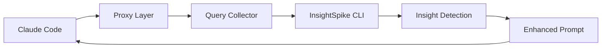

# Claude Code InsightSpike Integration

## Overview

This document outlines the design and implementation plan for integrating InsightSpike's insight detection capabilities with Claude Code, enabling the system to discover patterns and insights from conversation history and enhance future interactions.

## Concept

```
User Query History → Insight Detection → Enhanced Prompts → Better Responses
```

The system monitors Claude Code conversations, detects conceptual connections and patterns, and automatically enhances future prompts with discovered insights.

## Architecture

### High-Level Design



### Repository Structure

#### 1. InsightSpike CLI Enhancement (This Repository)

Additional CLI commands needed:

```python
# Export conversation history
@app.command()
def export_history(format: str = "json"):
    """Export conversation history for analysis"""
    
# API server mode
@app.command()
def api_server(port: int = 8000):
    """Start REST API server for external integrations"""
    
# Batch insight detection
@app.command()
def detect_insights(queries: List[str]):
    """Detect insights from a list of queries"""
```

#### 2. Claude Code Wrapper Repository (New)

```
claude-code-insightspike/
├── README.md
├── pyproject.toml
├── src/
│   ├── claude_insight/
│   │   ├── __init__.py
│   │   ├── proxy.py          # Claude API proxy
│   │   ├── collector.py      # Query collection
│   │   ├── enhancer.py       # Prompt enhancement
│   │   ├── detector.py       # Insight detection interface
│   │   └── storage.py        # Local storage management
│   │
│   ├── vscode_ext/           # VS Code extension
│   │   ├── extension.ts
│   │   └── package.json
│   │
│   └── cli.py                # Wrapper CLI
│
├── extension/                 # VS Code extension build
│   ├── package.json
│   ├── src/
│   └── dist/
│
├── data/
│   ├── queries.db            # SQLite database
│   ├── insights.json         # Cached insights
│   └── embeddings/           # Vector representations
│
├── config/
│   ├── settings.yaml         # Configuration
│   └── prompts/              # Prompt templates
│
├── tests/
│   └── test_integration.py
│
└── docker/
    └── Dockerfile            # Containerization
```

## Key Components

### 1. Query Collection System

```python
class QueryCollector:
    def __init__(self, storage_path: Path):
        self.storage = SQLiteStorage(storage_path)
        self.embedder = SentenceTransformer('all-MiniLM-L6-v2')
    
    def capture_query(self, query: str, context: dict):
        """Capture and store Claude Code queries"""
        embedding = self.embedder.encode(query)
        
        self.storage.save({
            'query': query,
            'timestamp': datetime.now(),
            'context': context,
            'embedding': embedding,
            'session_id': context.get('session_id')
        })
    
    def get_recent_queries(self, n: int = 10) -> List[Query]:
        """Retrieve recent queries for analysis"""
        return self.storage.get_recent(n)
```

### 2. Insight Detection Interface

```python
class InsightDetector:
    def __init__(self, insightspike_url: str = "http://localhost:8000"):
        self.client = InsightSpikeClient(insightspike_url)
    
    def detect_patterns(self, queries: List[Query]) -> List[Insight]:
        """Detect patterns across queries"""
        # Group by semantic similarity
        clusters = self.cluster_queries(queries)
        
        # Detect progression patterns
        patterns = []
        for cluster in clusters:
            if self.is_progression(cluster):
                patterns.append(self.extract_pattern(cluster))
        
        return patterns
    
    def find_conceptual_bridges(self, q1: Query, q2: Query) -> Optional[Bridge]:
        """Find conceptual connections between queries"""
        response = self.client.analyze_pair(q1.text, q2.text)
        
        if response.spike_detected:
            return Bridge(
                source=q1,
                target=q2,
                connection=response.insight,
                strength=response.metrics
            )
        return None
```

### 3. Prompt Enhancement

```python
class PromptEnhancer:
    def __init__(self):
        self.templates = PromptTemplates()
    
    def enhance_with_insights(
        self, 
        current_query: str, 
        insights: List[Insight],
        context: dict
    ) -> str:
        """Enhance prompt with discovered insights"""
        
        if not insights:
            return current_query
        
        # Select relevant insights
        relevant = self.filter_relevant(insights, current_query)
        
        if relevant:
            return self.templates.render(
                'enhanced_query',
                query=current_query,
                insights=relevant,
                context=context
            )
        
        return current_query
```

### 4. VS Code Extension

```typescript
// extension.ts
import * as vscode from 'vscode';
import { ClaudeInsightClient } from './client';

export function activate(context: vscode.ExtensionContext) {
    const client = new ClaudeInsightClient();
    
    // Status bar item
    const statusBar = vscode.window.createStatusBarItem(
        vscode.StatusBarAlignment.Right
    );
    statusBar.text = "$(lightbulb) InsightSpike";
    statusBar.show();
    
    // Command: Show insights
    const showInsights = vscode.commands.registerCommand(
        'claude-insight.showInsights',
        async () => {
            const insights = await client.getRecentInsights();
            showInsightPanel(insights);
        }
    );
    
    // Auto-enhancement toggle
    const autoEnhance = vscode.commands.registerCommand(
        'claude-insight.toggleAutoEnhance',
        () => {
            client.toggleAutoEnhancement();
            updateStatusBar(statusBar, client.isAutoEnhancing());
        }
    );
    
    context.subscriptions.push(showInsights, autoEnhance);
}
```

## Implementation Phases

### Phase 1: InsightSpike CLI Enhancement

1. Add REST API server capability
2. Implement batch processing endpoints
3. Create export/import functionality
4. Add real-time insight detection mode

```bash
# New CLI commands
spike api-server --port 8000
spike export-history --format json --output history.json
spike detect-insights --input queries.json --output insights.json
spike monitor --real-time
```

### Phase 2: Wrapper Library Development

1. Create Python package structure
2. Implement proxy layer for Claude API
3. Build query collection system
4. Integrate with InsightSpike CLI
5. Add local storage and caching

```python
# Usage example
from claude_insight import ClaudeProxy

proxy = ClaudeProxy()
enhanced_query = proxy.process(
    "How to implement authentication?",
    context={'session_id': '123'}
)
```

### Phase 3: VS Code Extension

1. Create extension scaffold
2. Implement Claude Code detection
3. Add UI components (status bar, panel)
4. Integrate with wrapper library
5. Publish to VS Code marketplace

### Phase 4: Integration Testing

1. End-to-end testing
2. Performance optimization
3. Privacy compliance verification
4. User acceptance testing

## Technical Requirements

### InsightSpike Side

1. **RESTful API**
   - FastAPI server
   - OpenAPI documentation
   - Rate limiting
   - Authentication

2. **Performance**
   - Sub-100ms insight detection
   - Batch processing support
   - Caching layer

3. **Compatibility**
   - JSON input/output
   - Streaming support
   - WebSocket for real-time

### Wrapper Side

1. **Minimal Overhead**
   - Async processing
   - Local caching
   - Efficient storage

2. **Privacy First**
   - Local processing option
   - Data encryption
   - User consent

3. **Reliability**
   - Offline mode
   - Error recovery
   - Graceful degradation

## Configuration

### Settings Example

```yaml
# claude-insight/config/settings.yaml
insightspike:
  url: http://localhost:8000
  timeout: 5
  retry_count: 3

storage:
  type: sqlite
  path: ~/.claude-insight/data
  max_queries: 10000
  
privacy:
  local_only: false
  encryption: true
  auto_delete_days: 30

enhancement:
  auto_enhance: true
  min_insights: 2
  relevance_threshold: 0.7
```

## Usage Examples

### Basic Usage

```python
# Initialize the system
from claude_insight import setup

insight_system = setup()

# Process a query
enhanced = insight_system.enhance(
    "How do I optimize database queries?"
)

# View insights
insights = insight_system.get_insights()
for insight in insights:
    print(f"Pattern: {insight.pattern}")
    print(f"Strength: {insight.strength}")
```

### Advanced Features

```python
# Track learning progression
progression = insight_system.analyze_progression(
    user_id="user123",
    time_range="7d"
)

# Export for analysis
insight_system.export_data(
    format="json",
    include_embeddings=True,
    output_path="./analysis"
)

# Real-time monitoring
with insight_system.monitor() as monitor:
    for event in monitor.events():
        if event.type == "spike_detected":
            print(f"Insight discovered: {event.insight}")
```

## Deployment

### Local Development

```bash
# Install dependencies
pip install insightspike-ai
pip install claude-code-insightspike

# Start services
spike api-server --dev
claude-insight start --connect localhost:8000
```

### Docker Deployment

```dockerfile
# Dockerfile
FROM python:3.10-slim

WORKDIR /app

COPY requirements.txt .
RUN pip install -r requirements.txt

COPY . .

EXPOSE 8000

CMD ["spike", "api-server", "--host", "0.0.0.0"]
```

### Production Setup

```bash
# Using Docker Compose
docker-compose up -d

# Using Kubernetes
kubectl apply -f k8s/deployment.yaml
```

## Security Considerations

1. **Data Privacy**
   - All processing can be done locally
   - No data sent to external servers without consent
   - Automatic data expiration

2. **API Security**
   - Token-based authentication
   - Rate limiting per user
   - Input validation

3. **Storage Security**
   - Encrypted at rest
   - Secure key management
   - Regular security audits

## Performance Metrics

### Target Metrics

- Query processing: < 50ms overhead
- Insight detection: < 100ms for 10 queries
- Memory usage: < 500MB
- Storage: < 1GB for 10K queries

### Monitoring

```python
# Performance tracking
metrics = insight_system.get_metrics()
print(f"Avg processing time: {metrics.avg_processing_time}ms")
print(f"Insights per session: {metrics.insights_per_session}")
print(f"Cache hit rate: {metrics.cache_hit_rate}%")
```

## Future Enhancements

1. **Multi-model Support**
   - GPT-4 integration
   - Anthropic API compatibility
   - Custom model support

2. **Advanced Analytics**
   - Learning style detection
   - Knowledge gap identification
   - Personalized recommendations

3. **Collaboration Features**
   - Team insights sharing
   - Collective pattern discovery
   - Knowledge base building

## Contributing

See [CONTRIBUTING.md](../../CONTRIBUTING.md) for guidelines on contributing to this integration.

## License

This integration follows the same license as the main InsightSpike-AI project.