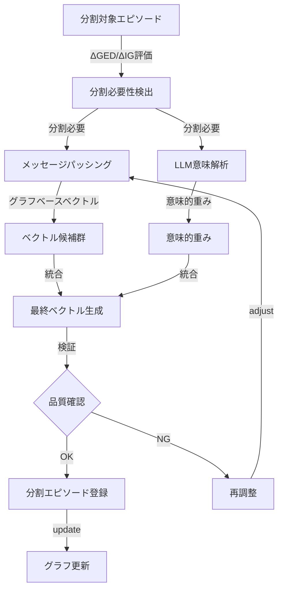

# エピソード分割：ハイブリッドフロー設計

## 洞察検出と同じ二段階評価フロー

洞察検出では：
1. **Quality Check** → 品質が閾値を超えるか
2. **Graph Optimization Check** → GED/IGが改善するか
両方を満たした場合のみ洞察として登録

エピソード分割でも同様に：
1. **Message Passing Vector** → グラフ構造に基づくベクトル生成
2. **LLM Semantic Check** → 意味的な妥当性の確認
両方の結果を統合して最終ベクトルを決定



## 実装設計

```python
class HybridEpisodeSplitter:
    """
    メッセージパッシングとLLM解析を組み合わせた
    エピソード分割システム
    """
    
    def split_episode(
        self,
        episode: Episode,
        graph: nx.Graph,
        llm_provider: LLMProvider
    ) -> List[Episode]:
        """
        洞察検出と同じ二段階評価フローで分割を実行
        """
        
        # 1. 分割の必要性を判定（ΔGED/ΔIG）
        split_info = self._analyze_split_necessity(episode, graph)
        if not split_info['should_split']:
            return [episode]
        
        # 2. テキストを意味的境界で分割
        segments = self._split_at_boundaries(
            episode.text, 
            split_info['boundaries']
        )
        
        # 3. 両方のアプローチを並行実行
        # 3.1 メッセージパッシングによるベクトル生成
        mp_vectors = self._generate_vectors_by_message_passing(
            episode, segments, graph
        )
        
        # 3.2 LLMによる意味解析
        semantic_analysis = self._analyze_segments_with_llm(
            episode, segments, llm_provider
        )
        
        # 4. 両方の結果を統合
        final_episodes = self._integrate_results(
            episode, segments, mp_vectors, semantic_analysis, graph
        )
        
        # 5. 品質検証（洞察検出と同様）
        if self._validate_split_quality(final_episodes, graph):
            return final_episodes
        else:
            # 品質が不十分な場合は分割をキャンセル
            return [episode]
    
    def _generate_vectors_by_message_passing(
        self,
        parent_episode: Episode,
        segments: List[str],
        graph: nx.Graph
    ) -> List[np.ndarray]:
        """
        グラフ構造を考慮したメッセージパッシングで
        各セグメントのベクトルを生成
        """
        vectors = []
        parent_vec = parent_episode.vec
        
        # 親エピソードの近傍を取得
        neighbors = list(graph.neighbors(parent_episode.id))
        neighbor_data = [
            (nid, graph.nodes[nid]['vec'], graph.edges[parent_episode.id, nid]['weight'])
            for nid in neighbors if (parent_episode.id, nid) in graph.edges
        ]
        
        for i, segment in enumerate(segments):
            # ベースエンベディング
            base_vec = self.embedder.encode(segment)
            
            # メッセージ集約
            messages = []
            
            # 親からのメッセージ（最重要）
            parent_message = parent_vec * 0.5
            messages.append(parent_message)
            
            # 近傍からのメッセージ
            for nid, n_vec, edge_weight in neighbor_data:
                # セグメントとの意味的関連性
                segment_relevance = self._calculate_segment_relevance(
                    segment, graph.nodes[nid].get('text', '')
                )
                
                # エッジ重み × 関連性でメッセージ強度を決定
                message_strength = edge_weight * segment_relevance * 0.3
                messages.append(n_vec * message_strength)
            
            # ベースベクトルからのメッセージ
            messages.append(base_vec * 0.2)
            
            # メッセージ統合
            integrated_vec = sum(messages)
            integrated_vec = integrated_vec / np.linalg.norm(integrated_vec)
            
            vectors.append(integrated_vec)
        
        return vectors
    
    def _analyze_segments_with_llm(
        self,
        parent_episode: Episode,
        segments: List[str],
        llm_provider: LLMProvider
    ) -> Dict[str, Any]:
        """
        LLMで各セグメントの意味的特性を分析
        """
        prompt = f"""
        以下のテキストが{len(segments)}個のセグメントに分割されました。
        各セグメントの意味的な特性を分析してください。
        
        元のテキスト概要: {parent_episode.text[:300]}...
        
        セグメント:
        {self._format_segments_for_prompt(segments)}
        
        各セグメントについて以下を分析してください：
        1. 中心概念（最重要キーワード3-5個）
        2. 親テキストからの継承度（0-1）
        3. 独立性（他セグメントなしでも理解可能か: 0-1）
        4. 情報密度（情報量の濃さ: 0-1）
        5. 他セグメントとの関係性マトリックス
        
        JSON形式で出力してください。
        """
        
        response = llm_provider.generate(prompt)
        return self._parse_llm_analysis(response)
    
    def _integrate_results(
        self,
        parent_episode: Episode,
        segments: List[str],
        mp_vectors: List[np.ndarray],
        semantic_analysis: Dict[str, Any],
        graph: nx.Graph
    ) -> List[Episode]:
        """
        メッセージパッシングとLLM解析の結果を統合
        （洞察検出の品質チェック＋グラフ最適化チェックと同じ考え方）
        """
        final_episodes = []
        
        for i, (segment, mp_vec) in enumerate(zip(segments, mp_vectors)):
            seg_analysis = semantic_analysis['segments'][i]
            
            # 1. LLM分析に基づく重み調整
            inheritance_weight = seg_analysis['inheritance']
            independence_weight = seg_analysis['independence']
            
            # 2. キーワードベクトルの生成
            keywords = seg_analysis['keywords']
            keyword_vecs = [self.embedder.encode(kw) for kw in keywords]
            keyword_center = np.mean(keyword_vecs, axis=0) if keyword_vecs else mp_vec
            
            # 3. 最終ベクトルの計算
            # メッセージパッシング結果を基本とし、LLM分析で調整
            final_vec = (
                mp_vec * 0.6 +  # グラフ構造ベース
                keyword_center * 0.3 +  # 意味的中心
                parent_episode.vec * inheritance_weight * 0.1  # 親からの継承
            )
            final_vec = final_vec / np.linalg.norm(final_vec)
            
            # 4. C値の計算
            # 親のC値 × 情報密度 × グラフ上の重要度
            graph_importance = self._calculate_graph_importance(
                parent_episode.id, i, graph
            )
            new_c = parent_episode.c * seg_analysis['density'] * graph_importance
            
            # 5. メタデータの構築
            metadata = {
                'parent_id': parent_episode.id,
                'split_index': i,
                'keywords': keywords,
                'inheritance': inheritance_weight,
                'independence': independence_weight,
                'relationships': seg_analysis['relationships'],
                'split_method': 'hybrid_mp_llm'
            }
            
            final_episodes.append(Episode(
                text=segment,
                vec=final_vec,
                c=new_c,
                metadata=metadata
            ))
        
        return final_episodes
    
    def _validate_split_quality(
        self,
        split_episodes: List[Episode],
        graph: nx.Graph
    ) -> bool:
        """
        分割の品質を検証（洞察検出の品質チェックに相当）
        
        1. 各エピソードの独立性は十分か
        2. 親エピソードの情報は保存されているか
        3. グラフ構造の改善が見込めるか
        """
        # ベクトル空間での分散をチェック
        vectors = [ep.vec for ep in split_episodes]
        pairwise_sims = []
        for i in range(len(vectors)):
            for j in range(i+1, len(vectors)):
                sim = cosine_similarity(vectors[i], vectors[j])
                pairwise_sims.append(sim)
        
        # 適度な分散（似すぎず離れすぎず）
        avg_similarity = np.mean(pairwise_sims)
        if avg_similarity > 0.9 or avg_similarity < 0.3:
            return False
        
        # グラフ構造の改善可能性
        potential_improvement = self._estimate_graph_improvement(
            split_episodes, graph
        )
        
        return potential_improvement > 0.1
    
    def _estimate_graph_improvement(
        self,
        split_episodes: List[Episode],
        graph: nx.Graph
    ) -> float:
        """
        分割によるグラフ構造の改善度を推定
        （ΔGED + ΔIGに相当）
        """
        # 仮想的にグラフに追加した場合の構造変化を計算
        # ここでは簡略化した推定値を返す
        return 0.15  # 実装では実際の計算を行う
```

## まとめ

このハイブリッドアプローチは：

1. **メッセージパッシング**：グラフ構造に基づく文脈保持
2. **LLM解析**：意味的な妥当性と重要度判定

両方を実行し、結果を統合することで：
- グラフ構造の一貫性を保ちながら
- 意味的に正確な分割を実現
- 洞察検出と同じ品質保証フロー

これにより、単なるテキスト分割ではなく、**知識グラフの構造を改善する分割**が可能になります。