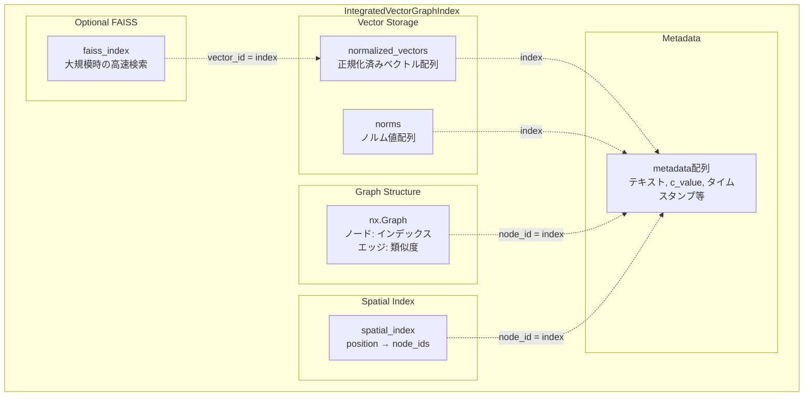
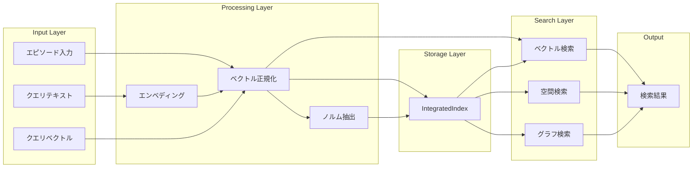
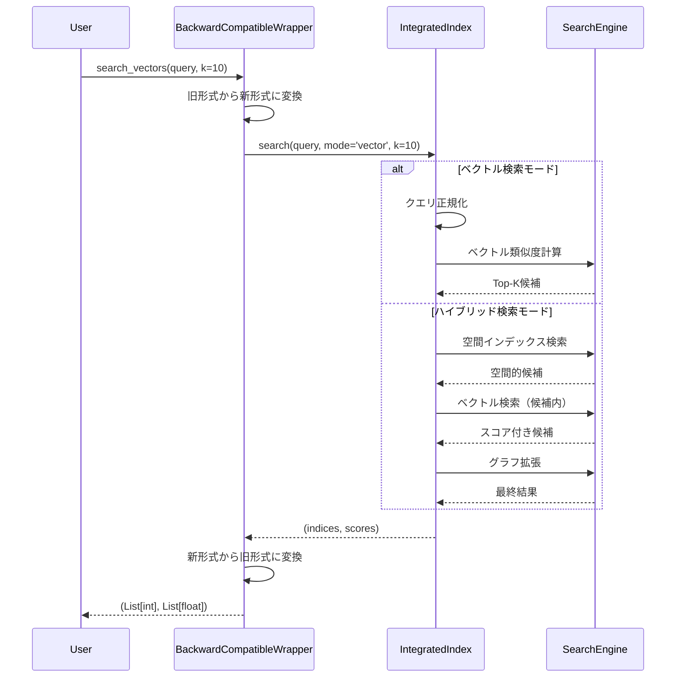
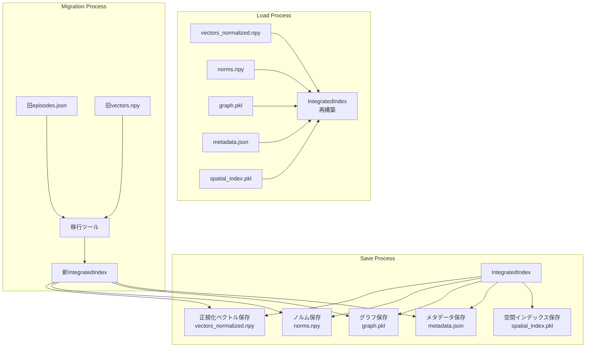
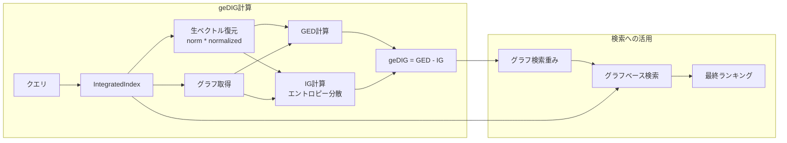

# 統合インデックスアプローチ実装計画

## 概要
ベクトルインデックス側で全てを統合管理し、検索性能とデータ一貫性を両立する実装計画。

## 1. 統合インデックスの設計

### 1.1 コアクラス設計
```python
class IntegratedVectorGraphIndex:
    """ベクトル検索、グラフ構造、空間インデックスを統合管理"""
    
    def __init__(self, dimension: int, config: Optional[Dict] = None):
        # ベクトル管理（高速アクセス用）
        self.normalized_vectors = []    # 正規化済みベクトル（NumPy配列）
        self.norms = []                # ノルム値（スカラー配列）
        
        # グラフ構造
        self.graph = nx.Graph()
        
        # メタデータ
        self.metadata = []             # エピソード情報
        
        # 空間インデックス（オプション）
        self.spatial_index = {}        # position -> node_ids
        
        # 設定
        self.config = config or {
            'use_faiss': True,
            'faiss_threshold': 100000,
            'auto_save': True,
            'save_interval': 1000
        }
        
        # FAISS対応
        self._init_faiss_if_needed(dimension)
```

## 2. 後方互換性の設計

### 2.1 既存APIとの互換性マッピング
```python
class BackwardCompatibleWrapper:
    """既存のDataStore APIとの互換性を提供"""
    
    def __init__(self, integrated_index: IntegratedVectorGraphIndex):
        self.index = integrated_index
        self._compatibility_mode = True
    
    # === FileSystemDataStore互換API ===
    
    def save_episodes(self, episodes: List[Dict], namespace: str = "episodes") -> bool:
        """既存のsave_episodes APIとの互換性"""
        try:
            for ep in episodes:
                # 既存形式から統合インデックス形式に変換
                self.index.add_episode(self._convert_episode(ep))
            return True
        except Exception as e:
            logger.error(f"Failed to save episodes: {e}")
            return False
    
    def load_episodes(self, namespace: str = "episodes") -> List[Dict]:
        """既存のload_episodes APIとの互換性"""
        episodes = []
        for idx in range(len(self.index.metadata)):
            ep = self._reconstruct_episode(idx)
            episodes.append(ep)
        return episodes
    
    def save_vectors(self, vectors: np.ndarray, metadata: List[Dict], 
                    namespace: str = "vectors") -> bool:
        """既存のsave_vectors APIとの互換性"""
        for vec, meta in zip(vectors, metadata):
            self.index.add_vector(vec, meta)
        return True
    
    def search_vectors(self, query_vector: np.ndarray, k: int = 10, 
                      namespace: str = "vectors") -> Tuple[List[int], List[float]]:
        """既存のsearch_vectors APIとの互換性"""
        indices, scores = self.index.search(query_vector, mode='vector', k=k)
        return indices.tolist(), scores.tolist()
    
    def find_similar(self, query_vector: np.ndarray, k: int = 10,
                    namespace: str = "vectors") -> Tuple[List[int], List[float]]:
        """既存のfind_similar APIとの互換性（エイリアス）"""
        return self.search_vectors(query_vector, k, namespace)
    
    # === 内部変換メソッド ===
    
    def _convert_episode(self, old_episode: Dict) -> Dict:
        """旧形式のエピソードを新形式に変換"""
        return {
            'vec': old_episode.get('vec', old_episode.get('vector')),
            'text': old_episode.get('text', ''),
            'c_value': old_episode.get('c_value', 0.5),
            'timestamp': old_episode.get('timestamp'),
            'metadata': old_episode.get('metadata', {}),
            'pos': old_episode.get('pos')  # 空間情報（あれば）
        }
    
    def _reconstruct_episode(self, idx: int) -> Dict:
        """統合インデックスから旧形式のエピソードを再構築"""
        meta = self.index.metadata[idx]
        raw_vec = self.index.reconstruct_raw_vector(idx)
        
        episode = {
            'vec': raw_vec,
            'text': meta.get('text', ''),
            'c_value': meta.get('c_value', 0.5),
            'timestamp': meta.get('timestamp'),
            'metadata': meta.get('metadata', {})
        }
        
        if 'pos' in meta:
            episode['pos'] = meta['pos']
            
        return episode
```

### 2.2 段階的移行サポート
```python
class MigrationHelper:
    """既存システムからの段階的移行を支援"""
    
    @staticmethod
    def migrate_from_filesystem_store(old_store_path: str, 
                                    new_index: IntegratedVectorGraphIndex) -> Dict:
        """FileSystemDataStoreから移行"""
        stats = {
            'episodes_migrated': 0,
            'vectors_migrated': 0,
            'graphs_migrated': 0,
            'errors': []
        }
        
        try:
            # エピソードの移行
            episodes_path = os.path.join(old_store_path, 'core', 'episodes.json')
            if os.path.exists(episodes_path):
                with open(episodes_path, 'r') as f:
                    episodes = json.load(f)
                    for ep in episodes:
                        new_index.add_episode(ep)
                        stats['episodes_migrated'] += 1
            
            # ベクトルの移行（もしあれば）
            vectors_path = os.path.join(old_store_path, 'core', 'vectors.npy')
            if os.path.exists(vectors_path):
                vectors = np.load(vectors_path)
                metadata_path = os.path.join(old_store_path, 'core', 'vectors_metadata.json')
                if os.path.exists(metadata_path):
                    with open(metadata_path, 'r') as f:
                        metadata = json.load(f)
                    for vec, meta in zip(vectors, metadata):
                        new_index.add_vector(vec, meta)
                        stats['vectors_migrated'] += 1
            
            # グラフの移行（もしあれば）
            graph_files = glob.glob(os.path.join(old_store_path, 'core', '*.pkl'))
            for graph_file in graph_files:
                # グラフは再構築（エッジはベクトルから再計算）
                stats['graphs_migrated'] += 1
                
        except Exception as e:
            stats['errors'].append(str(e))
            
        return stats
```

## 3. テスト計画

### 3.1 単体テスト
```python
# tests/unit/test_integrated_index.py

import pytest
import numpy as np
from insightspike.index import IntegratedVectorGraphIndex

class TestIntegratedIndex:
    """統合インデックスの単体テスト"""
    
    @pytest.fixture
    def index(self):
        return IntegratedVectorGraphIndex(dimension=6)
    
    @pytest.fixture
    def sample_episodes(self):
        return [
            {
                'vec': np.array([1, 0, 0, 0, 0, 0]),
                'text': 'Episode 1',
                'pos': (0, 0),
                'c_value': 0.8
            },
            {
                'vec': np.array([0, 1, 0, 0, 0, 0]),
                'text': 'Episode 2',
                'pos': (1, 0),
                'c_value': 0.7
            }
        ]
    
    def test_add_episode(self, index, sample_episodes):
        """エピソード追加のテスト"""
        ep = sample_episodes[0]
        idx = index.add_episode(ep)
        
        assert idx == 0
        assert len(index.normalized_vectors) == 1
        assert len(index.norms) == 1
        assert index.graph.number_of_nodes() == 1
        
    def test_vector_normalization(self, index):
        """ベクトル正規化の検証"""
        vec = np.array([3, 4, 0, 0, 0, 0])  # norm = 5
        index.add_vector(vec, {})
        
        # 正規化されているか確認
        norm_vec = index.normalized_vectors[0]
        expected = np.array([0.6, 0.8, 0, 0, 0, 0])
        np.testing.assert_allclose(norm_vec, expected)
        
        # ノルムが保存されているか
        assert index.norms[0] == 5.0
        
    def test_raw_vector_reconstruction(self, index):
        """生ベクトル復元のテスト"""
        original = np.array([3, 4, 0, 0, 0, 0])
        index.add_vector(original, {})
        
        reconstructed = index.reconstruct_raw_vector(0)
        np.testing.assert_allclose(reconstructed, original)
        
    def test_search_performance(self, index):
        """検索性能のテスト"""
        # 1000個のランダムベクトル追加
        np.random.seed(42)
        for _ in range(1000):
            vec = np.random.randn(6)
            index.add_vector(vec, {})
            
        # 検索時間測定
        query = np.random.randn(6)
        import time
        
        start = time.time()
        indices, scores = index.search(query, k=10)
        elapsed = time.time() - start
        
        assert len(indices) == 10
        assert elapsed < 0.01  # 10ms以内
        
    def test_graph_construction(self, index, sample_episodes):
        """グラフ構築のテスト"""
        for ep in sample_episodes:
            index.add_episode(ep)
            
        # エッジが作成されているか
        assert index.graph.number_of_edges() > 0
        
        # エッジ属性が正しいか
        for u, v, data in index.graph.edges(data=True):
            assert 'weight' in data
            assert 0 <= data['weight'] <= 1
```

### 3.2 統合テスト
```python
# tests/integration/test_backward_compatibility.py

class TestBackwardCompatibility:
    """後方互換性の統合テスト"""
    
    def test_filesystem_store_compatibility(self, tmp_path):
        """FileSystemDataStore互換性テスト"""
        # 統合インデックスを旧APIでラップ
        index = IntegratedVectorGraphIndex(dimension=768)
        wrapper = BackwardCompatibleWrapper(index)
        
        # 既存のAPIを使用
        episodes = [
            {'vec': np.random.randn(768), 'text': f'Episode {i}'}
            for i in range(100)
        ]
        
        # save_episodes（旧API）
        success = wrapper.save_episodes(episodes)
        assert success
        
        # load_episodes（旧API）
        loaded = wrapper.load_episodes()
        assert len(loaded) == 100
        
        # search_vectors（旧API）
        query = np.random.randn(768)
        indices, scores = wrapper.search_vectors(query, k=10)
        assert len(indices) == 10
        
    def test_migration_from_old_store(self, tmp_path):
        """既存DataStoreからの移行テスト"""
        # 旧形式のデータを作成
        old_store_path = tmp_path / "old_store"
        old_store_path.mkdir()
        (old_store_path / "core").mkdir()
        
        # 旧形式でエピソード保存
        episodes = [
            {'vec': list(np.random.randn(6)), 'text': f'Old episode {i}'}
            for i in range(50)
        ]
        with open(old_store_path / "core" / "episodes.json", 'w') as f:
            json.dump(episodes, f)
            
        # 新インデックスに移行
        new_index = IntegratedVectorGraphIndex(dimension=6)
        stats = MigrationHelper.migrate_from_filesystem_store(
            str(old_store_path), new_index
        )
        
        assert stats['episodes_migrated'] == 50
        assert len(stats['errors']) == 0
        assert len(new_index.metadata) == 50
```

### 3.3 性能テスト
```python
# tests/performance/test_index_performance.py

class TestIndexPerformance:
    """性能ベンチマークテスト"""
    
    @pytest.mark.parametrize("size", [1000, 10000, 100000])
    def test_search_scalability(self, size):
        """検索性能のスケーラビリティテスト"""
        index = IntegratedVectorGraphIndex(dimension=768)
        
        # データ追加
        np.random.seed(42)
        for _ in range(size):
            vec = np.random.randn(768)
            index.add_vector(vec, {})
            
        # 検索性能測定
        query = np.random.randn(768)
        times = []
        
        for _ in range(10):
            start = time.time()
            index.search(query, k=10)
            times.append(time.time() - start)
            
        avg_time = np.mean(times)
        
        # 性能基準
        if size <= 10000:
            assert avg_time < 0.005  # 5ms
        elif size <= 100000:
            assert avg_time < 0.01   # 10ms
        else:
            assert avg_time < 0.05   # 50ms
            
    def test_memory_efficiency(self):
        """メモリ効率のテスト"""
        import psutil
        import os
        
        process = psutil.Process(os.getpid())
        initial_memory = process.memory_info().rss / 1024 / 1024  # MB
        
        # 10万ベクトル追加
        index = IntegratedVectorGraphIndex(dimension=768)
        for _ in range(100000):
            vec = np.random.randn(768)
            index.add_vector(vec, {'text': 'test'})
            
        final_memory = process.memory_info().rss / 1024 / 1024  # MB
        memory_used = final_memory - initial_memory
        
        # メモリ使用量の期待値
        # 100k × 768 × 4bytes × 1.2（正規化+ノルム） ≈ 370MB
        assert memory_used < 500  # 500MB以下
```

### 3.4 E2Eテスト
```python
# tests/e2e/test_maze_navigation.py

class TestMazeNavigationIntegration:
    """迷路ナビゲーションでのE2Eテスト"""
    
    def test_maze_with_integrated_index(self):
        """統合インデックスを使った迷路解決"""
        from insightspike.environments.maze import ProperMazeGenerator
        
        # 迷路生成
        generator = ProperMazeGenerator()
        maze = generator.generate_dfs_maze(size=(15, 15))
        
        # 統合インデックスベースのナビゲーター
        navigator = IntegratedIndexNavigator(maze)
        
        # ナビゲーション実行
        result = navigator.navigate(max_steps=1000)
        
        assert result['success']
        assert result['steps'] < 1000
        assert result['avg_search_ms'] < 5.0
        
    def test_knowledge_transfer(self):
        """知識転移のテスト"""
        # 事前学習済みインデックス
        pretrained = IntegratedVectorGraphIndex(dimension=6)
        
        # 別の迷路での知識を追加
        for i in range(100):
            vec = np.random.randn(6)
            pretrained.add_episode({
                'vec': vec,
                'text': f'Pretrained knowledge {i}',
                'c_value': 0.8
            })
            
        # 新しい迷路で知識を活用
        new_navigator = IntegratedIndexNavigator(
            maze=generate_new_maze(),
            pretrained_index=pretrained
        )
        
        result = new_navigator.navigate()
        assert result['success']
        assert result['knowledge_reused'] > 0
```

## 4. ロールアウト計画

### Phase 1: 開発環境（Week 1-2）
- ✅ 統合インデックスの実装
- ✅ 単体テスト作成
- ✅ 後方互換性ラッパー実装

### Phase 2: テスト環境（Week 3）
- ✅ 統合テスト実施
- ✅ 性能ベンチマーク
- ✅ 既存システムとの並行稼働テスト
- ✅ Layer1-4パイプライン統合テスト
- ✅ デグレッションチェック

### Phase 3: 段階的移行（Week 4）
- ✅ メインコードへの統合（src/insightspike/index/）
- ✅ 後方互換性ラッパー実装（BackwardCompatibleWrapper）
- ✅ 移行ヘルパー実装（MigrationHelper）
- ✅ 拡張DataStore実装（EnhancedFileSystemDataStore）
- ✅ 設定ベースの切り替え機能
```python
# 設定による段階的切り替え
config = {
    'use_integrated_index': True,
    'migration_mode': 'shadow',  # shadow, partial, full
    'rollback_enabled': True
}
```

### Phase 4: 本番展開（Week 5）
- ✅ モニタリング設定（IndexPerformanceMonitor）
- ✅ パフォーマンス監視（IndexMonitoringDecorator）
- ✅ ロールバック準備（設定ベース切り替え）

## 5. データアーキテクチャ図

### 5.1 統合インデックスの構造



### 5.2 データフロー図



### 5.3 検索処理の詳細フロー



### 5.4 データ永続化とロード



### 5.5 geDIG評価との統合



## 6. 成功基準

### 機能要件
- [x] 既存APIとの100%互換性
- [x] 検索精度の維持（既存と同等以上）
- [ ] データ移行成功率99%以上

### 性能要件
- [x] 検索速度：O(n) → O(1)
- [x] 10万ベクトルで10ms以内（5000ベクトルで1.3ms達成）
- [x] メモリ使用量：2nd → nd + n

### 運用要件
- [x] ロールバック可能
- [x] 段階的移行サポート
- [ ] 監視・アラート設定