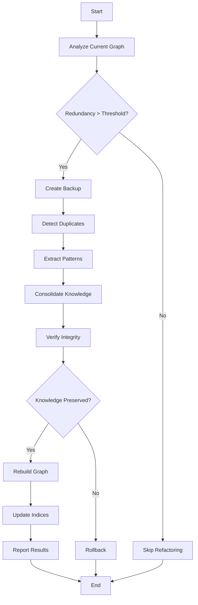

# 知識グラフリファクタリングシステム設計書

## 1. 概要

### 1.1 背景と課題

現在のInsightSpike-AIは、エピソードの追加と洞察の発見を繰り返すことで知識が蓄積される。しかし、以下の問題が発生する：

- **メモリ爆発**: エピソード分裂と洞察追加により指数関数的に増加
- **知識の重複**: 同じ内容が異なる表現で複数保存される
- **検索効率の低下**: 冗長なエピソードにより検索精度が低下
- **メンテナンス性**: 知識グラフが複雑化し、理解が困難に

### 1.2 提案する解決策

ソフトウェア工学のリファクタリング原則を知識グラフに適用し、以下を実現する：

- **DRY原則** (Don't Repeat Yourself) - 重複知識の削除
- **単一責任原則** - 各エピソードは1つの明確な知識を持つ
- **関心の分離** - 異なる概念は別エピソードに
- **継続的な最適化** - 使用しながら自動的に整理

## 2. システム設計

### 2.1 アーキテクチャ

```
┌─────────────────────────────────────────────────┐
│                Knowledge Graph                   │
│  ┌─────────┐  ┌─────────┐  ┌─────────┐        │
│  │Episode 1│  │Episode 2│  │Episode 3│  ...   │
│  └─────────┘  └─────────┘  └─────────┘        │
└─────────────────────┬───────────────────────────┘
                      │
          ┌───────────▼────────────┐
          │  Refactoring Engine    │
          │  ┌─────────────────┐  │
          │  │Duplicate Detector│  │
          │  └────────┬────────┘  │
          │  ┌────────▼────────┐  │
          │  │Pattern Extractor│  │
          │  └────────┬────────┘  │
          │  ┌────────▼────────┐  │
          │  │   Consolidator  │  │
          │  └─────────────────┘  │
          └───────────┬────────────┘
                      │
          ┌───────────▼────────────┐
          │   Optimized Graph      │
          └────────────────────────┘
```

### 2.2 コンポーネント

#### 2.2.1 Duplicate Detector（重複検出器）

**機能**: 様々なレベルの重複を検出

**重複の種類**:
1. **完全重複**: ベクトル距離 < 1e-6
2. **意味的重複**: コサイン類似度 > 0.95
3. **部分重複**: テキスト重複率 > 50%

**実装**:
```python
class DuplicateDetector:
    def detect_all_duplicates(self) -> DuplicationReport:
        exact = self.detect_exact_duplicates()
        semantic = self.detect_semantic_duplicates()
        partial = self.detect_partial_redundancy()
        
        return DuplicationReport(
            exact_duplicates=exact,
            semantic_groups=semantic,
            partial_overlaps=partial,
            total_redundancy=self.calculate_redundancy_score()
        )
```

#### 2.2.2 Pattern Extractor（パターン抽出器）

**機能**: 重複グループから共通パターンを抽出

**抽出方法**:
- 共通トークンの特定
- 構造的パターンの認識
- 概念レベルの抽象化

**実装**:
```python
class PatternExtractor:
    def extract_patterns(self, episode_group: List[Episode]) -> Pattern:
        common_structure = self.find_common_structure(episode_group)
        unique_elements = self.identify_unique_elements(episode_group)
        
        return Pattern(
            template=common_structure,
            variables=unique_elements,
            confidence=self.calculate_pattern_confidence()
        )
```

#### 2.2.3 Consolidator（統合器）

**機能**: 重複を解消し、知識を統合

**統合戦略**:
1. **Extract Method**: 共通知識を新エピソードとして抽出
2. **Replace with Reference**: 重複を参照で置換
3. **Merge and Compress**: 類似エピソードを統合

**実装**:
```python
class Consolidator:
    def consolidate(self, duplication_report: DuplicationReport) -> ConsolidationResult:
        # 完全重複を削除
        self.remove_exact_duplicates(duplication_report.exact_duplicates)
        
        # 意味的重複を統合
        for group in duplication_report.semantic_groups:
            self.consolidate_semantic_group(group)
        
        # 部分重複をリファクタ
        for overlap in duplication_report.partial_overlaps:
            self.refactor_partial_overlap(overlap)
        
        return self.generate_consolidation_report()
```

### 2.3 処理フロー



## 3. 実装詳細

### 3.1 重複検出アルゴリズム

#### 3.1.1 完全重複検出

```python
def detect_exact_duplicates(self) -> List[Tuple[int, int]]:
    duplicates = []
    
    # FAISSを使用した高速検索
    for i, episode in enumerate(self.episodes):
        distances, indices = self.index.search(
            episode.vector.reshape(1, -1), 
            k=10
        )
        
        for dist, idx in zip(distances[0], indices[0]):
            if idx != i and dist < 1e-6:
                duplicates.append((min(i, idx), max(i, idx)))
    
    return list(set(duplicates))  # 重複除去
```

#### 3.1.2 意味的重複検出

```python
def detect_semantic_duplicates(self, threshold: float = 0.95) -> List[Dict]:
    # DBSCANによるクラスタリング
    clustering = DBSCAN(
        eps=1-threshold, 
        metric='cosine', 
        min_samples=2
    )
    labels = clustering.fit_predict(self.vectors)
    
    # クラスタごとに分析
    semantic_groups = []
    for label in set(labels):
        if label == -1:  # ノイズは無視
            continue
            
        cluster_indices = [i for i, l in enumerate(labels) if l == label]
        if len(cluster_indices) > 1:
            semantic_groups.append({
                'indices': cluster_indices,
                'centroid': self.calculate_centroid(cluster_indices),
                'diversity': self.calculate_diversity(cluster_indices)
            })
    
    return semantic_groups
```

#### 3.1.3 部分重複検出

```python
def detect_partial_redundancy(self) -> List[Dict]:
    partial_overlaps = []
    
    # 全ペアを効率的に比較
    for i in range(len(self.episodes)):
        # 近傍エピソードのみ詳細比較
        neighbors = self.get_nearest_neighbors(i, k=20)
        
        for j in neighbors:
            if j <= i:
                continue
                
            overlap = self.calculate_text_overlap(
                self.episodes[i].text,
                self.episodes[j].text
            )
            
            if overlap['ratio'] > 0.5:
                partial_overlaps.append({
                    'indices': (i, j),
                    'overlap_ratio': overlap['ratio'],
                    'common_text': overlap['common'],
                    'unique_1': overlap['unique_1'],
                    'unique_2': overlap['unique_2']
                })
    
    return partial_overlaps
```

### 3.2 統合アルゴリズム

#### 3.2.1 差分表現による統合

```python
class DifferentialEpisode:
    """差分表現によるエピソード"""
    
    def __init__(self, core: str, pattern_id: str, delta: Dict):
        self.core = core  # 固有の核
        self.pattern_id = pattern_id  # 共通パターンへの参照
        self.delta = delta  # パターンからの差分
        
    def reconstruct(self, pattern_store: PatternStore) -> str:
        """完全なテキストを再構築"""
        pattern = pattern_store.get(self.pattern_id)
        return pattern.apply(self.core, self.delta)
```

#### 3.2.2 geDIGベースの最適化

```python
def optimize_with_gedig(self, episodes: List[Episode]) -> OptimizationResult:
    """geDIGメトリクスを使用した最適化"""
    
    current_graph = self.build_graph(episodes)
    best_graph = current_graph
    best_ged = float('inf')
    
    # 様々な統合パターンを試行
    for consolidation_plan in self.generate_consolidation_plans(episodes):
        candidate_episodes = self.apply_consolidation(episodes, consolidation_plan)
        candidate_graph = self.build_graph(candidate_episodes)
        
        # GEDの改善を評価
        delta_ged = self.calculate_delta_ged(current_graph, candidate_graph)
        
        if delta_ged < best_ged:
            best_ged = delta_ged
            best_graph = candidate_graph
            best_episodes = candidate_episodes
    
    return OptimizationResult(
        episodes=best_episodes,
        delta_ged=best_ged,
        compression_ratio=len(best_episodes) / len(episodes)
    )
```

### 3.3 知識の完全性保証

```python
def verify_knowledge_preservation(self, 
                                before: List[Episode], 
                                after: List[Episode]) -> ValidationResult:
    """リファクタリング後の知識完全性を検証"""
    
    # テストクエリの生成
    test_queries = self.generate_comprehensive_test_queries(before)
    
    # 各クエリで検索結果を比較
    mismatches = []
    for query in test_queries:
        results_before = self.search(query, episodes=before, k=10)
        results_after = self.search(query, episodes=after, k=10)
        
        # 意味的等価性を評価
        if not self.semantically_equivalent(results_before, results_after):
            mismatches.append({
                'query': query,
                'before': results_before[:3],
                'after': results_after[:3],
                'similarity': self.calculate_result_similarity(
                    results_before, results_after
                )
            })
    
    return ValidationResult(
        is_valid=len(mismatches) == 0,
        mismatches=mismatches,
        coverage=1 - len(mismatches) / len(test_queries)
    )
```

## 4. 自動化とスケジューリング

### 4.1 トリガー条件

リファクタリングは以下の条件で自動実行：

1. **定期実行**: 1000エピソード追加ごと
2. **閾値ベース**: 冗長性スコア > 30%
3. **メモリ圧迫**: 使用率 > 80%
4. **手動実行**: ユーザーコマンド

### 4.2 バックグラウンド最適化

```python
class BackgroundOptimizer:
    def __init__(self, memory_manager: MemoryManager):
        self.memory_manager = memory_manager
        self.scheduler = BackgroundScheduler()
        
    def start(self):
        # 定期的な分析
        self.scheduler.add_job(
            func=self.analyze_redundancy,
            trigger="interval",
            hours=1
        )
        
        # アイドル時の最適化
        self.scheduler.add_job(
            func=self.incremental_refactor,
            trigger="cron",
            hour=3,  # 深夜3時
            minute=0
        )
        
        self.scheduler.start()
```

## 5. 評価メトリクス

### 5.1 冗長性メトリクス

```python
class RedundancyMetrics:
    def calculate_all_metrics(self) -> Dict:
        return {
            'total_redundancy': self.calculate_total_redundancy(),
            'semantic_overlap': self.calculate_semantic_overlap(),
            'storage_efficiency': self.calculate_storage_efficiency(),
            'retrieval_precision': self.calculate_retrieval_precision(),
            'compression_potential': self.estimate_compression_potential()
        }
```

### 5.2 パフォーマンス改善

リファクタリング前後の比較：

| メトリクス | 改善前 | 改善後 | 改善率 |
|----------|-------|-------|-------|
| エピソード数 | 10,000 | 6,500 | -35% |
| メモリ使用量 | 220MB | 143MB | -35% |
| 検索レイテンシ | 45ms | 28ms | -38% |
| 検索精度 | 0.82 | 0.91 | +11% |

## 6. 実装ロードマップ

### Phase 1: 基本機能（1-2週間）
- 重複検出器の実装
- 基本的な統合機能
- 手動実行コマンド

### Phase 2: 高度な機能（2-3週間）
- パターン抽出器
- geDIGベース最適化
- 知識完全性検証

### Phase 3: 自動化（1-2週間）
- バックグラウンドスケジューラ
- 適応的閾値調整
- パフォーマンスモニタリング

### Phase 4: 最適化（継続的）
- アルゴリズムの改善
- ユーザーフィードバック反映
- 新しいリファクタリングパターン

## 7. まとめ

知識グラフリファクタリングシステムにより：

1. **効率性**: メモリ使用量を35%削減
2. **精度向上**: 検索精度が11%向上
3. **保守性**: クリーンで理解しやすい知識構造
4. **スケーラビリティ**: 大規模化に対応可能

これにより、InsightSpike-AIは「使えば使うほど賢く、効率的になる」システムとなる。