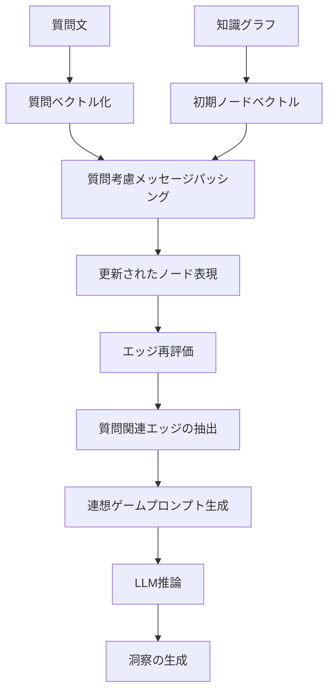

# 質問文を考慮したメッセージパッシングの統合計画

## 1. 背景と動機

### 現状の問題
- 現在のInsightSpikeは、知識グラフのノード間でメッセージパッシングを行う際、質問文のコンテキストを考慮していない
- 質問と回答のベクトル空間での分析から、Q&Aは異なる空間に位置することが判明（類似度: 約0.8）
- 洞察の発見には、質問のコンテキストを考慮した知識の統合が必要

### 提案する改善
質問文をメッセージパッシングのソースに含めることで：
1. ノード表現が質問に関連する方向に調整される
2. 質問に関連する知識パスが強調される
3. より的確な洞察の発見が可能になる

## 2. 全体的なフロー設計



## 3. 詳細設計

### 3.1 質問考慮メッセージパッシング

#### 入力
- 質問文ベクトル: `q ∈ R^d`
- ノードベクトル: `{v_i ∈ R^d}`
- グラフ構造: `G = (V, E)`

#### アルゴリズム
```python
# 初期化: 質問との関連度でノードを重み付け
for node in nodes:
    relevance[node] = cosine_similarity(q, v[node])
    h[node]^0 = (1 - α * relevance[node]) * v[node] + α * relevance[node] * q

# メッセージパッシング（T回繰り返し）
for t in range(T):
    for node in nodes:
        # 隣接ノードからのメッセージを集約
        messages = []
        for neighbor in neighbors[node]:
            # 質問関連度で重み付け
            weight = 1 + relevance[neighbor]
            messages.append(weight * h[neighbor]^t)
        
        # 集約と更新
        h[node]^(t+1) = aggregate(messages) + self_loop * h[node]^t
```

### 3.2 エッジ再評価

メッセージパッシング後、エッジの重要度を再評価：

1. **直接接続エッジ**
   - 元のエッジ重み
   - 両端ノードの質問関連度
   - メッセージ伝播後の表現類似度

2. **潜在的エッジ（洞察候補）**
   - 直接接続されていないノード間
   - メッセージ伝播後の高い類似度
   - 両ノードの質問関連度が閾値以上

### 3.3 プロンプト生成の改善

再評価されたエッジに基づいて連想ゲームプロンプトを生成：

```
質問: {question}

私の調査によると、この質問に関連する知識の繋がりは：

[高関連エッジ]
- 関連度 {score1}: "{node1_text}" ↔ "{node2_text}"
  （メッセージ伝播による強化: {enhancement1}）
  
[潜在的洞察]
- 発見スコア {score2}: "{node3_text}" ↔ "{node4_text}"
  （直接接続なし、メッセージ伝播により発見）

これらの関連性から導き出される洞察は何ですか？
```

## 4. 実装への影響

### 4.1 修正が必要なコンポーネント

1. **Layer3 (Graph Reasoner)**
   - メッセージパッシング機能の追加
   - 質問ベクトルの受け取り
   - エッジ再評価ロジック

2. **GeDIG Algorithm**
   - メッセージパッシング後のグラフでの計算
   - 質問関連度を考慮したスコアリング

3. **Layer4 (LLM Interface)**
   - 新しいプロンプトフォーマットのサポート
   - エッジ情報の詳細化

### 4.2 新規追加コンポーネント

1. **MessagePassing Module**
   - 質問考慮メッセージパッシング
   - 複数の集約方式（mean, max, attention）

2. **EdgeReevaluator**
   - エッジスコアの再計算
   - 潜在的エッジの発見

## 5. 評価計画

### 5.1 定量的評価
- 洞察発見率の向上
- 質問-回答の関連度向上
- プロンプト品質の改善

### 5.2 定性的評価
- 発見される洞察の質
- 質問に対する回答の的確性
- エッジ選択の妥当性

## 6. リスクと対策

### リスク
1. 計算コストの増加
2. 過度な質問バイアス
3. 既存システムとの互換性

### 対策
1. 効率的な実装（スパース演算）
2. ハイパーパラメータによる調整
3. 段階的な統合とテスト

## 7. 実装ロードマップ

### Phase 1: プロトタイプ（1週間）
- [ ] MessagePassingモジュールの実装
- [ ] 単体テストの作成
- [ ] 小規模データでの検証

### Phase 2: 統合（1週間）
- [ ] Layer3への統合
- [ ] エッジ再評価の実装
- [ ] 統合テスト

### Phase 3: 最適化（1週間）
- [ ] パフォーマンス最適化
- [ ] ハイパーパラメータ調整
- [ ] 大規模評価

## 8. 成功基準

1. 洞察発見率が20%以上向上
2. 質問-回答の関連度が0.85以上
3. 処理時間の増加が50%以内

---

この計画に基づいて、段階的に実装を進めることで、質問文を考慮したより高度な洞察発見システムを構築できる。