# Design Log: From Transformer Interpretation to Self-Verifying AI

*Date: 2025-07-23*
*Status: Living Document*

This document consolidates a series of design discussions that trace the evolution of the `geDIG` theory, from re-interpreting existing AI architectures to proposing a novel, self-verifying system.

## 1. The First Leap: Re-interpreting the Transformer

The foundational insight is that the success of the Transformer architecture can be explained through the lens of the `geDIG` potential (`𝓕 = w₁ΔGED – kTΔIG`).

- **Core Hypothesis**: The self-attention mechanism is a micro-scale, implicit implementation of the `geDIG` principle.
- **Deconstruction**:
    - **GED (Structural Evaluation)**: The `Query-Key` interaction (`QK^T`) measures the structural fitness between tokens. A high similarity score implies a low structural cost (GED).
    - **IG (Information Gain)**: The aggregation of `Value` vectors, weighted by attention scores, is a process of information gain, where a token's representation is enriched by structurally relevant context.
- **The "Product Form"**: Self-attention elegantly combines these two concepts in a product form: `[Output] = [Structural Weights] × [Information Content]`.

This re-interpretation moves the Transformer from a "magical black box" to a specific, constrained implementation of a more universal law.

*(Reference: `docs/research/thinking/reinterpreting_transformer_with_gedig.md`)*

## 2. The Path Forward: The `GeDIGformer`

Based on the re-interpretation, we can design a next-generation architecture that makes the implicit `geDIG` principles explicit and more powerful.

- **Concept**: A hybrid model, the `GeDIGformer`, that leverages the rich token embeddings from pre-trained Transformers but replaces the rigid, `O(n^2)` self-attention mechanism with a flexible `GeDIGLayer`.
- **`GeDIGLayer`**: This new layer would dynamically construct a sparse graph from token embeddings and update them by seeking to minimize the `𝓕` potential, allowing for more efficient and context-aware information flow.

*(Reference: `src/insightspike/models/ge_dig_transformer.py`)*

## 3. A New Philosophy: From Hallucination to Hypothesis

A key philosophical distinction was made between the outputs of standard LLMs and `InsightSpike-AI`.

- **Standard Hallucination**: An uncontrollable, untraceable, and incorrigible association based on statistical patterns.
- **`geDIG` Insight**: A form of **"intentional and traceable hallucination"**. It's a creative leap, but one that is:
    - **Governed by a Principle**: It follows a clear objective to minimize the `𝓕` potential.
    - **Traceable**: The path of reasoning (the connections in the knowledge graph) is explicitly recorded.
    - **Correctable**: If a connection is flawed, it can be externally corrected, leading the system to self-organize into a new, more stable state without full retraining.

This reframes the core process from "unreliable generation" to "falsifiable hypothesis generation."

## 4. Architectural Embodiment: Correction and Verification Cycles

To implement this philosophy of "intellectual honesty," two key feedback loops are required in the `MainAgent` architecture.

### a. Correction Cycle (Passive, External Feedback)

- **Purpose**: To allow the system to learn from external corrections.
- **Mechanism**: The `correct_reasoning_path` method allows a user or system to specify a flawed connection in the knowledge graph. The agent then re-runs its reasoning from this corrected state to find a new, better insight.

### b. Verification Cycle (Active, Internal Feedback)

- **Purpose**: To enable the system to actively question and validate its own generated hypotheses.
- **Mechanism**:
    1.  When a `geDIG` spike is detected, the `InsightDecoder` translates the abstract graph change into a human-readable text hypothesis.
    2.  The `HypothesisVerifier` then takes this text and generates a list of concrete, falsifiable questions to test its validity.
    3.  These questions are queued for future cycles, creating a continuous loop of hypothesis generation and validation.

*(Reference: `docs/research/thinking/correction_and_verification_cycles.md`)*

## 5. A Dual-Pronged Validation Strategy for Insights

The "Evaluation Wall" — proving that a detected insight is truly meaningful — is the project's greatest challenge. The solution is a two-pronged validation approach that combines structural and semantic checks.

### a. Structural Validation (The `InsightDecoder`)

- **Method**: Uses `geDIG` itself as a loss function. It iteratively generates text and refines it until the text's syntactic structure (as a dependency graph) closely matches the structure of the target insight graph.
- **What it proves**: The insight has a coherent, communicable structure that can be expressed in natural language.

*(Reference: `docs/development/decoder_design/decoder_design.md`)*

### b. Semantic Validation (The "Claude" Method)

- **Method**: Uses a powerful, external LLM (like Claude) to synthesize a single, coherent explanation from all the related source episodes that led to the insight.
- **Evaluation**: The semantic vector of this synthesized text is then compared (via cosine similarity) to the system's internal "insight vector."
- **What it proves**: The insight's core meaning is semantically consistent with the source information it was derived from.

*(Reference: `src/insightspike/verification/verifier.py` - `validate_semantic_coherence` method)*

## 6. Conclusion: A Unified Vision

These interconnected ideas form a single, coherent vision for a new kind of AI.

```mermaid
graph TD
    subgraph "Universal Theory"
        A["geDIG Potential<br>𝓕 = w₁ΔGED – kTΔIG"]
    end

    subgraph "Analysis of Existing Systems"
        B["Transformer as a<br>Micro-Scale geDIG Implementation"]
    end

    subgraph "Synthesis of New Systems"
        C["InsightSpike-AI & GeDIGformer<br>(Explicit geDIG Implementation)"]
    end

    subgraph "Core Reasoning Loop"
        D["Intentional Hypothesis Generation<br>(geDIG Spike Detection)"]
        E["Self-Correction & Verification<br>(Correction/Verification Cycles)"]
        F["Structural & Semantic Decoding<br>(InsightDecoder & Semantic Validation)"]
    end

    A --> B
    A --> C
    C --> D --> E --> F --> C
```

This creates a system that not only generates insights but also understands, explains, and validates them based on its own first principles, moving us closer to a truly "scientific partner" AI.