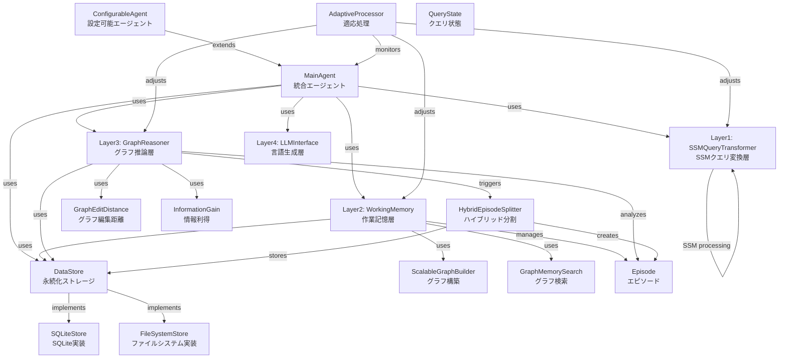
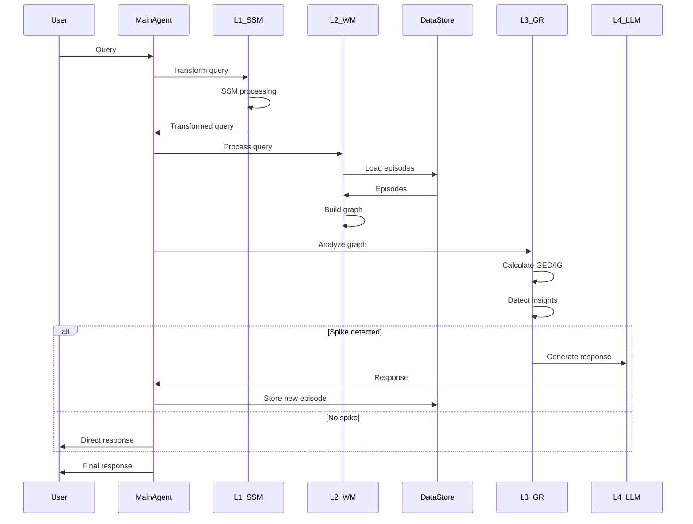
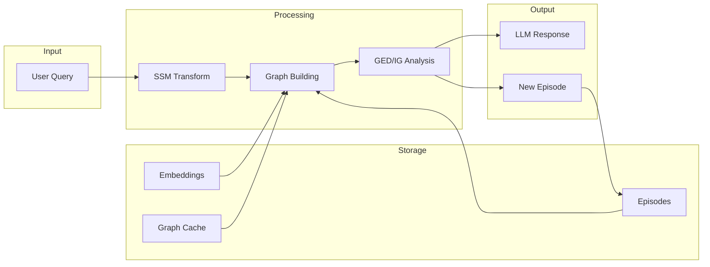
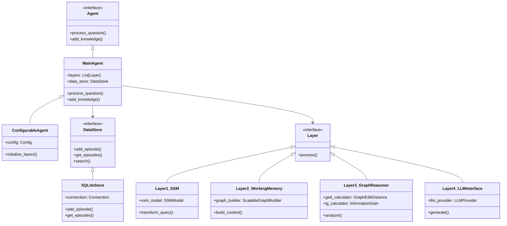

# InsightSpike-AI Class Relationships

## Overview
This document visualizes the complex relationships between major classes in InsightSpike-AI after the 2025-01 refactoring.

## Main Architecture (Post-Refactoring)



## Key Changes from Previous Architecture

### 1. L2MemoryManager廃止
- 以前: L2MemoryManagerが中央集権的にメモリ管理
- 現在: Layer2_WorkingMemoryが軽量な作業記憶として機能

### 2. DataStore中心アーキテクチャ
- 以前: 各層が独自にデータ管理
- 現在: DataStoreが一元的に永続化を管理

### 3. SSMベースのLayer1
- 以前: 単純なクエリ変換
- 現在: State Space Modelによる高速な不確実性検出

### 4. ハイブリッドエピソード分割
- 新機能: ベクトル空間とテキスト構造の両方を考慮した分割

## Component Interactions



## Memory Flow



## Class Hierarchy (Simplified)



## Future Architecture (Quantum geDIG)

```mermaid
graph TB
    subgraph "Classical geDIG (Current)"
        ClassicalNode[Point Nodes<br/>点ノード]
        ClassicalEdge[Fixed Edges<br/>固定エッジ]
        ClassicalSpace[Discrete Space<br/>離散空間]
    end
    
    subgraph "Quantum geDIG (Future)"
        QuantumNode[Gaussian Nodes<br/>ガウシアンノード]
        QuantumEdge[Probabilistic Edges<br/>確率的エッジ]
        QuantumSpace[Continuous Field<br/>連続場]
    end
    
    ClassicalNode -.->|Evolution| QuantumNode
    ClassicalEdge -.->|Evolution| QuantumEdge
    ClassicalSpace -.->|Evolution| QuantumSpace
    
    QuantumNode -->|Uncertainty| GaussianDistribution[N(μ, Σ)]
    QuantumEdge -->|Interaction| WassersteinDistance[Wasserstein Distance]
    QuantumSpace -->|Density| KnowledgeField[Knowledge Density Field]
```