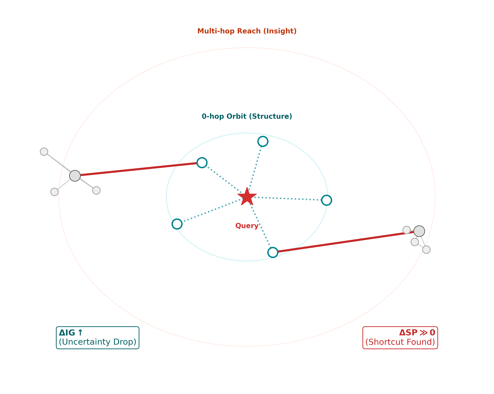

# geDIGの起源：閃くAIを作るまでの思考の軌跡
# Origin of geDIG: The Journey to Building an AI That Has Insights

*Created: 2026-01-28*

---

## 日本語版

### 問いの始まり

> 「アインシュタインのようなAIを作るにはどうすればいいか？」

これがgeDIGの出発点だった。

現在のAIは膨大な知識を持ち、人間の問いに答えることができる。しかし、**知らないことを発見する**ことはできない。既存のパターンを組み合わせることはできても、根本的に新しい構造を生み出すことはない。

では、アインシュタインは何をしたのか？

### アマチュアの閃き

1905年、特許庁の技師だったアインシュタインは、専門の物理学者ではなかった。しかし彼は、**電磁気学とニュートン力学の矛盾**に気づいた。

- マクスウェル方程式：光速は観測者によらず一定
- ニュートン力学：速度は観測者の運動によって変わる

この矛盾を、彼は**理論のトポロジカルな再構成**によって解決した。「光速不変」を公理として採用し、時間と空間の概念そのものを再定義した。

ここに閃きの本質がある：

> **閃きとは、既存の知識（記憶）をトポロジカルに再構成することである**

### 湯川秀樹の木目

もう一つの例がある。

湯川秀樹は、寝床から見える天井の木目を眺めていて、中間子論を着想したという。木目と素粒子物理学——本来まったく交わらない二つの領域が、彼の脳内でトポロジカルに接続された。

これが閃きの本質だ。**交わらないはずの記憶が、ポテンシャルの壁をトンネルするように接続し、新しい構造を生む**。

アインシュタインも湯川も、既存の知識を「再配置」したのではない。知識の**トポロジーそのものを変えた**。

ここでいう**トポロジー**とは、概念ノードと関係エッジからなる知識グラフの接続構造を指す。**再構成**とは、同じ語彙の再結合ではなく、矛盾の説明可能性を増やすようにエッジ集合そのものを更新する操作である。LLMの「パターン合成」とは、この点で質的に異なる。

### 実験設計から理論へ

この洞察から、一つの実験を思いついた：

```
【1905年実験】
コーパス：1905年以前の科学論文のみ
タスク：特殊相対論を導出せよ

成功条件：
1. 電磁気学とニュートン力学の矛盾を検出する
2. 光速不変を公理として採用する
3. ローレンツ変換を自力で導出する
```

これは、現在のAI性能テスト（「人類最後の試験」など）とは**質的に異なる**。

| | 従来のテスト | 1905年実験 |
|--|-------------|-----------|
| 問う能力 | 知識の再生 | 知識の創造 |
| 正解 | 人間が既に知っている | 当時の人間は知らなかった |
| 本質 | パターンマッチング | トポロジカル再構成 |

実験の公平性を担保するため、1905年以後の知識混入を避ける学習データ管理・出典監査と、導出の同値性判定基準（等価変形・記法差の許容範囲）を設ける予定だ。

では、トポロジカル再構成をどう数式化するか？

### 構造と情報のトレードオフ

閃きを情報理論とグラフ理論で捉え直す：

- **知識** = グラフ構造（ノード：概念、エッジ：関係）
- **再構成** = グラフの編集（エッジの追加・削除・変更）
- **閃き** = 低コストで高い情報利得をもたらす編集

これを定式化すると：

```
F = ΔEPC - λ·ΔIG

ΔEPC: Edit Path Cost（構造変更のコスト）
ΔIG: Information Gain（情報利得）
λ: 情報温度パラメータ
```

> **各項の操作的定義**：
> - **ΔEPC**：グラフ編集（エッジの追加・削除・置換）の最短編集コスト
> - **ΔIG**：編集前後での予測分布（または説明可能性）の改善量
> - **λ**：探索↔収束のトレードオフを制御する温度（固定 or スケジュール）
>
> 詳細な定義と導出は論文を参照。
>
> 📂 **実装**: [`src/insightspike/gedig/`](https://github.com/miyauchikazuyoshi/InsightSpike-AI/tree/main/src/insightspike/gedig)

**F < 0 のとき、閃きが起きる**。

構造コストより情報利得が上回る瞬間——それが「あ、わかった！」の正体。

### 熱力学との対応

この式は、熱力学の自由エネルギーと同型だった：

```
F = E - TS（ヘルムホルツ自由エネルギー）

E ↔ ΔEPC（構造的エネルギー）
TS ↔ λ·ΔIG（エントロピー項）
```

この対応は偶然ではないかもしれない。

### 式から自然に導かれる設計

geDIGの式を基本則として受け入れると、システム設計が自然に導かれた。

#### AG/DG二段ゲート

- **AG（Anomaly Gate）**：0-hopで「何かおかしい」を検知（F > θ_AG）
- **DG（Discovery Gate）**：multi-hopで「本当にショートカットか」を確認（F < θ_DG）



*図：0-hop Orbit（構造的近傍）とMulti-hop Reach（洞察的到達）。AGは局所的な異常を検知し、DGは遠方への短絡（ΔSP ≫ 0）が真に有効かを確認する。*

なぜ二段か？　閃きには二つのフェーズがあるからだ：
1. 違和感の検知（「あれ？」）
2. 構造的検証（「なるほど、繋がった」）

#### 神経伝達物質との対応

この設計を考えていて、脳の神経伝達物質との対応に気づいた：

- **ノルアドレナリン（NA）**：覚醒・注意・異常検知 → AGに対応
- **ドーパミン（DA）**：報酬・学習・確信 → DGに対応

NAが「何かおかしい」を検知し、DAが「正しかった、覚えよう」を確定する。これはまさにAG→DGの流れ。

注：NA/DA対応は、現段階では**実装上の設計比喩（computational analogy）**であり、生理学的同一性を主張するものではない。

#### 二相アーキテクチャ

従来のAIは「学習」と「推論」を分離する。しかし人間の脳は違う。

- **覚醒相**：学習と推論が同時に起きる（経験しながら考える）
- **睡眠相**：記憶の整理と定着（不要な接続を刈り込み、重要な接続を強化）

geDIGはこの設計を自然に要求した。Fが常に計算されるなら、「学習するか否か」はFの値で動的に決まる。学習と推論を分ける必要がない。

そして記憶整理（エビクション）もFで制御できる。F > 0 が続くエッジは「コストに見合わない」から刈り込む。これが睡眠相の役割。

geDIGの式から、脳と同じアーキテクチャが自然に導出された。これは偶然だろうか？　それとも、**知性の必然的構造**なのか？

### 迷路から始める

壮大な仮説を立てたが、検証なしでは科学ではない。

最小の検証可能単位として、**迷路探索**を選んだ：

- 完全に制御された環境
- ΔEPC, ΔIG が厳密に計算可能
- 最適解という明確な正解がある
- サイズを変えてスケール不変性を検証できる

**仮説**：F < 0 のときに探索を進め、F > 0 のときにバックトラックする制御で、効率的な経路発見が可能。

**結果**：「探索ステップ数」「無駄枝の剪定率」「最短路到達率」において、geDIGの予測と実際の探索行動が一貫して対応した。15×15、25×25、51×51——スケールが変わっても、この対応は維持された。成功率はベースライン60%に対し98%を達成。

> 📂 **実験詳細**: [`experiments/maze-query-hub-prototype/`](https://github.com/miyauchikazuyoshi/InsightSpike-AI/tree/main/experiments/maze-query-hub-prototype)

### Transformerへの拡張

次に、現代AIの中核であるTransformerを検証対象にした。

Attentionパターンを「意味的知識グラフ」として解釈し、geDIGを適用：

- AG（Anomaly Gate）：矛盾・異常の検出
- DG（Discovery Gate）：有効な再構成の確認

**仮説**：
- H1: 実際のTransformer Attentionは、ランダム/一様/局所ベースラインよりも低いFを示す
- H2: 深い層ほどFが低下する（構造化が進む）
- H3: Attentionへの介入（スパース化/ノイズ付加）は、ΔFに応じて下流タスク性能を変化させる

**結果**：
- F_real < F_random（p<0.001, Cohen's d>0.5）を確認
- 層ごとのF低下傾向（Spearman ρ<−0.3）を観測
- F正則化による学習でベースラインを上回る性能を達成

Attentionをグラフ化した際の「編集イベント」と「予測改善（ΔIG）」の対応を観測し、Transformerの推論過程がgeDIGの力学に従うことを確認した。

> 📂 **実験詳細**: [`experiments/transformer_gedig/`](https://github.com/miyauchikazuyoshi/InsightSpike-AI/tree/main/experiments/transformer_gedig)

### 理論の自己言及性

geDIGには特異な性質がある：

> **geDIG自身の誕生を、geDIGで説明できる**

私がgeDIGに至ったプロセス：
- 複数の知識領域（AI、物理学、情報理論）
- 矛盾の検出（現在のAIは閃けない）
- トポロジカル再構成（構造-情報トレードオフ）
- F < 0 の達成（「これだ」という納得）

geDIGは、自身の誕生過程を自身で説明できる。

注：これは正しさの証明ではなく、認知過程の記述としても同じレンズが使えるという意味での**自己整合性**である。

これは良い理論の特徴でもある：
- 相対性理論は、相対論を発見する物理学者にも適用される
- 進化論は、進化論を考える脳の進化にも適用される
- geDIGは、geDIGを発見する認知過程にも適用される

### 究極のゴール

1905年実験に戻る。

geDIGが完成すれば、この実験に挑戦できる：

```
1905年以前の知識のみを持つAIが、
特殊相対論を「再発見」できるか？
```

成功すれば、それは：

- AIが「人類が知らなかったことを発見する」初の実証
- 本当の意味での科学的創造性の実現
- 知性の本質への一歩

失敗すれば、geDIGの限界が明らかになる。

どちらにせよ、科学は前進する。

---

**正しい問いを持つことが、正しいレンズを生む。**

アインシュタインが「光と一緒に走ったらどう見えるか」と問うたように、私は「アインシュタインのようなAIをどう作るか」と問うた。

その問いの先に、geDIGがあった。

---

## English Version

### The Beginning of the Question

> "How do we build an AI that thinks like Einstein?"

This was the starting point of geDIG.

Current AI systems possess vast knowledge and can answer human questions. However, they cannot **discover what they don't know**. They can combine existing patterns, but they cannot generate fundamentally new structures.

So what did Einstein actually do?

### The Amateur's Insight

In 1905, Einstein was a patent office clerk, not a professional physicist. Yet he noticed the **contradiction between electromagnetism and Newtonian mechanics**:

- Maxwell's equations: The speed of light is constant regardless of the observer
- Newtonian mechanics: Velocity changes depending on the observer's motion

He resolved this contradiction through **topological reconstruction of theories**. By adopting "the constancy of the speed of light" as an axiom, he redefined the very concepts of time and space.

Here lies the essence of insight:

> **Insight is the topological reconstruction of existing knowledge (memory)**

### Hideki Yukawa and the Wood Grain

Another example reinforces this idea.

Hideki Yukawa reportedly conceived his meson theory while gazing at the wood grain patterns on his bedroom ceiling. Wood grain and particle physics—two domains that should never intersect—became topologically connected in his mind.

This is the essence of insight. **Memories that should never connect tunnel through potential barriers, forming new structures.**

Both Einstein and Yukawa did not merely "rearrange" existing knowledge. They **changed the topology of knowledge itself**.

Here, **topology** refers to the connectivity structure of a knowledge graph composed of concept nodes and relation edges. **Reconstruction** is not mere recombination of the same vocabulary, but an operation that updates the edge set itself to increase the explainability of contradictions. This is qualitatively different from the "pattern synthesis" of LLMs.

### From Experimental Design to Theory

This understanding led to an experimental idea:

```
【The 1905 Experiment】
Corpus: Only scientific papers published before 1905
Task: Derive special relativity

Success criteria:
1. Detect the contradiction between electromagnetism and Newtonian mechanics
2. Adopt the constancy of light speed as an axiom
3. Independently derive the Lorentz transformation
```

This is **qualitatively different** from current AI benchmarks (like "Humanity's Last Exam"):

| | Conventional Tests | The 1905 Experiment |
|--|-------------------|---------------------|
| Ability tested | Knowledge reproduction | Knowledge creation |
| Correct answer | Already known by humans | Unknown to humans at the time |
| Essence | Pattern matching | Topological reconstruction |

To ensure experimental fairness, we plan to implement training data management and provenance auditing to prevent post-1905 knowledge contamination, along with equivalence criteria for derivation judgment (tolerance for equivalent transformations and notational differences).

How do we mathematically formalize topological reconstruction?

### The Structure-Information Tradeoff

Reframing insight through information theory and graph theory:

- **Knowledge** = Graph structure (nodes: concepts, edges: relations)
- **Reconstruction** = Graph editing (adding, removing, modifying edges)
- **Insight** = An edit that yields high information gain at low cost

Formalized:

```
F = ΔEPC - λ·ΔIG

ΔEPC: Edit Path Cost (cost of structural change)
ΔIG: Information Gain
λ: Information temperature parameter
```

> **Operational definitions**:
> - **ΔEPC**: Minimum edit cost for graph operations (edge addition, deletion, substitution)
> - **ΔIG**: Improvement in predictive distribution (or explainability) before and after the edit
> - **λ**: Temperature controlling the exploration↔convergence tradeoff (fixed or scheduled)
>
> See the paper for detailed definitions and derivations.
>
> 📂 **Implementation**: [`src/insightspike/gedig/`](https://github.com/miyauchikazuyoshi/InsightSpike-AI/tree/main/src/insightspike/gedig)

**When F < 0, insight occurs.**

The moment when information gain exceeds structural cost—that is the essence of the "Aha!" moment.

### Correspondence with Thermodynamics

This equation turned out to be isomorphic to thermodynamic free energy:

```
F = E - TS (Helmholtz free energy)

E ↔ ΔEPC (structural energy)
TS ↔ λ·ΔIG (entropy term)
```

This correspondence may not be a coincidence.

### Designs That Emerge Naturally from the Equation

Once geDIG's equation was accepted as a fundamental principle, system designs followed naturally.

#### AG/DG Two-Stage Gate

- **AG (Anomaly Gate)**: Detects "something is off" at 0-hop (F > θ_AG)
- **DG (Discovery Gate)**: Confirms "is this really a shortcut?" at multi-hop (F < θ_DG)


*Figure: 0-hop Orbit (structural neighborhood) and Multi-hop Reach (insightful reach). AG detects local anomalies, while DG confirms whether distant shortcuts (ΔSP ≫ 0) are genuinely effective.*

Why two stages? Because insight has two phases:
1. Detection of anomaly ("Huh?")
2. Structural verification ("Aha, it connects!")

#### Correspondence with Neurotransmitters

While developing this design, I noticed a correspondence with brain neurotransmitters:

- **Noradrenaline (NA)**: Arousal, attention, anomaly detection → corresponds to AG
- **Dopamine (DA)**: Reward, learning, confirmation → corresponds to DG

NA detects "something is off," DA confirms "that was right, let's remember." This is exactly the AG→DG flow.

Note: The NA/DA correspondence is currently a **computational analogy for implementation design**, not a claim of physiological identity.

#### Two-Phase Architecture

Conventional AI separates "learning" from "inference." But the human brain doesn't.

- **Awake phase**: Learning and inference happen simultaneously (thinking while experiencing)
- **Sleep phase**: Memory consolidation (pruning unnecessary connections, strengthening important ones)

geDIG naturally demanded this design. If F is constantly computed, "whether to learn" is dynamically determined by F's value. There's no need to separate learning and inference.

Memory consolidation (eviction) can also be controlled by F. Edges where F > 0 persists are "not worth the cost" and get pruned. This is the role of the sleep phase.

From geDIG's equation, the same architecture as the brain emerged naturally. Is this coincidence? Or is it the **inevitable structure of intelligence**?

### Starting with Mazes

A grand hypothesis was proposed, but without validation, it's not science.

As the minimal verifiable unit, **maze exploration** was chosen:

- Fully controlled environment
- ΔEPC and ΔIG can be computed exactly
- Clear ground truth (optimal path)
- Scale invariance can be tested by varying size

**Hypothesis**: Control that advances exploration when F < 0 and backtracks when F > 0 enables efficient pathfinding.

**Results**: In terms of "exploration steps," "redundant branch pruning rate," and "shortest path arrival rate," geDIG's predictions consistently corresponded with actual exploration behavior. 15×15, 25×25, 51×51—this correspondence held across different scales. Success rate reached 98% compared to the baseline of 60%.

> 📂 **Experiment details**: [`experiments/maze-query-hub-prototype/`](https://github.com/miyauchikazuyoshi/InsightSpike-AI/tree/main/experiments/maze-query-hub-prototype)

### Extension to Transformers

Next, the Transformer—the core of modern AI—was tested.

Interpreting attention patterns as "semantic knowledge graphs," geDIG was applied:

- AG (Anomaly Gate): Detection of contradictions and anomalies
- DG (Discovery Gate): Confirmation of valid reconstructions

**Hypotheses**:
- H1: Real Transformer attention produces lower F than random/uniform/local baselines
- H2: Deeper layers show lower F (progressive structuring)
- H3: Interventions on attention (sparsification/noise) change downstream task performance according to ΔF

**Results**:
- Confirmed F_real < F_random (p<0.001, Cohen's d>0.5)
- Observed layer-wise F decrease (Spearman ρ<−0.3)
- F-regularized training outperformed baseline

By graphifying attention patterns, we observed the correspondence between "edit events" and "prediction improvement (ΔIG)," confirming that the Transformer's reasoning process follows geDIG dynamics.

> 📂 **Experiment details**: [`experiments/transformer_gedig/`](https://github.com/miyauchikazuyoshi/InsightSpike-AI/tree/main/experiments/transformer_gedig)

### Self-Referentiality of the Theory

geDIG has a unique property:

> **geDIG can explain its own birth**

The process by which I arrived at geDIG:
- Multiple knowledge domains (AI, physics, information theory)
- Detection of contradiction (current AI cannot have insights)
- Topological reconstruction (structure-information tradeoff)
- Achievement of F < 0 (the conviction of "This is it!")

geDIG can explain its own birth process.

Note: This is not a proof of correctness, but **self-consistency** in the sense that the same lens can be used to describe cognitive processes.

This is also a hallmark of good theories:
- Relativity applies to the physicist who discovers relativity
- Evolution applies to the brain that conceives evolution
- geDIG applies to the cognitive process that discovers geDIG

### The Ultimate Goal

Returning to the 1905 Experiment.

Once geDIG is complete, this experiment becomes possible:

```
Can an AI with only pre-1905 knowledge
"rediscover" special relativity?
```

If successful, it would be:

- The first demonstration of AI discovering something humans didn't know
- The realization of genuine scientific creativity
- A step toward understanding the essence of intelligence

If it fails, the limits of geDIG become clear.

Either way, science advances.

---

**Having the right question generates the right lens.**

Just as Einstein asked "What would I see if I traveled alongside a beam of light?", I asked "How do we build an AI that thinks like Einstein?"

Beyond that question lay geDIG.
