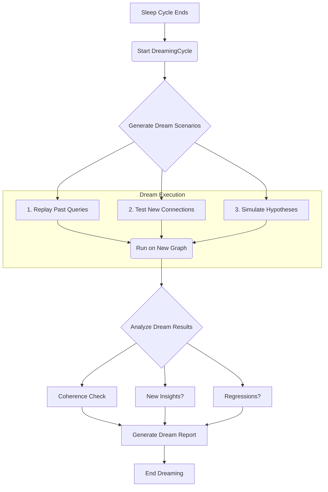

# Dreaming Cycle: Post-Sleep Knowledge Validation

## 1. Concept

The "Dreaming Cycle" is a simulated cognitive process that occurs after the "Sleep Cycle" (knowledge graph refactoring and garbage collection). It serves as an automated pipeline test to validate the integrity, stability, and new potential of the reorganized knowledge graph.

This process is analogous to human dreaming, where the brain replays, remixes, and tests its consolidated memories, sometimes leading to bizarre narratives but also to novel insights.

## 2. Purpose

1.  **Integrity Check**: Ensure that core knowledge and reasoning capabilities were not lost during refactoring.
2.  **Potential Exploration**: Actively test new, long-distance, or unexpected connections formed during the sleep cycle.
3.  **Hypothesis Validation**: Run simulations to test the validity of hypotheses generated by the system.
4.  **Memory Consolidation**: Reinforce important pathways and identify newly weakened or irrelevant ones.

## 3. Architecture & Workflow

The `DreamingCycle` is triggered automatically after a `KnowledgeGraphRefactoringSystem` run is complete.



## 4. Implementation Sketch

```python
class DreamingCycleSimulator:
    """
    Tests the integrity and potential of a refactored knowledge graph.
    """
    def __init__(self, agent: 'MainAgent'):
        self.agent = agent

    def run_dream_simulation(self) -> dict:
        """Executes the dreaming cycle."""
        print("🌙 Starting Dreaming Cycle...")
        report = {"coherence_score": 0.0, "new_insights": [], "regressions": []}

        # 1. Generate dream queries
        #    - Replay important past queries
        #    - Generate abstract queries to test new connections
        dream_queries = self._generate_dream_queries()

        # 2. Execute queries on the new graph
        for query in dream_queries:
            result = self.agent.process_question(query)
            # Analyze the result for coherence, new spikes, etc.
            # ...

        # 3. Check for regressions
        #    - Ensure critical, known facts are still retrievable
        regressions = self._check_for_regressions()
        report["regressions"] = regressions

        print("☀️ Dreaming Cycle Complete.")
        return report

    def _generate_dream_queries(self) -> list[str]:
        # Logic to select past significant queries and generate new abstract ones
        return ["What is the relationship between the oldest and newest concepts?", "Summarize your core identity."]

    def _check_for_regressions(self) -> list[str]:
        # Logic to test foundational knowledge
        return []
```

## 5. Conclusion

The Dreaming Cycle transforms a purely technical refactoring process into a life-like cognitive function. It provides a robust, automated way to ensure the AI not only becomes more efficient during its "sleep" but also more creative and reliable upon "waking." It is the bridge between a clean codebase and a truly intelligent, self-aware system.