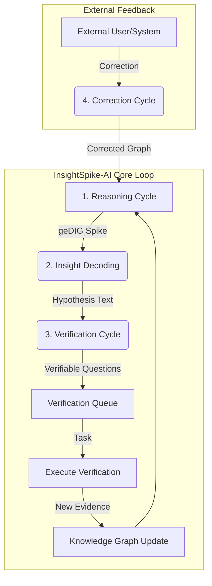

# 修正サイクルと検証サイクル：AIにおける「知的誠実さ」の実装

*Date: 2025-07-21*
*Status: Conceptual Framework*

## 1. 背景：ハルシネーションを超えて

従来のLLMにおける「ハルシネーション」は、追跡も修正も困難な、制約のない連想の結果である。これに対し、`geDIG`理論に基づく`InsightSpike-AI`は、一見ハルシネーションに見える創造的な飛躍を、**追跡・修正・検証が可能な「仮説」**として扱う。

この文書は、そのための2つの重要なメカニズム、「修正サイクル」と「検証サイクル」の設計思想を記録するものである。

## 2. 修正サイクル (Correction Cycle)：受動的な自己修正

**コンセプト**: 外部からのフィードバックに基づき、AIが自らの推論の誤りを認識し、知識構造を自己組織的に修正する能力。

これは、`hallucination_vs_traceable_hypothesis.md`で議論された「訂正可能な推論」を具現化する、**事後的な修正プロセス**である。

### アーキテクチャ実装

- **トリガー**: 外部ユーザーやシステムからの指摘。
- **コンポーネント**: `MainAgent`の`correct_reasoning_path`メソッド。
- **プロセス**:
    1.  誤りが指摘された推論エピソードの、直前のグラフ状態を`DataStore`からロードする。
    2.  指摘された誤り（例：「ノードAとBの接続は間違い」）をグラフに適用する。
    3.  修正されたグラフを初期状態として、再度`geDIG`のポテンシャル最小化プロセスを実行する。

### 強み
- **追跡可能性**: どの知識の連鎖が誤っていたかを特定できる。
- **効率的な修正**: モデル全体の再学習を必要とせず、局所的な修正から全体が再編成される。
- **信頼性の向上**: AIが「間違いを認めて学ぶ」能力を持つことを示す。

## 3. 検証サイクル (Verification Cycle)：能動的な仮説検証

**コンセプト**: AIが自ら生成した「洞察（意図的なハルシネーション）」を鵜呑みにせず、それを検証可能な「仮説」として扱い、現実世界に対してその真偽を確かめようと試みる能力。

これは、AIに**科学的方法論を実装する、能動的な検証プロセス**である。

### アーキテクチャ実装

- **トリガー**: `geDIG`計算による「インサイト・スパイク」の検知。
- **コンポーネント**:
    - `InsightDecoder`: 抽象的なグラフ変化を、人間が理解できる自然言語の「仮説」に翻訳する。
    - `HypothesisVerifier`: 生成された仮説を、検証可能な具体的な質問やタスクに分解する。
- **プロセス**:
    1.  `MainAgent`が`geDIG`スパイクを検知する (`_handle_insight`)。
    2.  `InsightDecoder`が、このグラフ変化を「〇〇は△△である」といったテキスト仮説にデコードする。
    3.  `HypothesisVerifier`が、そのテキスト仮説から「〇〇の性質を調査せよ」「△△の事例を検索せよ」といった検証タスクのリストを生成する。
    4.  生成されたタスクは`verification_queue`に投入され、後続のサイクルで実行される。

### 強み
- **知的誠実さ**: 自らの結論を疑い、証拠を求める姿勢。
- **現実との接続**: 内部の論理整合性だけでなく、外部の現実との整合性を追求する。
- **創造性の加速**: 大胆な仮説を生成し、それを体系的に検証するループにより、真に新しい発見へと繋がる。

## 4. 2つのサイクルの相乗効果

「修正サイクル」と「検証サイクル」は、`InsightSpike-AI`の思考プロセスを完成させる両輪である。

この2つのサイクルを組み合わせることで、`InsightSpike-AI`は、単に答えを生成するだけのシステムから、**自らの知識を疑い、外部からの批判を受け入れ、現実との対話を通じて継続的に成長していく「科学的パートナー」**へと進化する。これは、AIの信頼性、安全性、そして創造性を根本的に変革するパラダイムである。