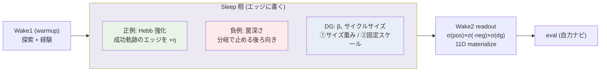
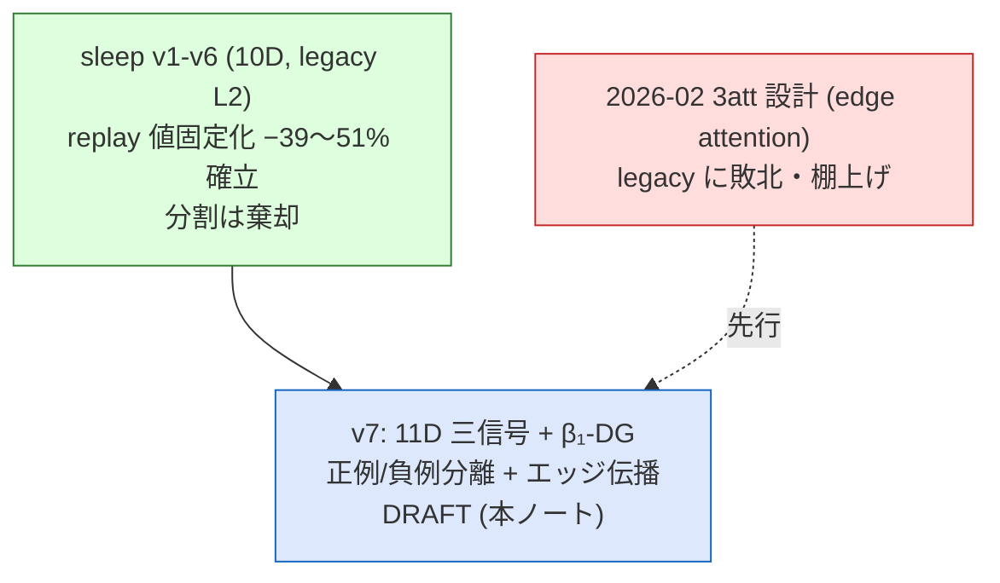

# v7 設計ノート: 三信号エッジ伝播アーキテクチャ(10D → 11D 抜本改訂)

**Status**: DRAFT(設計)— 2026-07-06、著者 × Fable の co-design セッション
**位置づけ**: v7 の**抜本見直し**の背骨。現行 10D ベクトル(8D + 生 reward + tanh(propagated))を
**8D + DG + 正例 + 負例 の 11D** に置換し、**正例/負例が sleep 相でエッジに伝播する機構**を作り直す。
**前提**: sleep ライン v1–v6 の決着(replay 値固定化 −39〜51% 確立、分割は棄却、v6 §8)。
**関連**: [[sleep-line-2026-07]] / [l1_three_attention_design.md](../../design/l1_three_attention_design.md)(2026-02 の先行設計・§10 で整合)/
[edge_flow_field_navigation](edge_flow_field_navigation_20260704.md) / [CANONICAL.md](../../CANONICAL.md) /
[agent_memory_landscape_2026](../references/agent_memory_landscape_2026.md)

---

## 0. なぜ見直すか(今日の2発見が起点)

1. **負例がほぼ休眠している**。勝ち構成では `deadend_penalty=0`、v4 で負例を強化しても無効だった。
   原因仮説: 符号1本の値 + argmax 様の exp 読み出しでは、トップの正例しか効かず負例が洗い流される。
   さらに **ノードに罠ペナルティを置くと手遅れ**(着いた時には価値ゼロ、必要なのは分岐点の入口エッジ)。
2. **価値は2経路で読み出されている**。行動バイアス(node.propagated 直読み、**8D でも動く**)+
   dim9 類似度(10D のみ)。dim9 の必要性は未検証(readout 分解の宿題)。

→ **正例と負例を分離し、それぞれに固有の伝播と読み出し経路を与える。** 符号1本を捨て、
3つの非負スカラーに割る。これが 11D 改訂の動機。

## 1. 背骨: 三信号(すべて sleep 相でエッジに書かれる量)

| 信号 | 何を測るか | 力学 | 源 |
|---|---|---|---|
| **正例(pos)** | 成功経験と共起したエッジの強度 | **Hebb 強化**(相関・累積) | goal 到達軌跡(replay が乗り物) |
| **負例(neg)** | commit する行き止まりの深さ | **罠深さ後ろ向き**(構造・分岐で止める) | 経験した dead-end / backtrack |
| **DG** | サイクルの大きさ(トポロジカル価値) | **β₁ サイズ**(persistence 様) | ループを閉じたエッジ |

読み出し: **`score(edge) = σ(pos/τ_p) × σ(-neg/τ_n) × σ(dg/τ_d)`**(3ゲートの乗算)。
11D ベクトル = 8D(位置・方向・通過可否・訪問数・success/goal)+ DG + pos + neg。

## 2. 貫く原理: 信用は散漫でいい、非難は精密でなければならない

正例と負例は**鏡像ではない**。ここが今日の一番の発見。

- **正例 = 大域的な吸引**。ゴールは迷路にただ1つの吸い込み点。成功経路のエッジは**どれも本当に良い**
  (通ったから成功した)。だから散漫に全部強化してよい → **Hebb**。
- **負例 = 局所的な忌避**。行き止まりは至る所の局所の罠。非難を散漫にやると、罠に至る手前の
  **無罪のエッジまで汚染する**。commit したエッジだけに精密に乗せる → **分岐で止める構造ロジック**。

これは RL の credit assignment の非対称(正の信用は緩く、負の責任は局所に)と同型。
`pos=Hebb / neg=構造` の割り当ては美学でなく、この非対称から出てくる。

## 3. 各信号の詳細

### 3.1 正例 = Hebb 強化(attraction)

- sleep の replay が goal 到達軌跡を辿り、通ったエッジの `w_pos` を強化(`w_pos += η`)。
  蟻の stigmergy / 海馬リプレイによる systems consolidation と同型 —— **sleep 相の生物学的意味に直結**。
- **距離を持たない**のが肝。Bellman(前案)は正例に距離まで背負わせて pos と DG が食い合っていた。
  Hebb は距離を手放し、**距離は DG(β₁)が拾う**。3信号がやっと重ならず立つ。
- **緊張**: Hebb は自己最適化しない(長い成功路を短い未踏路より強化しうる=rich-get-richer)。
  この弱点を DG が補う前提。→ **DG の定義が load-bearing**(§3.3)。
- **忘却ノブ**: `w_pos *= (1-λ)` を sleep ごとに。§6 参照。

### 3.2 負例 = 罠深さ(repulsion, 分岐で止める)

- 源 = 経験した dead-end(degree 1・非ゴール)と backtrack を強いられたセル。
- **「このエッジを通ったら、次の本当の選択肢までに何歩の行き止まりに commit するか」** を後ろ向きに伝播、
  **分岐点で止める**(分岐は逃げ道があるからセル自体は無罪、でも「分岐→袋小路枝」のエッジには累積の罠深さ)。
- **方向非対称が本質**: `w(分岐→袋小路)` 高負、`w(袋小路→分岐)` ゼロ(脱出は正しい)。
  **ノード値には表せない量** = 負例が edge を欲しがる理由。
- ループ(revisit)は非終端で厄介 → **v1 では dead-end だけ扱い、ループは後回し**(§8 の開いた箱)。

### 3.3 DG = β₁ サイクルサイズ(structure)/ ΔSP からの pivot

- **ΔSP を捨てて位相ゲージへ**。既存の `dg_attention = g_min`(ΔSP 形ゲージの commit 時値)を、
  β₁(独立サイクル)ベースに組み替える。ループ執着の直感(遠いループこそ効く)は β₁ の言語に自然に乗る。
- **落とし穴**: エッジ単位の Δβ₁ は**二値**(β₁=E−V+C、ループを閉じれば +1、でなければ 0)。
  素の β₁ は「遠いループも近いループも一律 +1」で「遠いループこそ効く」を表現できない。
  → **サイクルの大きさ(persistence)で重み付ける**必要がある。
- **hop がサイズ尺度に化ける**。「hop 正規化 vs 固定 hop」の 1,2 は、β₁ 世界では:
  - **① サイズ重み**(hop 正規化の後継): ループの DG 重み ∝ サイクルの大きさ。**遠い本物の大ループは重く、
    痩せたループは軽い** = 直感の原理化された姿
  - **② 固定スケール**(固定 hop の後継): 固定 hop 半径内のサイクルだけ数える。サイズ非依存の対抗馬
- **副産物**: ΔSP 世界で心配した **min-of-many バイアスが消える**(サイズは birth–death の内在量、
  hop を伸ばして min を拾う探索ではない)。正規化の動機が「バイアス除去」から「ループの頑健さを測るか」に純化。
- **軽い実装 proxy**: サイクル長 =「閉じたエッジの端点間の既存最短路 +1」。**エッジあたり最短路1回**で済む。
  真の persistent homology(filtration・birth–death)は proxy が芽を見せてからの重い upgrade。

## 4. 読み出し: 3ゲート + 11D 実体化

- `score(edge) = σ(pos/τ_p) × σ(-neg/τ_n) × σ(dg/τ_d)`。**乗算 = 拒否ゲート**:
  pos がいくら高くても neg ゲートが 0 に近ければ潰れる → 「行き止まりに行かない」を能動化。
- 既存 `--l1-score-mode 3att`(`ag × σ(-dg/τ) × σ(rw/τ)`)が**この構造の胚**。rw を pos/neg に割り、
  dg を β₁ 化するのが今回の差分。
- 11D: 3信号をベクトル次元に materialize → L2 類似度距離にも入る。**「dim9 は行動バイアスに対し冗長か」
  (readout 分解)の宿題は、この 11D 化と同時に決着させられる**。

## 5. 段階的自律化: DG が最初の F-native チャンネル

- DG をゲージ(β₁)にすると、**3信号のうち DG だけが報酬テーブル(goal+1/revisit−0.4)でなく
  系自身の情報幾何量を読む**。pos(Hebb)/neg(罠深さ)は経験由来のまま、DG が最初の F-native。
- ロードマップの「geDIG 量置換 = 自律化の関門」の第一歩を DG に踏ませる(構造チャンネル ← 構造ゲージ)。

## 6. 忘却への接続(Hebb decay = eviction の入口)

- 正例 Hebb 場の減衰 `w_pos *= (1-λ)` は、**分野の空き地「忘却(F 裁定エビクション)」の最初の具体実体**に
  なり得る。使われない成功経路の記憶が薄れる = agent memory の本丸([地形図](../references/agent_memory_landscape_2026.md) §4)。
- 迷路のベクトル改訂が、そのまま忘却アジェンダの入口になる —— 「閃きの工学」戦略([[strategy_memory_insight_roadmap_20260705]])との合流点。

## 7. 図

### 7.1 三信号パイプライン

### 7.2 系譜(v7 は現行 10D を改訂する)

## 8. まだ塗れない箱(diagram-as-audit: 設計の穴を明示)

- **DG サイズの測り方**: 軽い proxy(サイクル長)か、真の persistent homology か。第一アブレーションは軽い方推し
- **pos/neg/dg のゲート温度** τ_p / τ_n / τ_d の決め方(学習? グリッド? 分位固定?)
- **方向性の格納**: 無向グラフのまま方向ノード(r,c,a)に乗せるか、DiGraph に作り替えるか
- **ループ(revisit)の扱い**: 負例に畳むか別立てか(v1 は dead-end のみ)
- **Hebb の重み付け**: 純頻度か eligibility 重み付き(ゴール直前ほど強化)か
- **DG↔neg の衝突**: 「無駄なループが有用なショートカットを作った」時、neg(過去コスト)と dg(将来価値)が
  同じエッジで反発。将来の通行では dg が勝つべき(要ゲート設計)
- **β₁ は未確認ゲージ**(§9 の caveat)—— proxy が legacy 系を超えられなかった場合の撤退線を prereg で切る

## 9. 段階ロードマップ + 正直な caveat

**ロードマップ**(v6 の規律: 操作1変数・既存装置再利用・探索→確証):
1. **DG 正規化アブレーション**(サイズ重み ① vs 固定スケール ②)を**既存 3att 基盤で隔離**
   (dg_attention=g_min は既存)。3–5 シード探索 → prereg → 確証
2. 正例/負例の分離(Hebb + 罠深さ)を実装、11D materialize
3. 3ゲート readout 全体 vs legacy の対決
4. Hebb 忘却(decay λ)の導入 → 忘却アジェンダへ

**正直な caveat(引けない2点)**:
- **β₁ は未確認ゲージ**([CANONICAL.md](../../CANONICAL.md): ΔSP は確立・β₁ は prelim/負)。SP を降りるのは
  確立した地面から研究の地面へ踏み出す賭け。「replay −39〜51%」を稼いだゲージを手放す自覚の上で。
- **3att / three-layer 基盤は現状 legacy に敗北している**(§10)。既存基盤での隔離ランは
  「3att 内で効くか」は言えるが「legacy 超え」はまだ問わない —— そこは分けて記録する。

## 10. 先行研究との整合(2026-02 3att、なぜ今度は違うか)

本設計は [l1_three_attention_design.md](../../design/l1_three_attention_design.md)(2026-02-10)の**改訂・復活**。
2月版は既に3種の edge attention(ag=関連度・dg=構造価値・reward=正例/負例の node→edge 伝播)を持っていたが、
three-layer C が legacy B に **33% vs 100% で敗北**して棚上げされた。

**なぜ今度は違うと考えるか(=2月の敗因仮説)**: 2月版は **reward を符号1本(σ(propagated/τ))に畳んでいた**。
負例が休眠したまま3att を組んだから拒否ゲートが実質効かず、legacy に負けた。
今回の **正例/負例の分離**は、2月版が取りこぼした変数そのもの。これが復活を正当化する筋。
—— ただしこれは**仮説**であり、§9 のアブレーションで検証されるまで主張しない(prereg 原則)。
