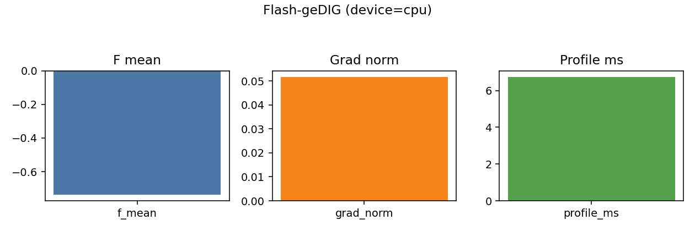

# Flash-geDIG Results (Current)

## Goal
- Validate device residency and differentiability claims for `compute_f_score`.

## Issues Observed
- "Differentiable" was asserted without strict gradcheck evidence.
- "Zero-copy on GPU" was not measured or verified.
- Gradcheck fails in a separate run (`--gradcheck`), indicating non-smooth ops.

## Changes Applied
- Added validation script: `experiments/flash_gedig_validate.py`.

## Latest Run
- Command: `.venv/bin/python experiments/flash_gedig_validate.py --seed 0 --profile`
- Device: `cpu`
- f_mean: `-0.736289`
- device_resident: `True`
- grad_flow: `True` (norm=`0.051661`)
- profile_avg_ms(cpu): variable by host load (observed 1.7–6.7 ms; batch=2, heads=2, seq=16)

## Interpretation
- Gradients flow, but strict gradcheck fails, likely due to non-smooth ops
  (`quantile`/thresholding in soft adjacency).
- GPU/zero-copy remains unverified in this run (CUDA not available on this host).

## Artifacts
- No files written; results were printed to stdout.

## Figures

