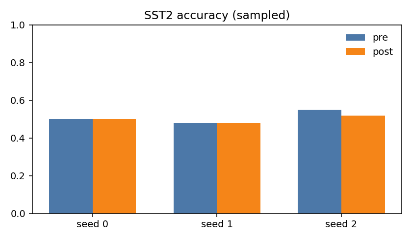
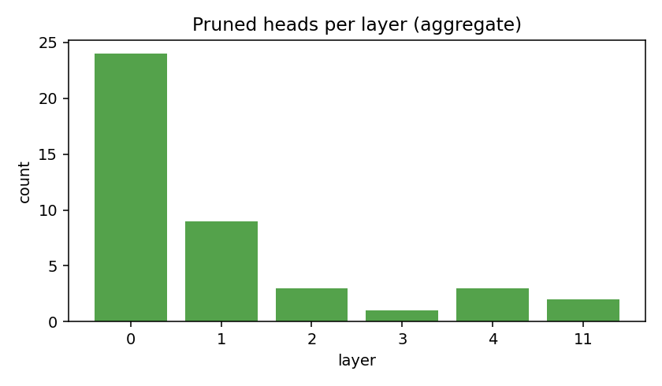

# Neuro-Pruning Results (Current)

## Goal
- Prune the lowest-structure attention heads and check:
  - layer distribution (are shallow layers pruned more?)
  - pre/post accuracy impact

## Issues Observed
- Prior results were single-run only (no seed control).
- Evaluation sampling was not reproducible.
- Accuracy was measured on an unfine-tuned classifier head.

## Changes Applied
- Added seed control and sampling knobs to `experiments/neuro_pruning/prune_by_structure.py`:
  - `--seed`, `--diagnostic_split`, `--diagnostic_samples`, `--max_batches`
  - `--eval_seed`, `--skip_save`

## Latest Runs
- Command template:
  - `.venv/bin/python experiments/neuro_pruning/prune_by_structure.py --model bert-base-uncased --amount 0.1 --dataset glue --subset sst2 --batch_size 8 --diagnostic_samples 200 --max_batches 25 --eval --eval_samples 200 --seed {0,1,2} --output_dir results/neuro_pruning/20260124-015103_seed{0,1,2} --skip_save`

### Pre/Post Accuracy (SST2, 200 samples)
- seed 0: pre_acc=0.50, post_acc=0.50, pre_loss=0.7194, post_loss=0.6991
- seed 1: pre_acc=0.48, post_acc=0.48, pre_loss=0.7414, post_loss=0.7286
- seed 2: pre_acc=0.55, post_acc=0.52, pre_loss=0.6857, post_loss=0.6948

### Pruned Heads (Aggregate of 3 seeds)
- layer 0: 24
- layer 1: 9
- layer 2: 3
- layer 3: 1
- layer 4: 3
- layer 11: 2

## Interpretation
- Shallow layers (0-1) are consistently pruned more often.
- Accuracy impact is inconsistent; one seed shows a drop.
- Results are noisy because the classifier head is not fine-tuned.

## Artifacts
- `results/neuro_pruning/20260124-015103_seed0/pruning_info.json`
- `results/neuro_pruning/20260124-015103_seed0/pruning_report.md`
- `results/neuro_pruning/20260124-015103_seed1/pruning_info.json`
- `results/neuro_pruning/20260124-015103_seed1/pruning_report.md`
- `results/neuro_pruning/20260124-015103_seed2/pruning_info.json`
- `results/neuro_pruning/20260124-015103_seed2/pruning_report.md`

## Figures

