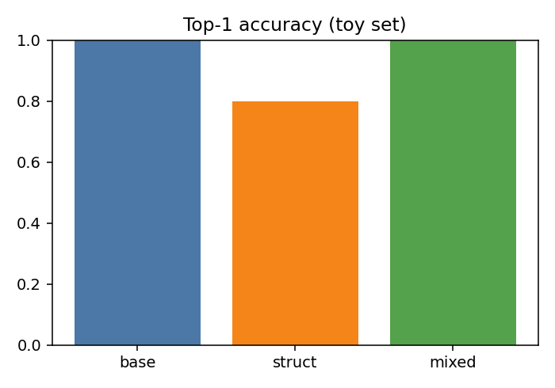

# Structure-Guided RAG Reranking Results (Current)

## Goal
- Use geDIG structure metrics to demote incoherent text while preserving relevance.

## Issues Observed
- Structure-only ranking promotes grammatical but irrelevant text.
- Toy evaluation is too small to support a strong claim.

## Changes Applied
- Added base relevance mixing and gating in `src/insightspike/rag/reranker.py`.
- Updated demo and eval scripts to show base/struct/mixed scores:
  - `experiments/rag_reranking/demo_rerank.py`
  - `experiments/rag_reranking/eval_rerank.py`

## Latest Runs

### Banana Demo (mix_weight=0.2, gate_min_norm=0.1, gate_penalty=1.0)
- Command: `.venv/bin/python experiments/rag_reranking/demo_rerank.py`
- Rank 1: AI definition (combined=0.8469, base=0.57, struct=0.0397)
- Rank 2: Banana (combined=0.8000, base=0.43, struct=0.1467)
- Rank 3: Word Salad (gated, combined=-1.0000)

### Tiny Eval (10 cases)
- Command: `.venv/bin/python experiments/rag_reranking/eval_rerank.py --mix_weight 0.2 --gate_min_norm 0.1 --gate_penalty 1.0`
- base_top1_acc: 1.000
- struct_top1_acc: 0.800
- mixed_top1_acc: 1.000

## Interpretation
- Gating drops incoherent text without hurting base relevance on the toy set.
- Still requires validation on real QA datasets.

## Artifacts
- No files written; results were printed to stdout.

## Figures

