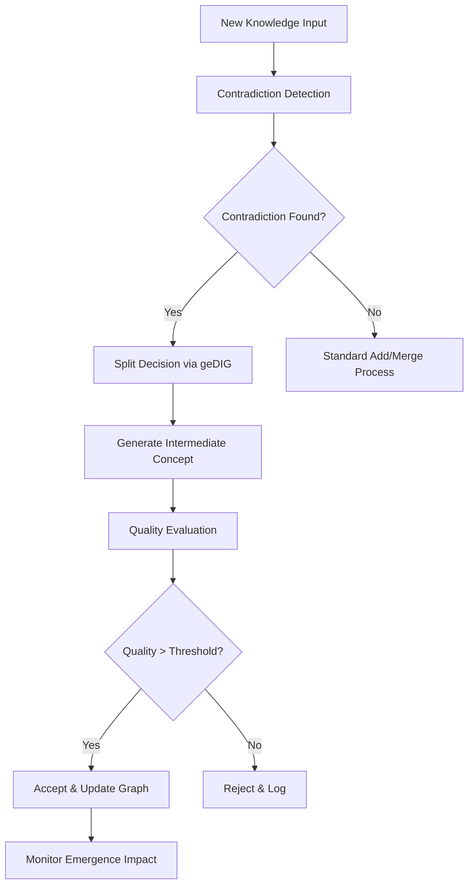

# 制御された創発：geDIG理論による矛盾処理と中間知識生成実験

## 実験概要

本実験は、geDIG（Graph Edit Distance + Information Gain）理論を基盤とする動的知識グラフにおいて、**矛盾検知→分裂→中間ノード生成**による「制御された創発」メカニズムを実装・評価する研究実験である。

### 研究仮説

1. **矛盾駆動分裂仮説**: 知識ノード間の矛盾検知により、より精密な知識表現への分裂が促進される
2. **中間知識創発仮説**: 矛盾解決過程で生成される中間ノードが、新たな洞察や概念橋渡しを実現する
3. **制御された創発仮説**: geDIG評価により、有益な創発のみを保持し、無関係な分岐を抑制できる

## 実験設計

### Phase 1: 基盤機能実装 
**期間**: 2-3日  
**目標**: 既存Dynamic RAG v2システムの拡張

#### 実装項目:
1. **Split機能の追加**
   - `UpdateType.SPLIT`の追加
   - `should_split_node()`判定ロジック
   - Split操作の実行機構

2. **実際のNLI統合**
   - Transformersライブラリによる矛盾検知
   - `entailment_score`/`contradiction_score`の実計算
   - 閾値最適化

3. **中間ノード生成機構**
   - 矛盾解決のための概念橋渡しノード作成
   - LLMによる中間概念生成
   - geDIG評価による品質管理

#### 成功基準:
- [ ] Split機能が正常に動作する
- [ ] 実際の矛盾スコアが計算される（非0.0）
- [ ] 中間ノードが生成される

### Phase 2: 制御メカニズム実装
**期間**: 2-3日  
**目標**: 創発の質的制御システム

#### 実装項目:
1. **創発品質評価**
   - 新規性スコア（既存知識との差異度）
   - 有用性スコア（下流タスクへの貢献度）
   - 一貫性スコア（既存知識体系との整合性）

2. **適応的閾値調整**
   - 成功した創発パターンの学習
   - 動的な分裂・統合閾値調整
   - フィードバックループの実装

3. **創発履歴追跡**
   - 分裂・統合の系譜管理
   - 中間ノードの進化追跡
   - 洞察の源流分析

#### 成功基準:
- [ ] 品質の高い中間ノードが優先的に保持される
- [ ] 無関係な分岐が適切に抑制される
- [ ] 創発プロセスが可視化される

### Phase 3: 評価実験実施
**期間**: 3-4日  
**目標**: 多角的性能評価とアブレーション分析

#### 評価データセット:
1. **矛盾含有データセット**
   - 科学的事実の時代的変遷（地動説vs天動説等）
   - 複数視点からの歴史記述
   - 異なる理論体系の説明

2. **推論タスク**
   - 常識推論（CommonsenseQA）
   - 科学推論（QASC）
   - 批判的思考（Critical Thinking）

#### 評価指標:
1. **定量的指標**
   - Knowledge Graph Quality Score
   - Contradiction Resolution Rate
   - Intermediate Node Utility Score
   - Reasoning Accuracy Improvement
   - Memory Efficiency Metrics

2. **定性的指標**
   - 生成された中間概念の妥当性評価
   - 矛盾解決プロセスの論理性評価
   - 創発知識の新規性評価

#### 比較ベースライン:
- Static Knowledge Graph（分裂なし）
- Simple Merge-only System
- Random Split System
- Human Expert Annotation

## 技術実装詳細

### アーキテクチャ拡張

```python
class ControlledEmergenceManager:
    """制御された創発メカニズムの中核クラス"""
    
    def detect_contradiction(self, node_a: str, node_b: str) -> ContradictionResult
    def should_split_node(self, node_id: str, contradiction_context: Dict) -> SplitDecision
    def generate_intermediate_concept(self, contradictory_nodes: List[str]) -> IntermediateNode
    def evaluate_emergence_quality(self, new_node: str) -> EmergenceQuality
```

### データフロー



## 期待される成果

### 学術的貢献
1. **理論的貢献**: geDIG理論の矛盾処理への応用
2. **技術的貢献**: 制御された創発メカニズムの実装
3. **実証的貢献**: 創発的知識処理の効果検証

### 実用的価値
1. **RAGシステム改善**: 矛盾情報の適切な処理
2. **知識統合**: 異なる情報源からの知識調和
3. **推論能力向上**: 中間概念による推論精度向上

## 実験環境・要件

### 計算リソース
- GPU: NVIDIA RTX 4090以上（NLI計算用）
- RAM: 32GB以上（グラフ処理用）
- ストレージ: 100GB以上（実験データ・ログ用）

### 依存関係
```python
# 主要ライブラリ
transformers>=4.30.0  # NLI model
torch>=2.0.0         # Deep learning
networkx>=3.0        # Graph processing
numpy>=1.24.0        # Numerical computation
scikit-learn>=1.3.0  # ML utilities
```

### 実験期間
**総期間**: 2-3週間
- 実装期間: 1-1.5週間
- 実験・評価期間: 1週間
- 分析・レポート作成: 0.5週間

## 成果物

1. **実装コード**: 完全な実験実装
2. **実験データ**: 評価結果・統計データ
3. **技術レポート**: 詳細な分析レポート
4. **論文草稿**: 学会投稿用論文ドラフト
5. **可視化**: 創発プロセスの動的可視化

## リスクと対策

### 技術的リスク
1. **NLI精度問題** → 複数モデルアンサンブル
2. **計算コスト増大** → 効率的近似手法導入
3. **創発品質制御困難** → 段階的閾値調整

### 実験的リスク
1. **評価指標不適切** → 専門家による妥当性検証
2. **データセット偏向** → 多様なドメインでの検証
3. **再現性問題** → 詳細な実験ログ記録

## 関連研究・参考文献

1. geDIG理論基盤論文（執筆中）
2. Dynamic RAG v2実装（既存）
3. Neural-Symbolic Integration研究
4. Contradiction Detection in NLP
5. Emergent Behavior in AI Systems

---

**実験責任者**: Claude + Human Researcher  
**開始予定日**: 2025-09-09  
**完了予定日**: 2025-09-30  
**実験ID**: CEGE-2025-09