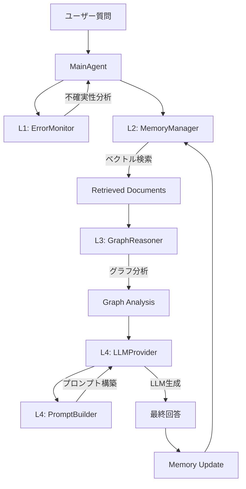

# InsightSpike データフロー分析

## 実際のデータフロー



## 詳細な流れ

### 1. **入力処理** (MainAgent)
```python
def process_question(self, question: str, max_cycles: int = 3)
```

### 2. **L1: ErrorMonitor** - 不確実性分析
```python
error_state = self.l1_error_monitor.analyze_uncertainty(
    question, self.previous_state
)
```

### 3. **L2: MemoryManager** - ベクトル検索
```python
memory_results = self._search_memory(question)
retrieved_docs = memory_results["documents"]
```
- 質問を**SentenceTransformer**でベクトル化
- FAISSで類似文書を検索

### 4. **L3: GraphReasoner** - グラフ分析
```python
graph_analysis = self.l3_graph.analyze_documents(
    retrieved_docs, graph_context
)
```
- 文書からグラフを構築
- **GED（グラフ編集距離）**と**IG（情報利得）**を計算
- スパイク検出

### 5. **L4: LLMProvider + PromptBuilder** - 応答生成
```python
llm_context = {
    "retrieved_documents": retrieved_docs,
    "graph_analysis": graph_analysis,
    "previous_state": self.previous_state,
    "reasoning_quality": graph_analysis.get("reasoning_quality", 0.0),
}
llm_result = self.l4_llm.generate_response_detailed(llm_context, question)
```

## あなたの理解との違い

### ❌ 誤解されている点：
1. **メッセージパッシングでクエリを変容** → 実際は行われていない
2. **Layer3からLayer4のプロンプトビルダーに直接渡る** → 実際はMainAgent経由

### ✅ 正しい流れ：
1. **Layer1**: エラー監視（現在は形式的）
2. **Layer2**: ベクトル検索で関連文書取得
3. **Layer3**: グラフ構築と分析（スパイク検出）
4. **Layer4**: プロンプト構築とLLM生成

### 📝 重要な発見：
- **クエリ変容は行われていない**（質問は変更されない）
- **メッセージパッシングは実装されていない**
- Layer3は文書の関係性を分析するが、質問自体は変更しない
- すべての層はMainAgentが順番に呼び出している

## 理想的なフロー（未実装）
```
質問 → ベクトル化 → 検索 → グラフ構築 → 
メッセージパッシング → クエリ変容 → 
拡張された検索 → プロンプト生成 → 回答
```

## 現在のフロー
```
質問 → ベクトル化 → 検索 → グラフ分析 → 
スパイク検出 → プロンプト生成（メトリクス付き） → 回答
```

メッセージパッシングとクエリ変容は、InsightSpikeの理論的な概念としては存在しますが、現在のコードには実装されていません。