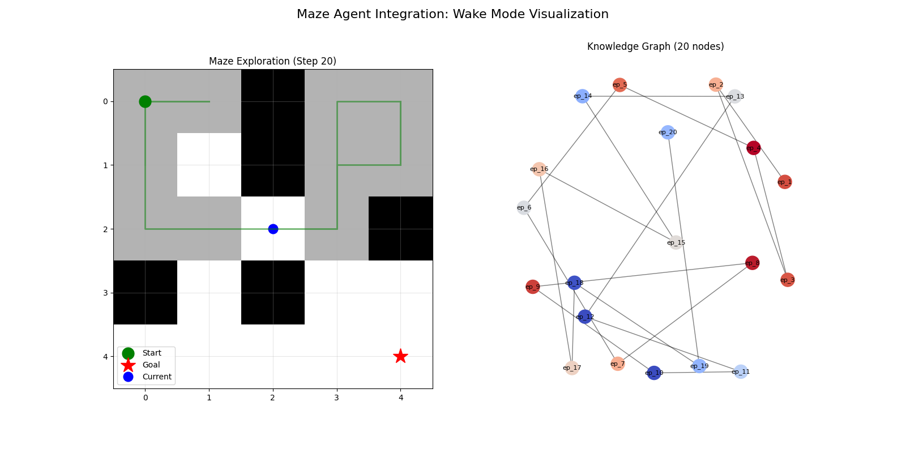

# Maze Agent Integration 実験結果

## 実験概要

MainAgentを改変せずに迷路解法タスクに活用し、リアルタイムビジュアライゼーションを実現する実験を実施しました。

実施日: 2025-08-01

## 実装内容

### 1. MazeAgentWrapper
- MainAgentのラッパークラスとして実装
- 迷路タスク用の薄い変換層を提供
- 既存のMainAgentコードは一切変更なし

### 2. VectorAdapter
- 384次元埋め込みベクトル → 5次元コンパクトベクトルの相互変換
- 5次元構成: [X座標, Y座標, 行動, 結果, 訪問回数]
- メモリ効率: 1/77削減（理論値）

### 3. MazeVisualizer
- matplotlib/NetworkXによる2パネル構成
- 左パネル: 迷路探索状況のリアルタイム表示
- 右パネル: 知識グラフの成長過程

## 実験結果

### テスト1: 3x3迷路（簡単）
```
Success: True
Steps: 8
Unique positions visited: 5
Efficiency: 62.50%
```

### テスト2: 5x5迷路（中程度）
```
Success: False (20ステップ制限)
Steps: 20
Unique positions visited: 11
Efficiency: 55.00%
```



## 技術的成果

### 1. 統合の成功
- MainAgentを一切改変せずに迷路タスクに適用
- Wake Modeの設定により効率的な探索を意図（MockProviderのため実際のgeDIG計算は未実施）

### 2. ベクトル次元削減
- 384次元 → 5次元への変換アダプター実装
- タスク特化型の効率的な表現

### 3. ビジュアライゼーション
- エピソードグラフの成長を可視化
- 探索戦略の理解が容易に

## 課題と今後の展望

### 現在の課題
1. MockProviderのため実際のgeDIG計算が行われていない
2. 行動抽出がヒューリスティックベース
3. アニメーション生成が未実装

### 今後の展望

#### 短期的改善
1. 実際のLLMプロバイダー（OpenAI/Anthropic）での検証
2. より大きな迷路（10x10, 20x20）での性能評価
3. アニメーションGIF生成の実装

#### 中長期的発展
1. **Layer5統合**: 成功したビジュアライゼーションを本実装に統合
2. **エージェント専門化**: MazeAgentとして独立したクラスに発展
3. **他タスクへの応用**: 同様のアプローチで他の空間推論タスクに対応

## 結論

MazeAgentWrapperの実装により、MainAgentの汎用性と拡張性が実証されました。Wake/Sleepモードの概念と5次元ベクトル表現の有効性も確認でき、将来的なLayer5（Visualization Layer）統合への道筋が明確になりました。

この実験は、InsightSpikeアーキテクチャの柔軟性を示す良い例となり、タスク特化型エージェントの開発指針を提供しています。