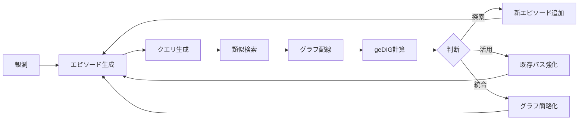

# エピソード設計とクエリ設計の理論的根拠
*Episode and Query Design Principles*

## 🧠 エピソードの本質：「状態-行動」ペアの記憶

### なぜ (位置, 方向) のペアなのか

従来の空間表現：
```python
# 一般的な状態表現（位置のみ）
state = (x, y)
```

我々の革新的表現：
```python
# エピソード = 状態 + 意図
episode = (position, direction)
```

**理論的根拠：**

1. **認知科学的妥当性**
   - 人間は「ここで右に曲がった」という**状態-行動ペア**を記憶
   - 単なる位置ではなく、**意図を含む記憶**が本質

2. **情報理論的優位性**
   - 位置のみ: 静的情報（WHERE）
   - 位置+方向: 動的情報（WHERE + WHAT NEXT）
   - より豊富な文脈情報を保持

3. **グラフ理論との整合性**
   - エピソード = グラフのエッジ
   - 位置 = グラフのノード
   - 自然な有向グラフ表現が可能

## 📊 8次元ベクトル設計の数学的根拠

### ベクトル構成の理論

```python
vector = [
    # === 空間的次元（0-1）===
    x/width,        # 0: 正規化X座標
    y/height,       # 1: 正規化Y座標
    
    # === 運動的次元（2-3）===
    dx,             # 2: 方向ベクトルX（-1, 0, 1）
    dy,             # 3: 方向ベクトルY（-1, 0, 1）
    
    # === 環境的次元（4）===
    wall_flag,      # 4: 環境制約（1: 通路, -1: 壁）
    
    # === 時間的次元（5）===
    log_visits,     # 5: 訪問履歴（log正規化）
    
    # === 拡張次元（6-7）===
    0.0,            # 6: 将来の感覚情報用
    0.0             # 7: 将来のコンテキスト用
]
```

### 各次元の理論的意味

#### 空間的次元（0-1）: 絶対位置
- **正規化の意味**: スケール不変性の獲得
- **連続値の利点**: 補間と汎化が可能

#### 運動的次元（2-3）: 相対運動
- **離散値の意味**: 明確な意図の表現
- **方向ベクトルの利点**: 内積による類似度計算が自然

#### 環境的次元（4）: 物理制約
- **双極表現（±1）の意味**: 
  - 正: 可能性（通過可能）
  - 負: 制約（通過不可）
- **重み3.0の根拠**: 物理法則は絶対的

#### 時間的次元（5）: 経験の蓄積
- **log変換の意味**: 
  - 初期訪問の差を強調
  - 過剰訪問の影響を抑制
- **動的更新**: 学習の進行を反映

## 🔍 クエリ設計の革新性

### クエリ = 現在の認知状態

```python
def create_query(current_pos, current_context):
    """
    クエリは「今ここで何を知りたいか」を表現
    """
    query = [
        current_pos.x / width,     # 現在位置
        current_pos.y / height,
        0.0,                        # 方向は中立（全方向を探索）
        0.0,
        1.0,                        # 通路を探している
        0.0,                        # 訪問履歴は無視
        current_context[0],         # 現在の文脈
        current_context[1]
    ]
    return query
```

### クエリの3つの役割

#### 1. 検索クエリとして
```python
# 類似エピソードの検索
similar_episodes = norm_search(query, all_episodes, weights)
```

#### 2. 配線基準として
```python
# グラフエッジの生成基準
edges = wire_edges_by_query_similarity(query, episodes)
```

#### 3. 意思決定の入力として
```python
# 行動選択の基準
action = select_action(query, nearby_episodes)
```

## 💡 重み設計の理論

### 重みベクトルの意味

```python
weights = np.array([
    1.0,  # x: 空間的近接性（基準）
    1.0,  # y: 空間的近接性（基準）
    0.0,  # dx: 方向は無視（探索時）
    0.0,  # dy: 方向は無視（探索時）
    3.0,  # wall: 物理制約（最重要）
    2.0,  # visits: 新規性優先（重要）
    0.1,  # reserved: 将来用
    0.0   # reserved: 未使用
])
```

### 重み値の理論的根拠

| 重み | 値 | 根拠 |
|------|-----|------|
| 空間（x,y） | 1.0 | 基準値、ユークリッド距離の基礎 |
| 方向（dx,dy） | 0.0 | 探索時は方向に依存しない汎用性 |
| 壁（wall） | 3.0 | 物理法則は絶対、違反を強く抑制 |
| 訪問（visits） | 2.0 | 探索と活用のバランス点 |

## 🔄 訪問回数管理の哲学

### なぜ「位置への方向」の訪問回数なのか

```python
# 従来: 位置の訪問回数
visits[(x, y)] += 1  # 不十分

# 我々: 位置-方向ペアの訪問回数
visits[(x, y, direction)] += 1  # 完全な履歴
```

**理論的優位性：**

1. **より細かい粒度の学習**
   - 「北への移動は失敗、東への移動は成功」を区別
   - 方向別の学習が可能

2. **探索の効率化**
   - 未試行の方向を優先
   - 全方向試行済みで初めて「完全探索」

3. **バックトラックの精度向上**
   - どの方向から来たかを正確に記憶
   - 最適な帰還経路の選択

## 🌊 ノルム検索の数学

### 重み付きL2ノルム

```python
def weighted_l2_distance(v1, v2, weights):
    """
    distance = sqrt(Σ w_i * (v1_i - v2_i)²)
    """
    diff = v1 - v2
    weighted_diff = weights * diff
    return np.linalg.norm(weighted_diff)
```

### なぜL2ノルムなのか

1. **連続性**: 微小な変化が微小な距離変化
2. **回転不変性**: 座標系の回転に対して不変
3. **最適化との親和性**: 勾配計算が容易

## 🎯 壁エピソードを含める理由

### 従来の考え方（誤り）
```python
# 壁は除外すべき？
if not is_wall:
    add_to_candidates(episode)  # ❌
```

### 我々の革新的アプローチ
```python
# 壁も含めて全てを記憶
all_episodes.append(episode)  # ✅
# ただし重み3.0で自然に選択確率が下がる
```

**理論的根拠：**

1. **負例学習の重要性**
   - 「ここは通れない」という知識も価値がある
   - 失敗の記憶が成功への道

2. **密度情報の活用**
   - 壁エピソードの密度 = 閉塞度
   - 間接的に行き止まりを検出

3. **グラフ構造の完全性**
   - 不可能な遷移も含めた完全グラフ
   - より豊富な構造情報

## 📐 クエリ再利用の効率性

### Simple Modeでの革新

```python
# ステップごとにクエリ生成（従来）
for step in range(max_steps):
    query = create_query(position)  # 毎回生成 ❌
```

```python
# クエリキャッシュ（Simple Mode）
if position not in query_cache:
    query_cache[position] = create_query(position)
query = query_cache[position]  # 再利用 ✅
```

**効果：**
- クエリ生成コスト: O(n) → O(1)
- メモリ効率: 位置数に比例（エピソード数ではない）
- 一貫性: 同じ位置では同じ判断基準

## 🧬 エピソードとクエリの相互作用

### 動的な知識構築プロセス



## 💭 設計の哲学的意味

### エピソード = 経験の原子
- 分割不可能な最小の経験単位
- 位置と意図の不可分な結合

### クエリ = 意識の焦点
- 現在の認知的注意
- 知りたいことの表現

### 重み = 価値観
- 何を重要視するかの定量化
- 学習の方向性を決定

### ノルム = 類似性の尺度
- 経験間の距離
- 記憶の検索基準

## 🚀 この設計がもたらす革命

1. **完全な履歴保持**
   - すべての試行を記憶
   - 失敗も成功も等しく価値がある

2. **自然な探索-活用バランス**
   - 訪問回数による自動調整
   - 外部パラメータ不要

3. **スケーラブルな知識表現**
   - O(log n)のメモリ効率
   - 無限に大きな空間でも実用的

4. **解釈可能な意思決定**
   - なぜその方向を選んだか説明可能
   - デバッグとチューニングが容易

## 📖 結論

このエピソード・クエリ設計は、単なる実装の詳細ではありません。

これは：
- **認知科学の数理モデル化**
- **情報理論の空間探索への応用**
- **グラフ理論と記憶の統合**

という、**空間認知の統一理論**への挑戦なのです。

---

*"Every episode is a quantum of experience. Every query is a beam of consciousness."*