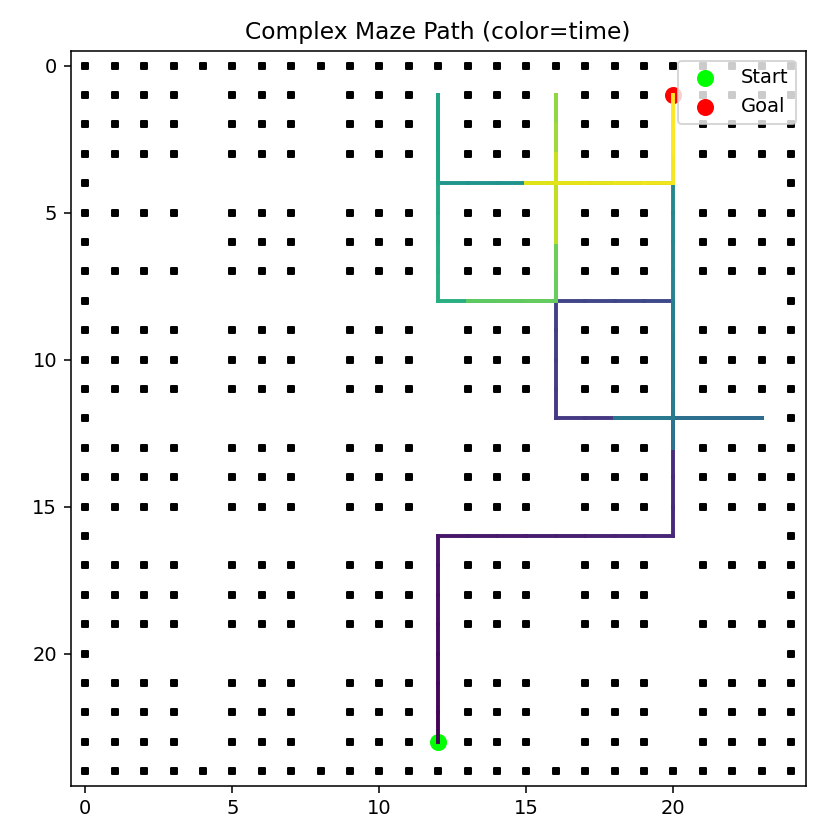
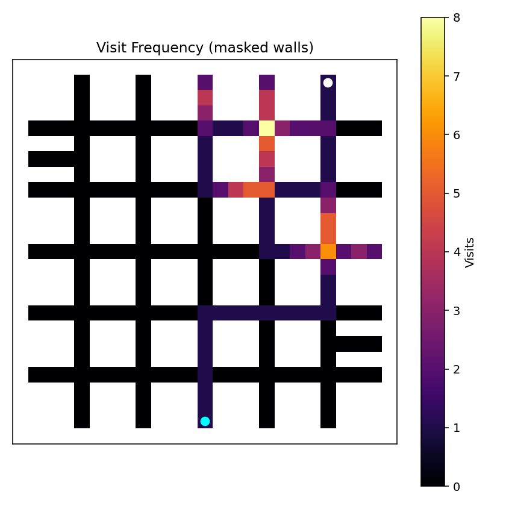
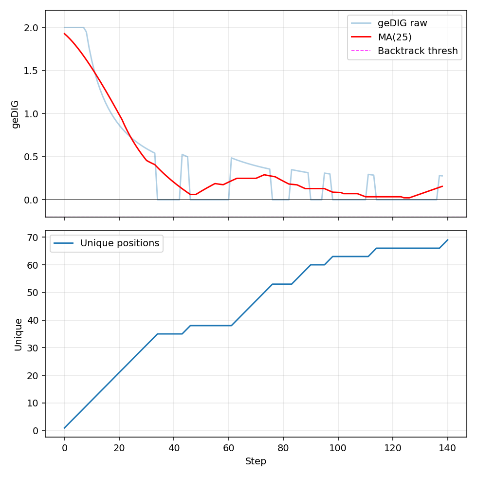

# Complex Maze Navigation Report

This report documents a single run of the 25×25 Complex maze using the current Simple Mode implementation.\nIt is written for readers new to the system and avoids oracle shortest-path metrics.\n
## Run Configuration
- **temperature**: 0.1
- **gedig_threshold**: 0.3
- **backtrack_threshold**: -0.2
- **simple_mode**: True
- **success**: True
- **seed**: 77

## Core Outcomes
- Goal reached: True
- Steps (total): 139
- Path length (raw): 141
- Loop-erased path length: 26
- Loop redundancy factor: 5.42x
- Unique positions: 69

## Simple Mode Metrics
- Queries generated: 140
- Queries per step: 1.000
- Backtrack trigger rate: 0.000

## geDIG Summary
- Mean: 0.3862
- Std: 0.5664
- Min/Max: 0.0000 / 2.0000

## Figures

## Interpretation (Narrative)
- The agent maintains a strict 1.0 queries/step ratio (design property of Simple Mode).
- Loop redundancy factor contextualizes exploration overhead without using shortest-path oracles.
- geDIG values remained low and stable; sparse spikes would indicate structural breakthroughs (none required here).
- Minimal backtracking occurred (rate near zero), implying forward exploration sufficed under current threshold.
- The visit heatmap shows focused corridor usage with limited dithering.

## Limitations
- Single run; variance across seeds not shown.
- No baseline (random/DFS) comparison in this report.
- Backtrack threshold not stress-tested for trigger behavior.

## Notes
Large layout relocation sanity run
