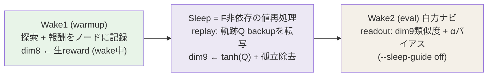
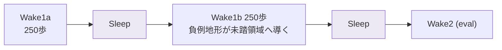
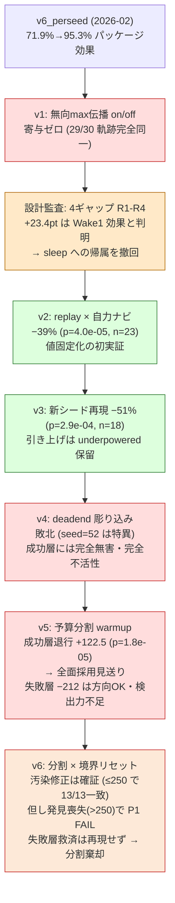

# Graph-Persistent DG (Wake-Sleep-Wake / stage-2)

**グラフを捨てずに sleep で再処理して引き継ぐ**ことで、次の試行を改善する実験モジュール。
論文 Phase 2(オフライン再編)の最小実装であり、agent memory 応用
([地形図](../../../docs/research/references/agent_memory_landscape_2026.md))への校正場。

> 迷い込んだら: 全体案内 [docs/MAP.md](../../../docs/MAP.md) /
> 実験の勝敗台帳 [docs/prereg/README.md](../../../docs/prereg/README.md) /
> 図版 [WAKE_SLEEP_WAKE.svg](../../../docs/diagrams/WAKE_SLEEP_WAKE.svg)

## パイプライン(現行構成)



**v5(決着 2026-07-06)の予算分割**: 総 warmup 予算 500 を固定したまま中間 sleep を挟む —
「sleep の価値は反復にある」の直接検証。**結果: 無条件の分割は不採用**(成功層 +122.5 歩の
退行が確定。失敗層は方向 OK だが n=6 で検出力不足)。一括 warmup(cycles=1)が既定のまま。



この構成が成立するのは**一括 warmup が失敗する迷路だけ**(救済 4/6、うち 3 件は両 warmup
未達のまま eval 成功 = 被覆機構の直接証拠)。成功する迷路では有害(v5 §8 の退行の型分析)。

## 実験系譜(事前登録 5 連)



> v6 は**部分的成果**(オレンジ寄り赤): 装置仮説「≤250 退行は汚染」は確証されたが、
> 「分割に反復価値がある」という上位主張は棄却。reset は残す・分割は捨てる、の分離判定。

## 主張の現状台帳

| 主張 | 状態 | 根拠 |
|---|---|---|
| replay 値固定化は warmup 成功層で eval −39〜−51% | ✅ **確立(独立 2 実験で再現)** | [v2](../../../docs/prereg/maze_sleep_ablation_v2.md)・[v3](../../../docs/prereg/maze_sleep_ablation_v3.md) |
| v6_perseed の +23.4pt は sleep の効果 | ❌ **撤回**(Wake1 効果 + パッケージ交絡) | [v1](../../../docs/prereg/maze_sleep_ablation.md)・[監査](../../../docs/audits/sleep_ablation_design_audit.md) |
| 旧 `--sleep-propagate on`(無向 max 伝播) | ❌ 寄与ゼロ・飽和バグ(比較用に残置) | v1・[semantics テスト](../test/test_sleep_propagate_semantics.py) |
| 未達トライの引き上げ | ⏸ 保留(方向 OK・検出力不足) | v3 §8 |
| deadend 彫り込み(dim8/dim9 価値統一) | ❌ 敗北(無害だが無力、seed=52 特異) | [v4](../../../docs/prereg/maze_sleep_v4_deadend_carving.md) |
| 無条件の予算分割 warmup(sleep 反復価値) | ❌ **棄却**(v5 退行 +122.5・v6 でも分割自体に利得なし。反復価値は迷路では不支持) | [v5 §8](../../../docs/prereg/maze_sleep_v5_budget_split.md)・[v6 §8](../../../docs/prereg/maze_sleep_v6_split_reset.md) |
| v5 の ≤250 退行の正体は境界跨ぎ汚染 | ✅ **確立**(reset で ≤250 成功層 13/13 完全一致。探索 5/5 → 確証 13/13) | [v6 §8](../../../docs/prereg/maze_sleep_v6_split_reset.md) |
| 分割は失敗層(一括 warmup 全滅の迷路)を救済する | ❌ **再現せず**(v5 −212 → v6 新シードで中立 +10.9、救済 2/損失 5/引分 4。v5 はシード群特異) | v5 §8・[v6 §8](../../../docs/prereg/maze_sleep_v6_split_reset.md) |
| 分割の発見喪失コスト(warmup >250 の迷路) | ✅ 実在(>250 成功層 6 中 5 が発見喪失、reset では不可避 — §6 登録済み) | [v6 §8](../../../docs/prereg/maze_sleep_v6_split_reset.md) |
| `--sleep-q-episode-reset`(多サイクル時の汚染除去) | ✅ 有効・**残置**(単一サイクルでは no-op、既定オフ) | v6 §8 |
| **v7: 11D 三信号 + β₁-DG(抜本改訂)** | 🔵 **設計進行中**(source-query readout配線PASS。seed 118は競合露出0で効果未評価・inconclusive) | [v7 設計ノート §9.5](../../../docs/research/thinking/v7_three_signal_edge_propagation_20260706.md) |
| readout 分解(dim9 は行動バイアスに対し冗長か) | ⬜ v7 に統合(11D materialize と同時に決着) | v7 設計ノート §4 |
| F 駆動 sleep・51×51・curl 診断 | ⬜ 未着手(各々新規事前登録で) | — |

詳細な経緯・実務知識(実行時間・難シード等)は各 prereg の §8 と
[edge_flow_field_navigation ノート](../../../docs/research/thinking/edge_flow_field_navigation_20260704.md)を参照。

## 機構の要点

### 何が Wake2 の行動を決めるか(v2 で実証された経路)

- 記憶は**ノード**に宿る: 方位ノード (r,c,a) に `reward`(wake 中・上書き)と `propagated`(sleep が付与)
- replay sleep = `build_sleep_q_table` の **Q(s,a) を方位ノードへ転写**(有向・有界・負例保存)、
  query ノードには V(s)=max Q。その後 dim9 ← tanh(propagated)、孤立ノード除去
- readout は 2 経路: dim9 が類似度計算に参加(weight 3.0)+ `propagated_alpha` の行動バイアス。
  **候補比較では abs と flow(V 差)は数学的に等価**(v4 期の探索で証明 — 詳細は flow ノート)

### ⚠ 旧アルゴリズム(参考・使用しない)

```
propagated(n) = reward(n) + γ · max(propagated(neighbor))   # --sleep-propagate on
```

無向 max の相互強化で全ノードが ~reward/(1−γ) に膨張し tanh 飽和 → **行動への寄与ゼロが v1 で確定**。
SPEC §3.3 の設計意図(負の dead-end 回避)は満たさない(strict xfail としてテストに固定済み)。
v6_perseed との比較のためだけに残置。**新実験は `--sleep-propagate replay` を使うこと**。

## ベクトル拡張(10D)

`--vector-mode extended` で 8D → 10D:

| dim | 内容 | weight | 書き込み者 |
|-----|------|--------|-----------|
| 0-1 | 位置 (row/col) | 1.0 | wake |
| 2-3 | 方向 (dx/dy) | 0.0 | wake |
| 4 | 通過可否 | 3.0 | wake |
| 5 | 訪問回数 | 2.0 | wake |
| 6-7 | success/goal | 0.0 | wake |
| **8** | **reward** | **2.0** | **wake**(記録と同時に同期) |
| **9** | **tanh(propagated)** | **3.0** | **sleep**(replay 転写後に同期) |

query vector は dim8=1.0, dim9=1.0 → 正報酬/正伝播ノードが L2 距離で「近い」= 高類似度。

## 報酬テーブル(実装値)

`run_experiment_query.py` の報酬記録部が正(SPEC §2.1 の +0.3/−0.3 は設計時初期案):

| イベント | reward(dim8) | replay Q 側 |
|----------|--------|--------|
| goal 到達 | +1.0 | goal_reward +1.0(吸収) |
| 新セル通過 | +0.2 | (novel 概念なし — step −0.01 のみ) |
| 既訪問再訪 | −0.4 | revisit_penalty −0.2 |
| 行き止まり | −1.0 | deadend_penalty 0.0(既定。−1.0 統一は v4 で無効果と判明) |
| 壁衝突 | −1.0 | blocked_penalty 0.0(自己ループ+観測ガードでほぼ不活性) |

## 使い方

### 現行実験標準(v2 以降の構成: replay + 自力ナビ)

```bash
cd experiments/maze
PYTHONPATH=../../src INSIGHTSPIKE_MIN_IMPORT=1 INSIGHTSPIKE_LITE_MODE=1 \
../../.venv/bin/python3 run_experiment_query.py \
  --maze-size 25 --max-steps 500 --seeds 1 --seed-start 0 \
  --max-hops 15 --sp-cand-topk 5 \
  --curriculum-warmup-steps 500 --lambda-weight 0.01 \
  --vector-mode extended \
  --sleep-propagate replay \
  --sleep-guide off \
  --steps-ultra-light \
  --output results/graph_persistent_dg/example.json
```

- 予算分割(v5 構成)は `--wsw-cycles 2` を追加(総 warmup 予算は自動で均等分割)
- 一括実行は `run_sleep_ablation*.sh` / `run_sleep_v4_carving.sh` / `run_sleep_v5_split.sh` を参照
  (per-seed・skip-if-exists・paired 実行の型)

### 主要オプション

| オプション | 既定 | 説明 |
|------------|-----------|------|
| `--sleep-propagate` | on | **replay 推奨**(軌跡 Q 転写)。on=旧 max 伝播(比較用)、off=生グラフ継承(対照) |
| `--sleep-guide` | override | **off 推奨**(自力ナビ)。override は辞書計画が行動を支配(v1 の床効果) |
| `--wsw-cycles` | 1 | 2 で予算分割 W-S-W-S-E(総 warmup 予算固定・均等分割) |
| `--vector-mode` | standard | extended(10D)が実験標準 |
| `--propagated-mode` | abs | gradient(V 差)は候補比較で abs と等価(v4 期に証明) |
| `--dg-action-alpha` | 0 | **v7探索用**。`exp(alpha × tanh(dg_size/scale))`でsource query×actionをbias。0は厳密no-op |
| `--dg-action-scale` | 10 | **v7探索用**。正の有限値のみ。単一seed smokeを超える効果主張はまだない |
| `--sleep-q-*` | 各種 | replay の Q 学習パラメータ(γ=0.99, α=0.4, iters=50 等) |

## ファイル構成

```
graph_persistent_dg/
├── README.md              ← この文書
├── SPEC.md                ← 設計仕様書(冒頭の実装乖離注記を必ず読む)
├── __init__.py
└── sleep_propagate.py     ← sleep_optimize(旧on) / sleep_replay_optimize(現行replay)
関連:
├── ../test/test_sleep_propagate_semantics.py  ← 意味論の正典(実装挙動+SPEC意図のxfail)
├── ../qhlib/sleep.py                          ← build_sleep_q_table(replayのQ源)
├── ../run_v7_dgwire_smoke.sh                  ← v7 DG readoutの単一seed操作確認
└── ../run_sleep_ablation*.sh ほか             ← 事前登録実験のランナー群
```
