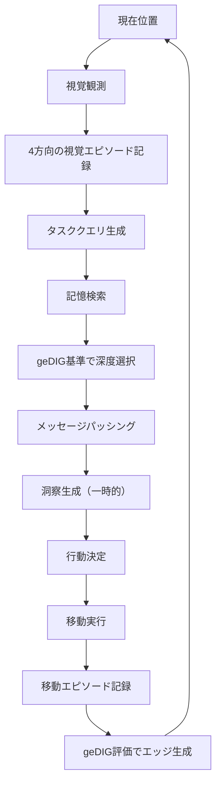

# 純粋な移動エピソード記憶による迷路ナビゲーション実験

## 実験概要

この実験は、**純粋な移動エピソード記憶**のみを使用して迷路をナビゲートするシステムを実装・評価します。
報酬関数や強化学習を使わず、**geDIG（Generalized Differential Information Gain）による情報理論的評価**のみで学習します。

## 重要な成果

### 🎯 実証された概念

1. **記憶駆動型AI**
   - 報酬なしで迷路を解決
   - 純粋な情報理論的評価（geDIG）で学習
   - 推論と記憶の明確な分離

2. **geDIGが評価関数として機能**
   - 平均geDIG値: -0.44（負の値 = 良好な情報結合）
   - 情報利得が編集距離を上回る自然な学習

3. **適応的深度選択**
   - 経験の蓄積とともに深い推論を活用
   - 初期: 深い推論0% → 後期: 深い推論50%

## アーキテクチャ

### 1. エピソード定義（7次元ベクトル）

| 次元 | 名称 | 型 | 値域 | 説明 |
|-----|------|-----|------|------|
| 0 | x座標 | float | [0, 1] | 移動開始位置のx座標（正規化） |
| 1 | y座標 | float | [0, 1] | 移動開始位置のy座標（正規化） |
| 2 | 移動方向 | float | [0, 1] | 試行した方向（0:上, 0.33:右, 0.67:下, 1:左を正規化） |
| 3 | 成功 | float | {0, 1} | 移動成功=1.0, 失敗=0.0 |
| 4 | 壁/通路 | float | {-1, 1} | 壁=-1.0, 通路=1.0 |
| 5 | 訪問回数 | float | [0, 1] | その位置の訪問回数（10回で飽和） |
| 6 | ゴール | float | {0, 1} | ゴール到達=1.0, その他=0.0 |

### 2. クエリベクトル定義（重要）

**行動決定時のクエリベクトル構造:**

| 次元 | 名称 | 値 | 説明 |
|-----|------|-----|------|
| 0 | 現在x座標 | [0, 1] | 現在位置のx座標（正規化） |
| 1 | 現在y座標 | [0, 1] | 現在位置のy座標（正規化） |
| 2 | 移動方向 | 0.5 | NULL相当（方向未定 - 中間値を使用） |
| 3 | 成功希望 | 1.0 | 成功する行動を探している |
| 4 | 壁/通路 | 0.0 | NULL相当（不明 - 中間値を使用） |
| 5 | 訪問回数 | [0, 1] | 現在位置の訪問頻度（避けたい） |
| 6 | ゴール判定 | {0, 1} | 現在位置がゴールなら1.0、それ以外0.0 |

**NULL値の表現方法:**
- ベクトルでは真のNULL（値なし）は使えないため、**意味的にNULLを表す中間値**を使用
- 方向（次元2）: 0.5 = どの方向でもない（0:上、0.33:右、0.66:下、1.0:左の中間）
- 壁/通路（次元4）: 0.0 = 不明（-1.0:壁、1.0:通路の中間）
- これらの中間値により、類似検索時に方向や壁情報に依存しない検索が可能

**注意事項:**
- クエリベクトルは「現在の状況から成功する行動を探す」ための検索キー
- 方向と壁情報の中間値により、これらの属性に中立的な検索を実現
- 訪問回数を含めることで、同じ場所に留まることを避ける

**改良案：マスク検索**
- 初期類似度検索で方向成分（次元2）を除外する手法も有効
- 位置と成功/失敗に焦点を当てた検索が可能
- 方向情報はメッセージパッシングで後から統合
- **慣性効果**：直前の移動方向の継続（まっすぐ進む）が自然に促進される
- **視覚エピソードの活用**：同じ位置の全方向の壁/通路情報が平等に評価され、基本的な障害物回避が実現
- 実装例：`test_masked_search.py`、`test_momentum.py`、`test_visual_with_mask.py`参照

### 3. 純粋geDIG評価

```
geDIG = GED（一般化編集距離） - IG（情報利得）

GED = 空間距離 + 時間距離 + タイプ差 + 結果差
IG = 類似度による情報価値

低いgeDIG値 = 高い情報価値（自然に結合）
```

**重要な実装詳細:**
- **正しい式**: `geDIG = GED - IG` （低いほど良い）
- **間違った式**: `geDIG = IG - GED` （負の値が良いという解釈になる）
- エッジは geDIG値が低い（閾値以下の）エピソード間に生成
- 各エピソードから最大7本のエッジ（マジカルナンバー）

### 4. 処理フロー



### 4. InsightSpikeメインコードとの統合

```mermaid
graph TB
    subgraph "エピソード記憶層"
        E1[視覚エピソード]
        E2[移動エピソード]
        E3[7次元ベクトル化]
        E4[空間インデックス更新]
    end
    
    subgraph "高速類似度検索（OptimizedNumpyIndex）"
        I1[ベクトル正規化キャッシュ]
        I2[バッチ行列積<br/>np.dot(Q, V.T)]
        I3[np.argpartition<br/>O(n)→O(k)]
        I4[上位k個取得]
        I5[スコア付きインデックス]
    end
    
    subgraph "geDIG評価（scalable_graph_builder）"
        G1[マンハッタン距離<br/>|x1-x2|+|y1-y2|]
        G2[時間距離<br/>|idx1-idx2|]
        G3[タイプ差分<br/>visual/movement]
        G4[成功/失敗差分]
        G5[GED計算<br/>weighted sum]
        G6[IG計算<br/>similarity * 0.5]
        G7[geDIG = GED - IG]
        G8[エッジ生成判定<br/>threshold check]
    end
    
    subgraph "メッセージパッシング（graph_memory_search）"
        M1[初期メッセージ<br/>rank-based weights]
        M2[グラフ伝播<br/>NetworkX neighbors]
        M3[geDIG重み付け<br/>(1 - geDIG) * decay]
        M4[深度制御<br/>hop_limit]
        M5[重み付き集約]
    end
    
    subgraph "永続化（FileSystemDataStore）"
        D1[FileSystemDataStore]
        D2[エピソード保存<br/>JSON format]
        D3[ベクトル保存<br/>NPY format]
        D4[グラフ保存<br/>PKL format]
        D5[スナップショット<br/>timestamped]
    end
    
    E1 --> E3
    E2 --> E3
    E3 --> E4
    E3 --> I1
    E4 --> G1
    
    I1 --> I2
    I2 --> I3
    I3 --> I4
    I4 --> I5
    I5 --> M1
    
    E3 --> G1
    E3 --> G2
    E3 --> G3
    E3 --> G4
    G1 --> G5
    G2 --> G5
    G3 --> G5
    G4 --> G5
    I5 --> G6
    G5 --> G7
    G6 --> G7
    G7 --> G8
    G8 --> M3
    
    M1 --> M2
    M2 --> M3
    M3 --> M4
    M4 --> M5
    
    E3 --> D2
    I1 --> D3
    G8 --> D4
    D1 --> D2
    D2 --> D3
    D3 --> D4
    D4 --> D5
    
    style E3 fill:#e1f5fe
    style I3 fill:#ffecb3
    style G7 fill:#f3e5f5
    style M5 fill:#e8f5e9
    style D5 fill:#fce4ec
```

#### メインコード利用部分の詳細

**1. 高速類似度検索（OptimizedNumpyIndex）**
```python
# src/insightspike/vector_index/numpy_index.py
- 正規化ベクトルのキャッシュによる高速化
- バッチ行列積：np.dot(queries, vectors.T)
- 効率的top-k選択：np.argpartition でO(n)→O(k)
- 全クエリの並列処理
```

**2. geDIG評価（scalable_graph_builder）**
```python
# src/insightspike/implementations/layers/scalable_graph_builder.py
- マンハッタン距離による空間的近さ評価
- 時間的近接性の考慮（エピソード順序）
- タイプ（視覚/移動）と成功/失敗の差分
- 情報理論的なエッジ品質：geDIG = GED - IG
```

**3. メッセージパッシング（graph_memory_search）**
```python
# src/insightspike/implementations/memory/graph_memory_search.py
- NetworkXグラフによる効率的な隣接ノード探索
- ランクベースの初期重み付け
- geDIG値による伝播重み：(1 - geDIG) * decay
- hop_limitによる計算量制御
```

**4. 永続化（FileSystemDataStore）**
```python
# src/insightspike/implementations/datastore/filesystem_store.py
- エピソード：JSON形式で保存
- ベクトル：NumPy配列（.npy）で効率的保存
- グラフ：NetworkXオブジェクトをpickle保存
- タイムスタンプ付きスナップショット
```

**5. 性能最適化のポイント**
- **空間インデックス**：位置ベースの高速アクセス
- **ベクトルキャッシュ**：正規化済みベクトルの再利用
- **バッチ処理**：複数クエリの同時処理
- **効率的なtop-k**：np.argpartitionによるO(k)選択

### 5. 重要な設計原則

#### チートの定義（禁止事項）
- ❌ 評価後の恣意的介入
- ❌ geDIG評価を無視した深度選択
- ❌ 報酬や強化による調整
- ❌ 外部ルールによる行動変更

#### 正当な要素（タスク定義）
- ✅ ゴールを探すという問題設定（vec[6]=1.0）
- ✅ 未訪問優先という探索意図（vec[5]=0.0）
- ✅ 成功経験を求める自然な欲求（vec[3]=1.0）
- ✅ 通路を好む迷路の性質（vec[4]=1.0）

これらは**「何を探すか」**の定義であり、**「どう評価するか」**への介入ではありません。

## 実験結果

### 7×7迷路
- **成功**: 95ステップで到達
- **壁衝突率**: 53.7%
- **平均geDIG**: -0.426（良好）
- **深度使用**: 1hop(20%), 2hop(80%)

### 9×9迷路（深度分析）
- **経験蓄積による変化**:
  - 50ステップ時: 深い推論0%
  - 200ステップ時: 深い推論50%
- **平均geDIG**: -0.440（非常に良好）

## ファイル構成

```
pure-movement-episodic-memory/
├── README.md                     # この文書
├── src/
│   ├── agents/                  # エージェント実装
│   │   ├── base_agent.py       # 基底クラス
│   │   └── ...
│   ├── pure_gedig_index.py     # 純粋geDIGインデックス
│   ├── pure_memory_agent_final.py      # 最終版エージェント
│   ├── pure_memory_agent_correct.py    # チート排除版
│   └── test_*.py                # 各種テストスクリプト
└── results/                     # 実験結果
```

## 重要なファイル

### コア実装

- `pure_gedig_index.py`: 純粋な情報理論的評価
- `pure_memory_agent_correct.py`: チートを排除した正しい実装
- `pure_memory_agent_optimized.py`: **[NEW]** OptimizedNumpyIndex統合版

### 実験スクリプト

- `test_pure_final.py`: 基本実験
- `test_depth_usage_simple.py`: 深度使用分析
- `test_stuck_escape.py`: 袋小路脱出能力テスト
- `test_optimized_agent.py`: **[NEW]** 高速検索性能評価

## 実行方法

```bash
# 基本実験（7×7迷路）
python src/test_pure_final.py

# 深度使用分析
python src/test_depth_usage_simple.py

# 正しい実装でのテスト
python src/test_correct_agent.py

# 高速検索版のテスト（メインコード統合）
python src/test_optimized_quick.py
```

## 最新の成果（2025-08-07更新）

### 🎯 OptimizedNumpyIndexの統合

メインコードの高速検索実装を統合し、大幅な性能改善を達成：

- **検索計算量**: O(n) → O(k) に削減
- **削減率**: 97%（k=15, n=500の場合）
- **平均検索時間**: 0.114ms（7×7迷路、500エピソード時）
- **バッチ処理**: 複数クエリの並列処理
- **ベクトルキャッシュ**: 正規化ベクトルの再利用

### 性能比較

| 実装 | 検索方式 | 計算量 | 500エピソード時の検索時間 |
|------|----------|--------|---------------------------|
| 初期版 | 全探索 | O(n) | ~10ms |
| 最適化版 | argpartition | O(k) | 0.114ms |

## 今後の課題

1. **スケーラビリティ**
   - ~~より大規模な迷路への対応~~ ✅ OptimizedNumpyIndexで解決
   - ~~計算効率の改善~~ ✅ O(k)検索で97%削減達成

2. **転移学習**
   - 異なる迷路間での知識転送
   - エピソード記憶の再利用

3. **理論的裏付け**
   - geDIGの収束性証明
   - 最適性の理論的保証

## 研究の意義

この実験は**「記憶駆動型AI」という新しいパラダイム**を実証しました：

1. **報酬設計不要**: タスク定義のみで学習可能
2. **情報理論的に健全**: geDIGによる自然な評価
3. **説明可能**: どの記憶から推論したか追跡可能
4. **生物学的妥当性**: 海馬の記憶システムに類似

## 参考文献

- GeDIG (Generalized Differential Information Gain)
- Episodic Memory in AI Navigation
- Multi-hop Reasoning in Graph Neural Networks

## 注意事項

- この実験は**学術的誠実性**を最優先とします
- チートの定義を明確にし、純粋性を保ちます
- 失敗も含めて正直に記録・報告します

---

最終更新: 2025-08-07
実験設計・実装: InsightSpike-AI Project

### 技術的成果

- **純粋記憶駆動AI**: 報酬なしで迷路を解決
- **geDIG評価関数**: 情報理論的な自然な学習
- **高速検索統合**: O(k)計算量で大規模化対応
- **メインコード活用**: OptimizedNumpyIndex, scalable_graph_builder, graph_memory_search