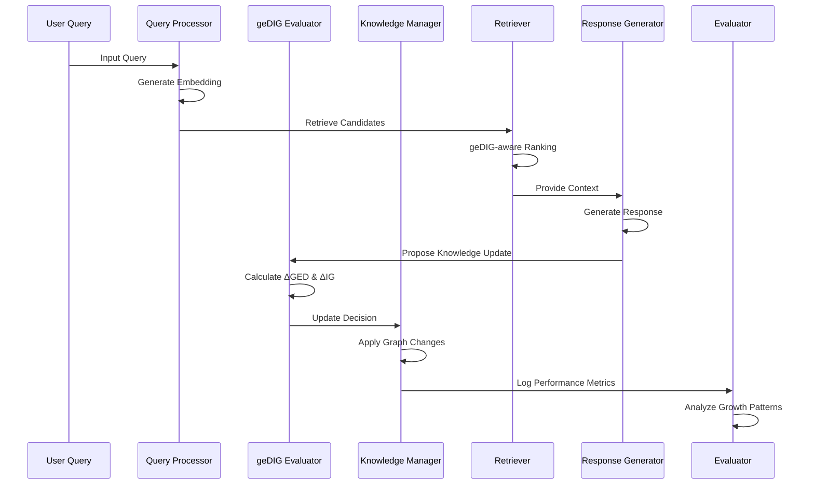

# geDIG-RAG v3 技術仕様書

## 1. システムアーキテクチャ

### 1.1 全体構成

```
┌─────────────────────────────────────────────────────────────┐
│                    geDIG-RAG v3 System                     │
├─────────────────────────────────────────────────────────────┤
│  Query Processing Layer                                     │
│  ┌─────────────┐  ┌──────────────┐  ┌─────────────────┐    │
│  │ Query       │  │ Embedding    │  │ Context         │    │
│  │ Analyzer    │→ │ Generator    │→ │ Extractor       │    │
│  └─────────────┘  └──────────────┘  └─────────────────┘    │
├─────────────────────────────────────────────────────────────┤
│  geDIG Evaluation Layer                                     │
│  ┌─────────────┐  ┌──────────────┐  ┌─────────────────┐    │
│  │ ΔGED        │  │ ΔIG          │  │ geDIG           │    │
│  │ Calculator  │  │ Calculator   │→ │ Evaluator       │    │
│  └─────────────┘  └──────────────┘  └─────────────────┘    │
├─────────────────────────────────────────────────────────────┤
│  Knowledge Management Layer                                 │
│  ┌─────────────┐  ┌──────────────┐  ┌─────────────────┐    │
│  │ Dynamic     │  │ Update       │  │ Maintenance     │    │
│  │ Graph       │  │ Decision     │  │ Manager         │    │
│  │ Manager     │  │ Engine       │  │                 │    │
│  └─────────────┘  └──────────────┘  └─────────────────┘    │
├─────────────────────────────────────────────────────────────┤
│  Retrieval & Generation Layer                              │
│  ┌─────────────┐  ┌──────────────┐  ┌─────────────────┐    │
│  │ geDIG-aware │  │ Context      │  │ Response        │    │
│  │ Retriever   │→ │ Composer     │→ │ Generator       │    │
│  └─────────────┘  └──────────────┘  └─────────────────┘    │
├─────────────────────────────────────────────────────────────┤
│  Evaluation & Analysis Layer                               │
│  ┌─────────────┐  ┌──────────────┐  ┌─────────────────┐    │
│  │ Performance │  │ Growth       │  │ Report          │    │
│  │ Metrics     │  │ Analyzer     │  │ Generator       │    │
│  └─────────────┘  └──────────────┘  └─────────────────┘    │
└─────────────────────────────────────────────────────────────┘
```

### 1.2 データフロー



## 2. コアコンポーネント設計

### 2.1 geDIG評価システム

#### 2.1.1 GeDIGEvaluator クラス
```python
class GeDIGEvaluator:
    """geDIG評価関数の核心実装"""
    
    def __init__(self, k_coefficient: float = 0.5, radius: int = 2):
        """
        Args:
            k_coefficient: ΔIG項の重み（論文での最適化対象）
            radius: 局所グラフ抽出の半径
        """
        self.k = k_coefficient
        self.radius = radius
        self.ged_calculator = DeltaGEDCalculator()
        self.ig_calculator = DeltaIGCalculator()
    
    def evaluate_update(self, 
                       graph_before: KnowledgeGraph,
                       proposed_update: GraphUpdate) -> GeDIGResult:
        """更新提案のgeDIG評価"""
        
        # 仮想的に更新を適用
        graph_after = self._simulate_update(graph_before, proposed_update)
        affected_nodes = proposed_update.get_affected_nodes()
        
        # ΔGED計算（構造変化量）
        delta_ged = self.ged_calculator.calculate(
            graph_before, graph_after, affected_nodes
        )
        
        # ΔIG計算（情報利得）  
        delta_ig = self.ig_calculator.calculate(
            graph_before, graph_after, affected_nodes
        )
        
        # geDIG統合評価
        delta_gedig = delta_ged - self.k * delta_ig
        
        return GeDIGResult(
            delta_ged=delta_ged,
            delta_ig=delta_ig,
            delta_gedig=delta_gedig,
            confidence=self._calculate_confidence(delta_ged, delta_ig),
            affected_nodes=affected_nodes
        )
```

#### 2.1.2 ΔGED計算詳細
```python
class DeltaGEDCalculator:
    """グラフ構造変化量の効率計算"""
    
    def __init__(self):
        self.structural_weights = {
            'node_count_change': 0.3,      # ノード数変化
            'edge_count_change': 0.2,      # エッジ数変化
            'degree_distribution': 0.15,   # 次数分布変化
            'clustering_coefficient': 0.15, # クラスタ係数変化
            'density_change': 0.1,         # グラフ密度変化
            'connectivity_change': 0.1     # 連結性変化
        }
    
    def calculate(self, graph_before, graph_after, affected_nodes):
        """局所的ΔGED計算"""
        
        # 局所サブグラフ抽出
        subgraph_before = self._extract_local_subgraph(graph_before, affected_nodes)
        subgraph_after = self._extract_local_subgraph(graph_after, affected_nodes)
        
        # 各構造指標の変化量計算
        structural_changes = {}
        for metric, weight in self.structural_weights.items():
            before_val = self._calculate_metric(subgraph_before, metric)
            after_val = self._calculate_metric(subgraph_after, metric)
            structural_changes[metric] = abs(after_val - before_val) * weight
        
        return sum(structural_changes.values())
```

#### 2.1.3 ΔIG計算詳細
```python
class DeltaIGCalculator:
    """情報利得変化量の計算"""
    
    def calculate(self, graph_before, graph_after, affected_nodes):
        """ヒューリスティックΔIG計算"""
        
        # 新規追加の場合
        if self._is_addition_update(graph_before, graph_after):
            return self._calculate_addition_ig(graph_before, graph_after)
        
        # 削除の場合  
        elif self._is_removal_update(graph_before, graph_after):
            return self._calculate_removal_ig(graph_before, graph_after)
        
        # 統合の場合
        elif self._is_merge_update(graph_before, graph_after):
            return self._calculate_merge_ig(graph_before, graph_after)
        
        return 0.0
    
    def _calculate_addition_ig(self, graph_before, graph_after):
        """追加時のΔIG計算"""
        
        # 新規ノードの検索性能向上ポテンシャル
        search_potential = self._estimate_search_improvement(graph_after)
        
        # 既存知識との関連度
        connection_value = self._estimate_connection_value(graph_after)
        
        # 冗長性ペナルティ
        redundancy_penalty = self._calculate_redundancy_penalty(graph_after)
        
        return search_potential + connection_value - redundancy_penalty
```

### 2.2 4種類のRAGシステム実装

#### 2.2.1 BaseRAGSystem 抽象クラス
```python
class BaseRAGSystem(ABC):
    """RAGシステムの共通インターフェース"""
    
    def __init__(self, config: ExperimentConfig):
        self.config = config
        self.knowledge_graph = KnowledgeGraph()
        self.retriever = self._create_retriever()
        self.generator = self._create_generator()
        self.evaluator = PerformanceEvaluator()
    
    @abstractmethod
    def should_update_knowledge(self, query: str, response: str) -> bool:
        """知識更新の判定ロジック（各手法で実装）"""
        pass
    
    @abstractmethod  
    def _create_retriever(self) -> BaseRetriever:
        """検索器の作成（各手法で実装）"""
        pass
    
    def process_query(self, query: str) -> RAGResponse:
        """クエリ処理の共通フロー"""
        
        # 1. 検索
        retrieved_docs = self.retriever.retrieve(query, k=self.config.top_k)
        
        # 2. 生成
        response = self.generator.generate(query, retrieved_docs)
        
        # 3. 知識更新判定
        if self.should_update_knowledge(query, response):
            update_result = self._update_knowledge(query, response)
        else:
            update_result = None
        
        # 4. 結果記録
        return RAGResponse(
            query=query,
            response=response,
            retrieved_docs=retrieved_docs,
            update_result=update_result,
            performance_metrics=self._calculate_metrics(query, response)
        )
```

#### 2.2.2 各RAGシステムの具体実装

```python
class StaticRAG(BaseRAGSystem):
    """ベースライン: 静的知識ベース"""
    
    def should_update_knowledge(self, query: str, response: str) -> bool:
        return False  # 常に更新なし
    
    def _create_retriever(self):
        return CosineRetriever(self.knowledge_graph)

class FrequencyBasedRAG(BaseRAGSystem):
    """頻度ベースRAG: 単純な使用頻度で更新判定"""
    
    def __init__(self, config):
        super().__init__(config)
        self.access_counts = defaultdict(int)
        self.last_update_time = defaultdict(float)
    
    def should_update_knowledge(self, query: str, response: str) -> bool:
        # 頻度ベースの単純ロジック
        query_hash = hashlib.md5(query.encode()).hexdigest()
        self.access_counts[query_hash] += 1
        
        # 低頻度クエリは知識追加候補
        if self.access_counts[query_hash] <= self.config.frequency_threshold:
            return True
            
        # 時間ベースの更新
        current_time = time.time()
        if current_time - self.last_update_time[query_hash] > self.config.time_threshold:
            return True
            
        return False

class CosineOnlyRAG(BaseRAGSystem):
    """コサイン類似度のみRAG: 類似度閾値で更新判定"""
    
    def should_update_knowledge(self, query: str, response: str) -> bool:
        query_embedding = self.retriever.embed_query(query)
        
        # 既存知識との最大類似度を計算
        similarities = []
        for node in self.knowledge_graph.nodes():
            node_embedding = self.knowledge_graph.get_node_embedding(node)
            similarity = cosine_similarity(query_embedding, node_embedding)
            similarities.append(similarity)
        
        max_similarity = max(similarities) if similarities else 0.0
        
        # 類似度が低い場合は新規知識として追加
        return max_similarity < self.config.cosine_threshold

class GeDIGRAG(BaseRAGSystem):
    """提案手法: geDIG評価によるRAG"""
    
    def __init__(self, config):
        super().__init__(config)
        self.gedig_evaluator = GeDIGEvaluator(
            k_coefficient=config.gedig_k,
            radius=config.gedig_radius
        )
        self.update_manager = DynamicUpdateManager(config)
    
    def should_update_knowledge(self, query: str, response: str) -> bool:
        # 知識更新候補を生成
        proposed_updates = self._generate_update_proposals(query, response)
        
        # geDIG評価で最適更新を選択
        best_update = None
        best_score = float('-inf')
        
        for update in proposed_updates:
            gedig_result = self.gedig_evaluator.evaluate_update(
                self.knowledge_graph, update
            )
            
            if gedig_result.delta_gedig > best_score:
                best_score = gedig_result.delta_gedig
                best_update = update
        
        # 閾値を超える場合のみ更新
        return best_score > self.config.gedig_threshold
    
    def _create_retriever(self):
        return GeDIGAwareRetriever(self.knowledge_graph, self.gedig_evaluator)
```

### 2.3 評価システム設計

#### 2.3.1 GrowthMetricsCalculator
```python
class GrowthMetricsCalculator:
    """長期成長効果の分析"""
    
    def calculate_session_growth(self, session_results: List[SessionResult]) -> GrowthAnalysis:
        """セッション毎の成長パターン分析"""
        
        growth_curves = {
            'em_scores': [],
            'f1_scores': [],
            'recall_at_k': {k: [] for k in [1, 3, 5, 10]},
            'mrr_scores': [],
            'knowledge_size': [],
            'update_rates': []
        }
        
        for session in session_results:
            # セッション内でのクエリ毎性能変化
            session_em = [result.em_score for result in session.query_results]
            session_f1 = [result.f1_score for result in session.query_results]
            
            growth_curves['em_scores'].append(session_em)
            growth_curves['f1_scores'].append(session_f1)
            
            # 他の指標も同様に計算...
            
        return GrowthAnalysis(
            curves=growth_curves,
            growth_rates=self._calculate_growth_rates(growth_curves),
            saturation_points=self._detect_saturation_points(growth_curves),
            efficiency_metrics=self._calculate_efficiency_metrics(session_results)
        )
    
    def _calculate_growth_rates(self, curves: Dict) -> Dict[str, float]:
        """各指標の成長率計算"""
        
        growth_rates = {}
        for metric, curve_data in curves.items():
            if isinstance(curve_data, dict):  # recall_at_k の場合
                growth_rates[metric] = {}
                for k, k_curves in curve_data.items():
                    growth_rates[metric][k] = self._calculate_linear_growth(k_curves)
            else:
                growth_rates[metric] = self._calculate_linear_growth(curve_data)
        
        return growth_rates
    
    def _calculate_linear_growth(self, curve_data: List[List[float]]) -> float:
        """線形成長率の計算"""
        
        # 全セッションの平均成長率
        session_growth_rates = []
        
        for session_curve in curve_data:
            if len(session_curve) >= 2:
                # 線形回帰で成長率を計算
                x = np.arange(len(session_curve))
                y = np.array(session_curve)
                slope, _ = np.polyfit(x, y, 1)
                session_growth_rates.append(slope)
        
        return np.mean(session_growth_rates)
```

#### 2.3.2 EfficiencyAnalyzer
```python
class EfficiencyAnalyzer:
    """効率性評価（1ノード追加当たりの改善効果）"""
    
    def analyze_update_efficiency(self, experiment_results: Dict[str, List[SessionResult]]) -> EfficiencyReport:
        """更新効率性の比較分析"""
        
        efficiency_data = {}
        
        for method_name, session_results in experiment_results.items():
            method_efficiency = self._calculate_method_efficiency(session_results)
            efficiency_data[method_name] = method_efficiency
        
        # 統計的有意性検定
        significance_tests = self._perform_significance_tests(efficiency_data)
        
        return EfficiencyReport(
            efficiency_per_method=efficiency_data,
            statistical_tests=significance_tests,
            ranking=self._rank_methods_by_efficiency(efficiency_data)
        )
    
    def _calculate_method_efficiency(self, session_results: List[SessionResult]) -> EfficiencyMetrics:
        """手法別効率性指標計算"""
        
        total_updates = 0
        total_em_improvement = 0
        total_f1_improvement = 0
        
        for session in session_results:
            session_updates = sum(1 for r in session.query_results if r.knowledge_updated)
            
            # セッション開始・終了での性能差
            start_em = session.query_results[0].em_score
            end_em = session.query_results[-1].em_score
            em_improvement = end_em - start_em
            
            start_f1 = session.query_results[0].f1_score  
            end_f1 = session.query_results[-1].f1_score
            f1_improvement = end_f1 - start_f1
            
            total_updates += session_updates
            total_em_improvement += em_improvement
            total_f1_improvement += f1_improvement
        
        # 1更新当たりの改善量
        em_per_update = total_em_improvement / max(total_updates, 1)
        f1_per_update = total_f1_improvement / max(total_updates, 1)
        
        return EfficiencyMetrics(
            updates_per_session=total_updates / len(session_results),
            em_improvement_per_update=em_per_update,
            f1_improvement_per_update=f1_per_update,
            total_sessions=len(session_results)
        )
```

## 3. 実験設計詳細

### 3.1 データセット管理

```python
class ExperimentDatasetManager:
    """実験データセットの統合管理"""
    
    def __init__(self, config: ExperimentConfig):
        self.config = config
        self.datasets = {}
    
    def load_hotpot_qa_sample(self, size: int = 1000) -> Dataset:
        """HotpotQAサンプルデータの読み込み"""
        
        # 公開データセットからサンプリング
        full_dataset = load_dataset("hotpot_qa", "fullwiki")
        sample_indices = random.sample(range(len(full_dataset['train'])), size)
        
        sampled_data = []
        for idx in sample_indices:
            item = full_dataset['train'][idx]
            sampled_data.append({
                'id': f"hotpot_{idx}",
                'question': item['question'],
                'answer': item['answer'],
                'supporting_facts': item['supporting_facts'],
                'context': item['context'],
                'level': item['level'],  # easy/medium/hard
                'type': item['type']     # bridge/comparison
            })
        
        return Dataset(name="hotpot_qa_sample", data=sampled_data)
    
    def load_domain_qa(self) -> Dataset:
        """ドメイン特化QAデータの読み込み（匿名化済み）"""
        
        # 技術文書ベースのQAペア
        domain_data = []
        
        # 実際のデータ読み込み（個人情報除去済み）
        with open(self.config.domain_qa_path, 'r') as f:
            raw_data = json.load(f)
        
        for item in raw_data:
            domain_data.append({
                'id': item['id'],
                'question': self._anonymize_text(item['question']),
                'answer': self._anonymize_text(item['answer']),
                'domain': item['domain'],
                'difficulty': item['difficulty'],
                'requires_multimodal': item.get('multimodal', False)
            })
        
        return Dataset(name="domain_qa", data=domain_data)
    
    def create_session_splits(self, dataset: Dataset, n_sessions: int) -> List[Dataset]:
        """セッション分割（時系列シミュレーション）"""
        
        # データをn_sessionsに分割
        session_size = len(dataset.data) // n_sessions
        sessions = []
        
        for i in range(n_sessions):
            start_idx = i * session_size
            end_idx = (i + 1) * session_size if i < n_sessions - 1 else len(dataset.data)
            
            session_data = dataset.data[start_idx:end_idx]
            sessions.append(Dataset(
                name=f"{dataset.name}_session_{i+1}",
                data=session_data
            ))
        
        return sessions
```

### 3.2 実験実行フレームワーク

```python
class ExperimentRunner:
    """実験実行の統合管理"""
    
    def __init__(self, config: ExperimentConfig):
        self.config = config
        self.dataset_manager = ExperimentDatasetManager(config)
        self.evaluator = ComprehensiveEvaluator()
        
        # 4種類のRAGシステム初期化
        self.rag_systems = {
            'static': StaticRAG(config),
            'frequency': FrequencyBasedRAG(config),
            'cosine': CosineOnlyRAG(config),
            'gedig': GeDIGRAG(config)
        }
    
    def run_full_experiment(self) -> ExperimentResults:
        """3週間分の完全実験実行"""
        
        results = {}
        
        # Phase 1: ベースライン比較
        print("🚀 Phase 1: Baseline Comparison")
        results['phase1'] = self.run_baseline_comparison()
        
        # Phase 2: 長期成長実験  
        print("📈 Phase 2: Long-term Growth")
        results['phase2'] = self.run_longterm_sessions()
        
        # Phase 3: アブレーション分析
        print("🔬 Phase 3: Ablation Analysis") 
        results['phase3'] = self.run_ablation_analysis()
        
        # 統合レポート生成
        print("📊 Generating Comprehensive Report")
        final_report = self._generate_final_report(results)
        
        return ExperimentResults(
            phase_results=results,
            final_report=final_report,
            config=self.config
        )
    
    def run_baseline_comparison(self) -> BaselineResults:
        """Phase 1: 4手法の基本性能比較"""
        
        # データセット準備
        hotpot_data = self.dataset_manager.load_hotpot_qa_sample(size=200)
        domain_data = self.dataset_manager.load_domain_qa()
        
        baseline_results = {}
        
        for method_name, rag_system in self.rag_systems.items():
            print(f"  Running {method_name}...")
            
            method_results = []
            
            # 各データセットで評価
            for dataset in [hotpot_data, domain_data]:
                dataset_result = self._evaluate_rag_system(rag_system, dataset)
                method_results.append(dataset_result)
            
            baseline_results[method_name] = method_results
        
        return BaselineResults(baseline_results)
    
    def run_longterm_sessions(self) -> LongtermResults:
        """Phase 2: 5セッション×20クエリの長期実験"""
        
        longterm_results = {}
        
        # データセット準備
        hotpot_data = self.dataset_manager.load_hotpot_qa_sample(size=1000)
        sessions = self.dataset_manager.create_session_splits(hotpot_data, n_sessions=5)
        
        for method_name, rag_system in self.rag_systems.items():
            print(f"  Running long-term {method_name}...")
            
            # 複数シードで実験
            method_sessions = []
            
            for seed in self.config.seeds:
                random.seed(seed)
                np.random.seed(seed)
                
                # システム初期化
                rag_system.reset()
                
                # 5セッション連続実行
                seed_sessions = []
                for session_dataset in sessions:
                    session_result = self._run_session(rag_system, session_dataset)
                    seed_sessions.append(session_result)
                
                method_sessions.append(seed_sessions)
            
            longterm_results[method_name] = method_sessions
        
        return LongtermResults(longterm_results)
```

## 4. 結果分析・可視化システム

### 4.1 論文用図表生成器

```python
class PaperFigureGenerator:
    """論文用図表の自動生成"""
    
    def __init__(self, results: ExperimentResults):
        self.results = results
        self.output_dir = Path("results/paper_figures")
        self.output_dir.mkdir(parents=True, exist_ok=True)
    
    def generate_all_figures(self):
        """全図表の一括生成"""
        
        # Figure 1: システムアーキテクチャ（手動作成）
        
        # Figure 2: 成長曲線
        self.generate_growth_curves()
        
        # Figure 3: 効率性比較
        self.generate_efficiency_comparison()
        
        # Figure 4: グラフ構造変化
        self.generate_graph_evolution()
        
        # Table 1: ベースライン比較
        self.generate_baseline_table()
        
        # Table 2: アブレーション結果
        self.generate_ablation_table()
        
        print(f"📊 All figures generated in {self.output_dir}")
    
    def generate_growth_curves(self):
        """Figure 2: セッション別成長曲線"""
        
        fig, axes = plt.subplots(2, 2, figsize=(12, 10))
        
        # EM/F1 成長曲線
        self._plot_metric_growth(axes[0, 0], 'em_score', 'EM Score Growth')
        self._plot_metric_growth(axes[0, 1], 'f1_score', 'F1 Score Growth')
        
        # Recall@K 成長曲線
        self._plot_recall_growth(axes[1, 0], k=5, title='Recall@5 Growth')
        self._plot_recall_growth(axes[1, 1], k=10, title='Recall@10 Growth')
        
        plt.tight_layout()
        plt.savefig(self.output_dir / "figure2_growth_curves.png", dpi=300, bbox_inches='tight')
        plt.savefig(self.output_dir / "figure2_growth_curves.pdf", bbox_inches='tight')
        plt.close()
    
    def _plot_metric_growth(self, ax, metric: str, title: str):
        """個別メトリクスの成長曲線描画"""
        
        longterm_results = self.results.phase_results['phase2']
        
        for method_name in ['static', 'frequency', 'cosine', 'gedig']:
            method_data = longterm_results.results[method_name]
            
            # 全シード・セッションの平均値計算
            session_means = []
            session_stds = []
            
            for session_idx in range(5):  # 5セッション
                session_values = []
                for seed_results in method_data:
                    session_result = seed_results[session_idx]
                    session_values.extend([
                        getattr(qr, metric) for qr in session_result.query_results
                    ])
                
                session_means.append(np.mean(session_values))
                session_stds.append(np.std(session_values))
            
            # 描画
            x = np.arange(1, 6)
            ax.plot(x, session_means, label=method_name.upper(), marker='o', linewidth=2)
            ax.fill_between(x, 
                          np.array(session_means) - np.array(session_stds), 
                          np.array(session_means) + np.array(session_stds),
                          alpha=0.2)
        
        ax.set_xlabel('Session')
        ax.set_ylabel(metric.replace('_', ' ').title())
        ax.set_title(title)
        ax.legend()
        ax.grid(True, alpha=0.3)
    
    def generate_efficiency_comparison(self):
        """Figure 3: 効率性比較（1ノード追加当たりの改善）"""
        
        efficiency_analyzer = EfficiencyAnalyzer()
        efficiency_report = efficiency_analyzer.analyze_update_efficiency(
            self.results.phase_results['phase2'].results
        )
        
        # 棒グラフ作成
        fig, (ax1, ax2) = plt.subplots(1, 2, figsize=(12, 5))
        
        methods = list(efficiency_report.efficiency_per_method.keys())
        em_efficiency = [efficiency_report.efficiency_per_method[m].em_improvement_per_update 
                        for m in methods]
        f1_efficiency = [efficiency_report.efficiency_per_method[m].f1_improvement_per_update 
                        for m in methods]
        
        # EM効率
        bars1 = ax1.bar(methods, em_efficiency, color=['#1f77b4', '#ff7f0e', '#2ca02c', '#d62728'])
        ax1.set_ylabel('EM Improvement per Update')
        ax1.set_title('EM Efficiency Comparison')
        ax1.set_ylim(0, max(em_efficiency) * 1.2)
        
        # 値をバーの上に表示
        for bar, value in zip(bars1, em_efficiency):
            ax1.text(bar.get_x() + bar.get_width()/2, bar.get_height() + max(em_efficiency)*0.01,
                    f'{value:.3f}', ha='center', va='bottom')
        
        # F1効率
        bars2 = ax2.bar(methods, f1_efficiency, color=['#1f77b4', '#ff7f0e', '#2ca02c', '#d62728'])
        ax2.set_ylabel('F1 Improvement per Update')
        ax2.set_title('F1 Efficiency Comparison')
        ax2.set_ylim(0, max(f1_efficiency) * 1.2)
        
        for bar, value in zip(bars2, f1_efficiency):
            ax2.text(bar.get_x() + bar.get_width()/2, bar.get_height() + max(f1_efficiency)*0.01,
                    f'{value:.3f}', ha='center', va='bottom')
        
        plt.tight_layout()
        plt.savefig(self.output_dir / "figure3_efficiency_comparison.png", dpi=300, bbox_inches='tight')
        plt.savefig(self.output_dir / "figure3_efficiency_comparison.pdf", bbox_inches='tight')
        plt.close()
```

## 5. 再現性・品質保証

### 5.1 実験設定の固定化

```python
class ReproducibilityManager:
    """実験の再現性確保"""
    
    @staticmethod
    def set_seeds(seed: int = 42):
        """全シード固定"""
        random.seed(seed)
        np.random.seed(seed)
        torch.manual_seed(seed)
        if torch.cuda.is_available():
            torch.cuda.manual_seed(seed)
            torch.cuda.manual_seed_all(seed)
    
    @staticmethod
    def save_experiment_config(config: ExperimentConfig, output_path: Path):
        """実験設定の保存"""
        config_dict = {
            'gedig_parameters': {
                'k_coefficient': config.gedig_k,
                'radius': config.gedig_radius,
                'thresholds': config.gedig_thresholds.__dict__
            },
            'experiment_parameters': {
                'seeds': config.seeds,
                'sessions': config.n_sessions,
                'queries_per_session': config.queries_per_session
            },
            'model_parameters': {
                'embedding_model': config.embedding_model,
                'generation_model': config.generation_model
            },
            'timestamp': datetime.now().isoformat(),
            'git_commit': subprocess.check_output(['git', 'rev-parse', 'HEAD']).decode().strip()
        }
        
        with open(output_path / "experiment_config.json", 'w') as f:
            json.dump(config_dict, f, indent=2)
```

### 5.2 自動テストスイート

```python
class ExperimentTestSuite:
    """実験コードの品質テスト"""
    
    def run_all_tests(self):
        """全テストの実行"""
        
        print("🧪 Running Experiment Test Suite...")
        
        # 単体テスト
        self.test_gedig_calculations()
        self.test_rag_systems()
        self.test_evaluation_metrics()
        
        # 統合テスト
        self.test_end_to_end_flow()
        
        # 性能テスト
        self.test_performance_requirements()
        
        print("✅ All tests passed!")
    
    def test_gedig_calculations(self):
        """geDIG計算の正確性テスト"""
        
        evaluator = GeDIGEvaluator(k_coefficient=0.5)
        
        # 簡単なテストケース
        graph_before = self._create_test_graph(nodes=3, edges=2)
        graph_after = self._create_test_graph(nodes=4, edges=3)  # ノード1個追加
        
        result = evaluator.evaluate_update(graph_before, graph_after, ['new_node'])
        
        assert result.delta_ged > 0, "ΔGED should be positive for node addition"
        assert result.delta_ig >= 0, "ΔIG should be non-negative"
        assert isinstance(result.delta_gedig, float), "ΔgeDIG should be float"
        
        print("  ✅ geDIG calculations test passed")
    
    def test_evaluation_metrics(self):
        """評価指標計算の正確性テスト"""
        
        # 模擬実験結果作成
        mock_results = self._create_mock_experiment_results()
        
        # 成長指標計算
        growth_calculator = GrowthMetricsCalculator()
        growth_analysis = growth_calculator.calculate_session_growth(mock_results)
        
        assert 'em_scores' in growth_analysis.curves
        assert 'f1_scores' in growth_analysis.curves
        assert len(growth_analysis.growth_rates) > 0
        
        print("  ✅ Evaluation metrics test passed")
```

この技術仕様書により、geDIG-RAG v3の詳細な実装指針と品質保証体制が確立されます。論文化レベルの実験実施に必要な全要素が網羅されています。